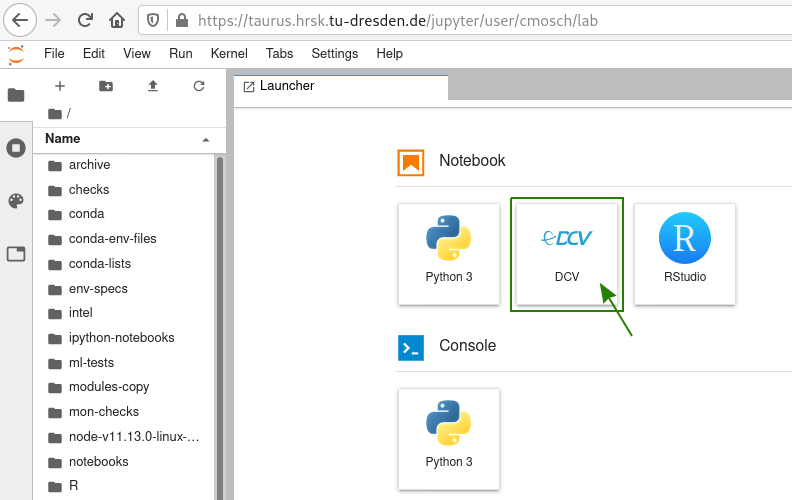

# Desktop Cloud Visualization (DCV)

NICE DCV enables remote accessing OpenGL 3D applications running on ZIH systems using the
server's GPUs. If you don't need OpenGL acceleration, you might also want to try our [WebVNC](web_vnc.md)
solution.

Look [here](https://docs.aws.amazon.com/dcv/latest/userguide/client-web.html) if you want to know
if your browser is supported by DCV.

## Access with JupyterHub

**Check out our new documentation about** [Virtual Desktops](../software/virtual_desktops.md).

To start a JupyterHub session on the dcv partition (taurusi210\[4-8\]) with one GPU, six CPU cores
and 2583 MB memory per core, click on:
[https://taurus.hrsk.tu-dresden.de/jupyter/hub/spawn#/~(partition~'dcv~cpuspertask~'6~gres~'gpu*3a1~mempercpu~'2583~environment~'production)](https://taurus.hrsk.tu-dresden.de/jupyter/hub/spawn#/~(partition~'dcv~cpuspertask~'6~gres~'gpu*3a1~mempercpu~'2583~environment~'production))
Optionally, you can modify many different Slurm parameters. For this
follow the general [JupyterHub](../access/jupyterhub.md) documentation.

Your browser should load JupyterLab, which looks like this:


{: align="center"}

Click on the `DCV` button. A new tab with the DCV client will be opened.

## Notes on GPU Support

- Check GPU support via:

```console hl_lines="4"
marie@compute$ glxinfo 
name of display: :1
display: :1  screen: 0
direct rendering: Yes
[...]
```

If direct rendering is not set to `Yes`, please contact [HPC support](mailto:hpcsupport@zih.tu-dresden.de).

- Expand LD_LIBRARY_PATH:

```console
marie@compute$ export LD_LIBRARY_PATH=$LD_LIBRARY_PATH:/usr/lib64/nvidia
```
