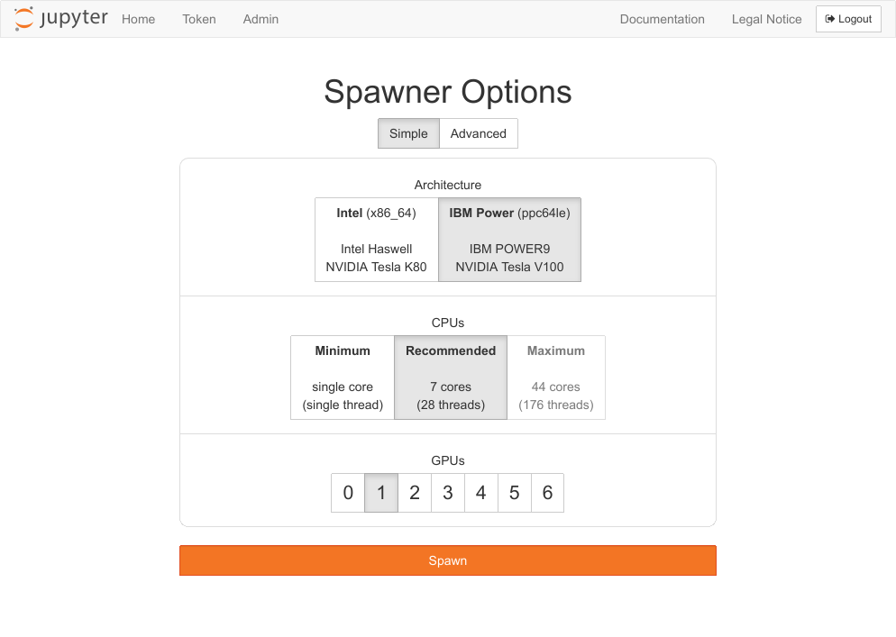
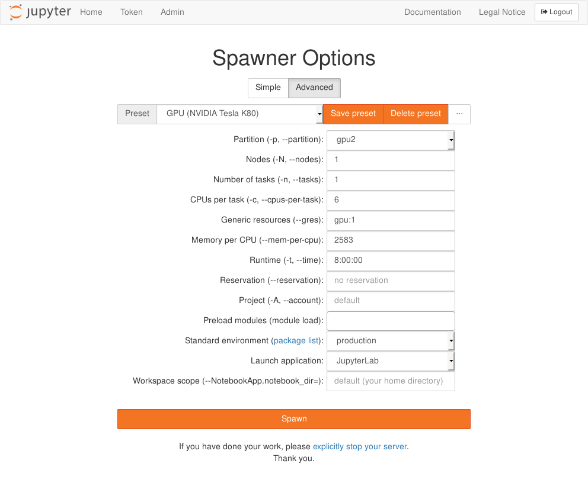
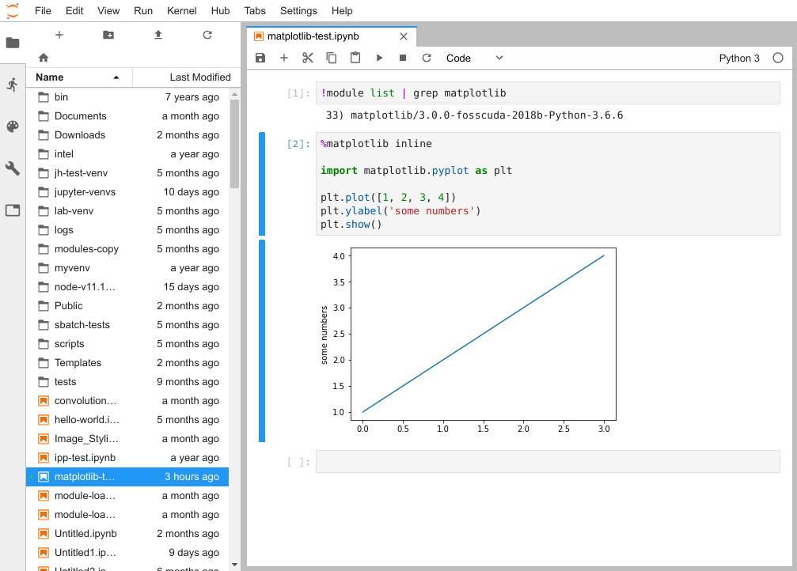
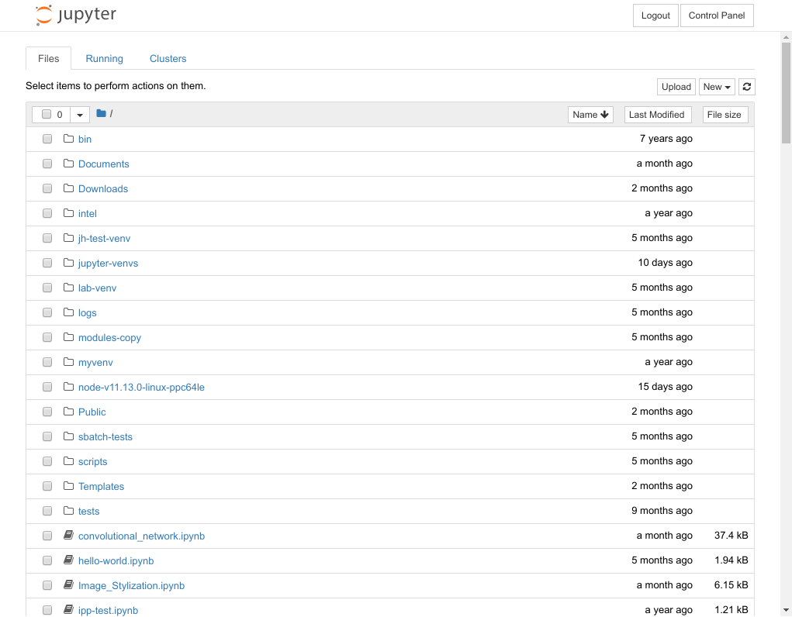
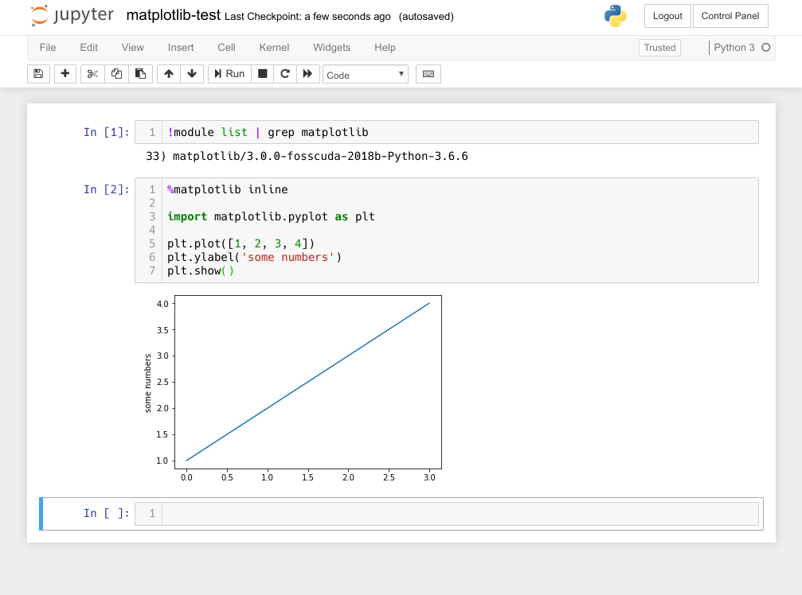
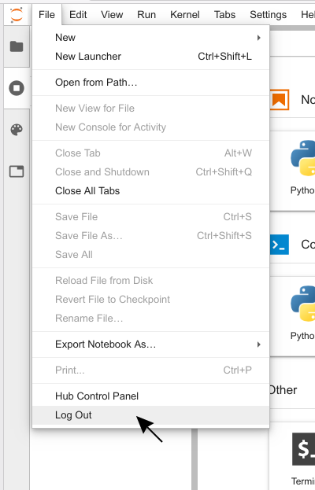
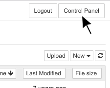
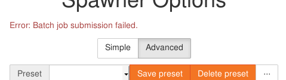
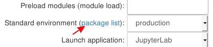

# JupyterHub

With our JupyterHub service, we offer you a quick and easy way to work with
Jupyter notebooks on ZIH systems. This page covers starting and stopping
JupyterHub sessions, error handling and customizing the environment.

We also provide a comprehensive documentation on how to use
[JupyterHub for Teaching (git-pull feature, quickstart links, direct links to notebook files)](jupyterhub_for_teaching.md).

## Disclaimer

!!! warning

    The JupyterHub service is provided *as-is*, use at your own discretion.

Please understand that JupyterHub is a complex software system of which we are
not the developers and don't have any downstream support contracts for, so we
merely offer an installation of it but cannot give extensive support in every
case.

## Access

!!! note
    This service is only available for users with an active HPC project.
    See [Application for Login and Resources](../application/overview.md), if
    you need to apply for an HPC project.

JupyterHub is available at
[https://taurus.hrsk.tu-dresden.de/jupyter](https://taurus.hrsk.tu-dresden.de/jupyter).

## Start a Session

Start a new session by clicking on the `Start my server` button.

A form opens up where you can customize your session. Our simple form
offers you the most important settings to start quickly.

{: align="center"}

For advanced users, we have an extended form where you can change many settings. You can:

- modify batch system parameters to your needs ([more about batch system Slurm](../jobs_and_resources/slurm.md))
- assign your session to a project or reservation
- load modules from the [module system](../software/modules.md)
- choose a different standard environment (in preparation for future
  software updates or testing additional features)

{: align="center"}

You can save your own configurations as additional presets. Those are
saved in your browser and are lost if you delete your browsing data. Use
the import/export feature (available through the button) to save your
presets in text files.

!!! info
    The partition [alpha](https://doc.zih.tu-dresden.de/hpc-wiki/bin/view/Compendium/AlphaCentauri)
    is available only in the extended form.

## Applications

You can choose between JupyterLab or classic Jupyter notebooks as outlined in the following.

=== "JupyterLab"

    
    {: align="center"}

    The main workspace is used for multiple notebooks, consoles or
    terminals. Those documents are organized with tabs and a very versatile
    split screen feature. On the left side of the screen you can open
    several views:

    - file manager
    - controller for running kernels and terminals
    - overview of commands and settings
    - details about selected notebook cell
    - list of open tabs

=== "Classic Jupyter Notebook"

    Initially, your home directory is listed. You can open existing notebooks or
    files by navigating to the corresponding path and clicking on them.

    
    {: align="center"}

    Above the table on the right side, there is the button `New` which lets you create new
    notebooks, files, directories or terminals.

    
    {: align="center"}

## Jupyter Notebooks in General

In JupyterHub, you can create scripts in notebooks. Notebooks are programs which are split into
multiple logical code blocks. Each block can be executed individually. In between those code
blocks, you can insert text blocks for documentation. Each notebook is paired with a kernel running
the code. We currently offer one for Python, C++, MATLAB and R.

### Version Control of Jupyter Notebooks with Git

Since Jupyter notebooks are files containing multiple blocks for input code,
documentation, output and further information, it is difficult to use them with
Git. Version tracking of the `.ipynb` notebook files can be improved with the
[Jupytext plugin](https://jupytext.readthedocs.io/en/latest/). Jupytext will
provide Markdown (`.md`) and Python (`.py`) conversions of notebooks on the fly,
next to `.ipynb`. Tracking these files will then provide a cleaner Git history.
A further advantage is that Python notebook versions can be imported, allowing
to split larger notebooks into smaller ones, based on chained imports.

!!! note
    The Jupytext plugin is not installed on the ZIH system at the moment.
    Currently, it can be [installed](https://jupytext.readthedocs.io/en/latest/install.html)
    by the users with parameter `--user`.
    Therefore, `ipynb` files need to be made available in a repository for shared
    usage within the ZIH system.

## Stop a Session

It is good practice to stop your session once your work is done. This releases
resources for other users and your quota is less charged. If you just log out or
close the window, your server continues running and **will not stop** until the
Slurm job runtime hits the limit (usually 8 hours).

At first, you have to open the JupyterHub control panel.

=== "JupyterLab"
    Open the file menu and then click on `Logout`. You can
    also click on `Hub Control Panel`, which opens the control panel in a new tab instead.

    
    {: align="center"}

=== "Classic Jupyter notebook"
    Click on the control panel button on the top right of your screen.

    
    {: align="center"}

    Now, you are back on the JupyterHub page and you can stop your server by clicking on
    
    {: align="center"}

## Error Handling

We want to explain some errors that you might face sooner or later.
If you need help, open a ticket and ask for support as described in
[How to Ask for Support](../support/support.md).

### Error at Session Start

{: align="center"}

This message appears instantly, if your batch system parameters are not valid.
Please check those settings against the available hardware.
Useful pages for valid batch system parameters:

- [General information how to use Slurm](../jobs_and_resources/slurm.md)
- [Partitions and limits](../jobs_and_resources/partitions_and_limits.md)

!!! hint
    This message might also appear for other Slurm related problems, e.g. quota issues.
    That might be the case when the error appears for you but not for others while using the same
    system parameters. In this case, please ask for support as described in
    [How to Ask for Support](../support/support.md).

### Error Message in JupyterLab

{: align="center"}

If the connection to your notebook server unexpectedly breaks, you will get this
error message. Sometimes your notebook server might hit a batch system or
hardware limit and gets killed. Then, the log file of the corresponding
batch job usually contains useful information. These log files are located in your
home directory and have the name `jupyter-session-<jobid>.log`.

## Advanced Tips

### Standard Environments

The default Python kernel uses conda environments based on the
[Watson Machine Learning Community Edition (formerly PowerAI)](https://developer.ibm.com/linuxonpower/deep-learning-powerai/)
package suite. You can open a list with all included python-packages that
are available within the standard environment through the spawner form:

{: align="center"}

This list shows all packages of the currently selected conda environment. This
depends on your settings for partition (CPU architecture) and standard
environment.

We have a number of standard environments, namely:

| name                                                       | optimized for   | specially recommended for | Modenv            | Partitions                                             |
|------------------------------------------------------------|-----------------|---------------------------|-------------------|-----------------------------------|
| foss-2020b                                                 | x86_64, ppc64le |                           | modenv/hiera & ml | romeo, alpha, ml                           |
| fosscuda-2019b                                             | GPUs            |                           | modenv/hiera & ml | romeo, alpha, ml                           |
| fosscuda-2020b                                             | GPUs            |                           | modenv/hiera & ml | romeo, alpha, ml                           |
| gcccore-10.3.0_python-3.9.5_matlab-2021b                   | x86_64          | MATLAB                    | modenv/hiera      | romeo, alpha                               |
| hiera_gcccore-10.2.0_python-3.8.6                          | x86_64 (AMD)    |                           | modenv/hiera      | romeo, alpha                               |
| hiera_gcccore-10.3.0_python-3.9.5_matlab-2021b             | x86_64 (AMD)    | MATLAB                    | modenv/hiera      | romeo, alpha                               |
| hiera_gcccore-10.3.0_python-3.9.5_r-4.1.0_rstudio-1.4.1717 | x86_64 (AMD)    | RStudio                   | modenv/hiera      | romeo, alpha                               |
| **production**                                             | x86_64, ppc64le |                           | modenv/scs5 & ml  | default, haswell, interactive, gpu2, hpdlf, dcv, julia, ml |
| scs5_gcccore-10.2.0_python-3.8.6                           | x86_64 (Intel)  |                           | modenv/scs5       | default, haswell, interactive, gpu2, hpdlf, dcv, julia     |
| scs5_gcccore-10.3.0_python-3.9.5_matlab-2021b              | x86_64 (Intel)  | MATLAB                    | modenv/scs5       | default, haswell, interactive, gpu2, hpdlf, dcv, julia     |
| scs5_gcccore-8.3.0_python-3.7.4                            | x86_64 (Intel)  |                           | modenv/scs5       | default, haswell, interactive, gpu2, hpdlf, dcv, julia     |

Actually 'romeo', 'alpha' and 'ml' refer to their respective interactive
partitions 'romeo-interactive', 'alpha-interactive', 'ml-interactive' to reduce job queue waiting time.

The standard environments in Jupyter are also closely related to the available
[Module Environments](../software/modules.md#module-environments).

With these **standard environments**, we have tried to integrate a set of compatible software:

=== "production"

    In this environment, we provide DCV and WebVNC access.

    You can load more software using our module system,
    by selecting these through the option ['Preload modules (module load)'](#loading-modules).

=== "...matlab"

    We integrated MATLAB into it, such that you can use it in your browser.

    You can load more software using our module system,
    by selecting these through the option ['Preload modules (module load)'](#loading-modules).

=== "...rstudio"

    We integrated R & RStudio into it, such that you can use it in your browser.
    Please click on RStudio's Icon for it, when you are in the JupyterHub overview.

=== "fosscuda-2020b"

    Can be utilized with the partitions `gpu2`, `alpha` and `ml`.
    It's specially geared towards GPU support.

### Loading Modules

You have now the option to preload modules from the [module system](../software/modules.md).
Select multiple modules that will be preloaded before your notebook server
starts. The list of available modules depends on the module environment you want
to start the session in (`scs5`, `hiera` or `ml`). The right module environment will be
chosen by your selected partition.

### Custom Kernels

As you might have noticed, after launching Jupyter**Lab**,
there are several boxes with icons therein visible in the `Launcher`.
Each box therein represents a so called 'Kernel'.
(note that these are not to be confused with operating system kernel,
but similarly provide basic functionality for running your use cases,
e.g. Python or R)

You can also [create your own Kernels](jupyterhub_custom_environments.md).
