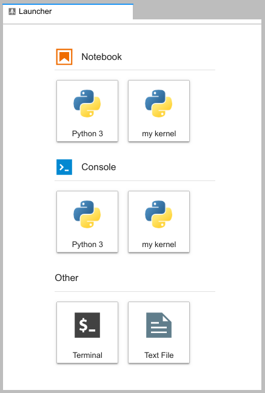
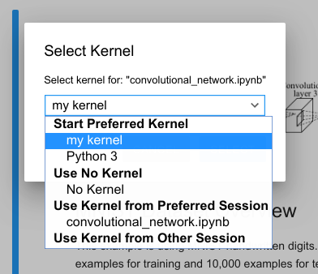
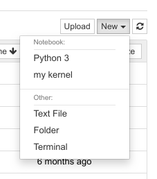
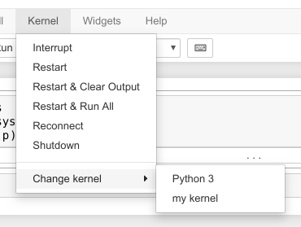

# Creating and Using a Custom Environment for JupyterHub

!!! info

    Interactive code interpreters which are used by Jupyter notebooks are called
    *kernels*. Creating and using your own kernel has the benefit that you can
    install your own preferred Python packages and use them in your notebooks.

We currently have two different architectures at ZIH systems.
Build your kernel environment on the **same architecture** that you want to use
later on with the kernel. In the examples below, we use the name
"my-kernel" for our user kernel. We recommend to prefix your kernels
with keywords like `haswell`, `ml`, `romeo`, `venv`, `conda`. This way, you
can later recognize easier how you built the kernel and on which hardware it
will work. Depending on that hardware, allocate resources as follows.

## Preliminary Steps

=== "Nodes with x86_64 (Intel) CPU"

    Use **one srun command** of these:

    ```console
    maria@login$ srun --partition=haswell64 --pty --ntasks=1 --cpus-per-task=2 \
     --mem-per-cpu=2541 --time=08:00:00 bash -l
    maria@login$ srun --partition=gpu2 --pty --ntasks=1 --cpus-per-task=2 \
     --mem-per-cpu=2541 --time=08:00:00 bash -l
    ```

=== "Nodes with x86_64 (AMD) CPU"

    Use **one srun command** of these:

    ```console
    maria@login$ srun --partition=romeo --pty --ntasks=1 --cpus-per-task=3 \
     --mem-per-cpu=1972 --time=08:00:00 bash -l
    maria@login$ srun --partition=alpha --gres=gpu:1 --pty --ntasks=1 \
     --cpus-per-task=6 --mem-per-cpu=10312 --time=08:00:00 bash -l
    ```

=== "Nodes with ppc64le CPU"

    ```console
    maria@login$ srun --pty --partition=ml --ntasks=1 --cpus-per-task=2 --mem-per-cpu=1443 \
     --time=08:00:00 bash -l
    ```

When creating a virtual environment in your home directory, you got to decide
to either use "Python virtualenv" or "conda environment".

!!! note
    Please keep in mind that Python virtualenv is the preferred way to create a Python
    virtual environment.
    For working with conda virtual environments, it may be necessary to configure your shell
    as described in [Python virtual environments](../software/python_virtual_environments.md#conda-virtual-environment)

## Python Virtualenv

While we have a general description on [Python Virtual Environments](/software/python_virtual_environments/), here we have a more detailed description on using them with JupyterHub:

Depending on the CPU architecture that you are targeting, please choose a `modenv`:

=== "scs5"
    For use with Standard Environment `scs5_gcccore-10.2.0_python-3.8.6`,
    please try to initialize your Python Virtual Environment like this:

    ```console
    marie@compute$ module load Python/3.8.6-GCCcore-10.2.0
    Module Python/3.8.6-GCCcore-10.2.0 and 11 dependencies loaded.
    marie@compute$ mkdir user-kernel # please use workspaces!
    marie@compute$ cd user-kernel
    marie@compute$ virtualenv --system-site-packages my-kernel
    created virtual environment CPython3.8.6.final.0-64 in 5985ms
      creator CPython3Posix(dest=[...]/my-kernel, clear=False, global=True)
      seeder FromAppData(download=False, pip=bundle, setuptools=bundle, wheel=bundle, via=copy, app_data_dir=[...])
        added seed packages: pip==20.2.3, setuptools==50.3.0, wheel==0.35.1
      activators BashActivator,CShellActivator,FishActivator,PowerShellActivator,PythonActivator,XonshActivator
    marie@compute$ source my-kernel/bin/activate
    (my-kernel) marie@compute$ pip install ipykernel
    Collecting ipykernel
    [...]
    Successfully installed [...] ipykernel-6.9.1 ipython-8.0.1 [...]
    ```
    
    Then continue with the steps below.

=== "hiera"
    For use with Standard Environment `hiera_gcccore-10.2.0_python-3.8.6`,
    please try to initialize your Python Virtual Environment like this:

    ```console
    marie@compute$ module load GCC/10.2.0 Python/3.8.6
    Module GCC/10.2.0Python/3.8.6 and 11 dependencies loaded.
    marie@compute$ mkdir user-kernel # please use workspaces!
    marie@compute$ cd user-kernel
    marie@compute$ virtualenv --system-site-packages my-kernel
    created virtual environment CPython3.8.6.final.0-64 in 5985ms
      creator CPython3Posix(dest=[...]/my-kernel, clear=False, global=True)
      seeder FromAppData(download=False, pip=bundle, setuptools=bundle, wheel=bundle, via=copy, app_data_dir=[...])
        added seed packages: pip==20.2.3, setuptools==50.3.0, wheel==0.35.1
      activators BashActivator,CShellActivator,FishActivator,PowerShellActivator,PythonActivator,XonshActivator
    marie@compute$ source my-kernel/bin/activate
    (my-kernel) marie@compute$ pip install ipykernel
    Collecting ipykernel
    [...]
    Successfully installed [...] ipykernel-6.9.1 ipython-8.0.1 [...]
    ```
    
    Then continue with the steps below.
=== "ml"
    ??? use production?
=== "default ('production')"
    For use with Standard Environment `production`,
    please try to initialize your Python Virtual Environment like this:

    ```console
    marie@compute$ module load Anaconda3/2022.05
    Module Anaconda3/2022.05 loaded.
    marie@compute$ mkdir user-kernel # please use workspaces!
    marie@compute$ cd user-kernel
    marie@compute$ python3 -m venv --system-site-packages my-kernel
    (my-kernel) marie@compute$ pip install ipykernel
    ```
    
    Then continue with the steps below.

After following the initialization of the environment (above),
the usage of Python's Package manager `pip` is the same:

```console
(my-kernel) marie@compute$ pip install --upgrade pip
(my-kernel) marie@compute$ python -m ipykernel install --user --name my-kernel --display-name="my kernel"
Installed kernelspec my-kernel in .../.local/share/jupyter/kernels/my-kernel
(my-kernel) marie@compute$ pip install [...] # now install additional packages for your notebooks
(my-kernel) marie@compute$ deactivate
```

!!! warning

    Take care to select the appropriate standard environment (as mentioned above)
    when [spawning a new session](./jupyterhub#start-a-session).

## Conda Environment

Load the needed module depending on partition architecture:

=== "Nodes with x86_64 CPU"
    ```console
    marie@compute$ module load Anaconda3
    ```

=== "Nodes with ppc64le CPU"
    ```console
    marie@ml$ module load PythonAnaconda
    ```

!!! hint
    For working with conda virtual environments, it may be necessary to configure your shell as
    described in
    [Python virtual environments](../software/python_virtual_environments.md#conda-virtual-environment).

Continue with environment creation, package installation and kernel
registration:

```console
marie@compute$ mkdir user-kernel # please use workspaces!
marie@compute$ conda create --prefix $HOME/user-kernel/my-kernel python=3.8.6
Collecting package metadata: done
Solving environment: done
[...]
marie@compute$ conda activate $HOME/user-kernel/my-kernel
marie@compute$ conda install ipykernel
Collecting package metadata: done
Solving environment: done
[...]
marie@compute$ python -m ipykernel install --user --name my-kernel --display-name="my kernel"
Installed kernelspec my-kernel in [...]
marie@compute$ conda install [..] # now install additional packages for your notebooks
marie@compute$ conda deactivate
```

## Using your custom environment

Now you can start a new session and your kernel should be available.

=== "JupyterLab"
    Your kernels are listed on the launcher page:

    
    {: align="center"}

    You can switch kernels of existing notebooks in the menu:

    
    {: align="center"}

=== "Classic Jupyter notebook"
    Your kernel is listed in the New menu:

    
    {: align="center"}

    You can switch kernels of existing notebooks in the kernel menu:

    
    {: align="center"}

!!! note
    Both python venv and conda virtual environments will be mentioned in the same
    list.
