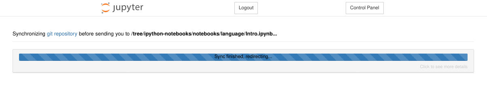
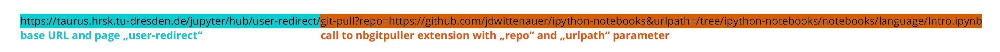
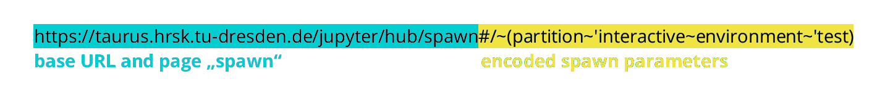
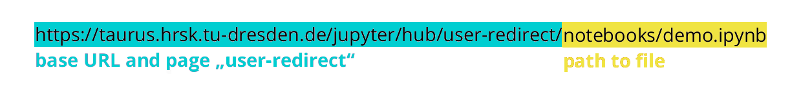

# JupyterHub for Teaching

On this page, we want to introduce to you some useful features if you want to
use JupyterHub for teaching.

!!! note

    JupyterHub uses compute resources from ZIH systems.

Please be aware of the following notes:

- ZIH systems operate at a lower availability level than your usual Enterprise
Cloud VM. There can always be downtimes, e.g. of the filesystems or the batch
system.
- Scheduled downtimes are announced by email. Please plan your courses
accordingly.
- Access to HPC resources is handled through projects. See your course as a
project. Projects need to be registered beforehand (more info on the page
[Access](../application/overview.md)).
- Don't forget to [add your users](../application/project_management.md#manage-project-members-dis-enable)
  (e.g. students or tutors) to your project.
- It might be a good idea to [request a reservation](../jobs_and_resources/overview.md#exclusive-reservation-of-hardware)
  of part of the compute resources for your project/course to avoid unnecessary
  waiting times in the batch system queue.

## Clone a Repository With a Link

This feature bases on [nbgitpuller](https://github.com/jupyterhub/nbgitpuller).
Further information can be found in the [external documentation about nbgitpuller](https://jupyterhub.github.io/nbgitpuller/).

This extension for Jupyter notebooks can clone every public git repository into
the users work directory. It's offering a quick way to distribute notebooks and
other material to your students.


{: align="center"}

To create a shareable link, we recommend to use [URL encoding](https://en.wikipedia.org/wiki/Percent-encoding)
instead plain text for the link in order to avoid defect links. The
[nbgitpuller link generator](https://jupyterhub.github.io/nbgitpuller/link?hub=https://taurus.hrsk.tu-dresden.de/jupyter/)
supports you in generating valid links for sharing.

??? example
    A shareable link for this feature looks like this:
    ```
    https://taurus.hrsk.tu-dresden.de/jupyter/hub/user-redirect/git-pull?repo=https%3A%2F%2Fgithub.com%2Fjdwittenauer%2Fipython-notebooks&urlpath=tree%2Fipython-notebooks%2Fnotebooks%2Flanguage%2FIntro.ipynb
    ```

!!! warning
    For illustration purposes, we use plain text links in the following parts. In practice, we
    highly recommend to use URL encoded links instead.


{: align="center"}

This example would clone the repository
[https://github.com/jdwittenauer/ipython-notebooks](https://github.com/jdwittenauer/ipython-notebooks)
and afterwards open the **Intro.ipynb** notebook in the given path.

The following parameters are available:

| Parameter | Info |
|---|---|
|`repo`    | path to git repository|
|`branch`  | branch in the repository to pull from default: `master`|
|`urlpath` | URL to redirect the user to a certain file, [more info about parameter urlpath](https://jupyterhub.github.io/nbgitpuller/topic/url-options.html#urlpath)|
|`depth`   | clone only a certain amount of latest commits not recommended|

## Spawn Options Pass-through with URL Parameters

The spawn form now offers a quick start mode by passing URL parameters.

!!! example

    The following link would create a jupyter notebook session on the
    `interactive` partition with the `test` environment being loaded:

    ```
    https://taurus.hrsk.tu-dresden.de/jupyter/hub/spawn#/~(partition~'interactive~environment~'test)
    ```


{: align="center"}

Every parameter of the advanced form can be set with this parameter. If the
parameter is not mentioned, the default value will be loaded.

| Parameter       | Default Value                            |
|:----------------|:-----------------------------------------|
| `partition`       | default                                  |
| `nodes`           | 1                                        |
| `ntasks`          | 1                                        |
| `cpuspertask`     | 1                                        |
| `gres`            | *empty* (no generic resources)           |
| `mempercpu`       | 1000                                     |
| `runtime`         | 8:00:00                                  |
| `reservation`     | *empty* (use no reservation)             |
| `project`         | *empty* (use default project)            |
| `modules`         | *empty* (do not load additional modules) |
| `environment`     | production                               |
| `launch`          | JupyterLab                               |
| `workspace_scope` | *empty* (home directory)                 |

You can use the advanced form to generate a URL for the settings you want. The
address bar contains the encoded parameters starting with `#/`.

### Combination of Quickstart and Git-Pull Feature

You can combine both features in a single link:

```
https://taurus.hrsk.tu-dresden.de/jupyter/hub/user-redirect/git-pull?repo=https://github.com/jdwittenauer/ipython-notebooks&urlpath=/tree/ipython-notebooks/notebooks/language/Intro.ipynb#/~(partition~'interactive~environment~'test)
```


{: align="center"}

## Open a Notebook Automatically with a Single Link

With the following link you will be redirected to a certain file in your
home directory.

[https://taurus.hrsk.tu-dresden.de/jupyter/user-redirect/notebooks/demo.ipynb](https://taurus.hrsk.tu-dresden.de/jupyter/user-redirect/notebooks/demo.ipynb)

The file needs to exist, otherwise a 404 error will be thrown.


{: align="center"}

This link would redirect to
`https://taurus.hrsk.tu-dresden.de/jupyter/user/{login}/notebooks/demo.ipynb`.

## Create a Shared Python Environment

To provide a consistent Python environment, you can create a shared [workspace](../data_lifecycle/workspaces.md)
and prepare a [Python virtual environment](../software/python_virtual_environments.md)
in it. Then use a custom Jupyter Kernel to use this environment in JupyterHub.
Please note the following:

- Set the correct permissions to the workspace and all relevant subdirectories
and files via `chmod`.

- Install all relevant Python packages in the shared Python virtual environment
(either pip or conda). Note that standard environments (as *production* or
*test*) are not available in that case.

- Modules can also be loaded in the Jupyter spawner via preload modules
(considering the Python version of your virtual environment).

Set up your shared Python virtual environment for JupyterHub.
!!! hint
    For working with conda virtual environments, it may be necessary to configure your shell via
    `conda init` as described in [Python virtual environments](../software/python_virtual_environments.md#conda-virtual-environment)

=== "virtualenv"

    ```console
    marie@compute$ module load Python #Load default Python
    [...]
    marie@compute$ ws_allocate -F scratch python_virtual_environment_teaching 1
    Info: creating workspace.
    /scratch/ws/1/python_virtual_environment_teaching
    [...]
    marie@compute$ virtualenv --system-site-packages /scratch/ws/1/python_virtual_environment_teaching/env #Create virtual environment
    [...]
    marie@compute$ source /scratch/ws/1/python_virtual_environment_teaching/env/bin/activate    #Activate virtual environment. Example output: (envtest) bash-4.2$
    marie@compute$ pip install ipykernel
    Collecting ipykernel
    [...]
    Successfully installed ... ipykernel-5.1.0 ipython-7.5.0 ...
    marie@compute$ pip install --upgrade pip
    marie@compute$ python -m ipykernel install --user --name my-teaching-kernel --display-name="my teaching kernel"
    Installed kernelspec my-teaching-kernel in .../.local/share/jupyter/kernels/my-teaching-kernel
    marie@compute$ pip install [...] #Now install additional packages for your notebooks
    marie@compute$ deactivate
    marie@compute$ chmod g+rx /scratch/ws/1/python_virtual_environment_teaching -R #Make the environment accesible for others

    ```

=== "conda"

    ```console
    marie@compute$ module load Anaconda3 #Load Anaconda
    [...]
    marie@compute$ ws_allocate -F scratch conda_virtual_environment_teaching 1
    Info: creating workspace.
    /scratch/ws/1/conda_virtual_environment_teaching
    [...]
    marie@compute$ conda create --prefix /scratch/ws/1/conda_virtual_environment_teaching/conda-env python=3.8 #create virtual environment with Python version 3.8
    [...]
    marie@compute$ conda activate /scratch/ws/1/conda_virtual_environment_teaching/conda-env #activate conda-env virtual environment
    marie@compute$ conda install ipykernel
    [...]
    marie@compute$ python -m ipykernel install --user --name my-teaching-kernel --display-name="my teaching kernel"
    Installed kernelspec my-teaching-kernel in .../.local/share/jupyter/kernels/my-teaching-kernel
    marie@compute$ conda install [...] # now install additional packages for your notebooks
    marie@compute$ conda deactivate
    marie@compute$ chmod g+rx /scratch/ws/1/conda_virtual_environment_teaching -R #Make the environment accesible for others

    ```

Now, users have to install the kernel in order to use the shared Python virtual
environment in JupyterHub:
=== "virtualenv"

    ```console
    marie@compute$ module load Python #Load default Python
    [...]
    marie@compute$ source /scratch/ws/1/python_virtual_environment_teaching/env/bin/activate #Activate virtual environment. Example output: (envtest) bash-4.2$
    marie@compute$ python -m ipykernel install --user --name my-teaching-kernel --display-name="my teaching kernel"
    Installed kernelspec my-teaching-kernel in .../.local/share/jupyter/kernels/my-teaching-kernel
    marie@compute$ deactivate

    ```

=== "conda"

    ```console
    marie@compute$ module load Anaconda3 #Load Anaconda
    [...]
    marie@compute$ conda activate /scratch/ws/1/conda_virtual_environment_teaching
    marie@compute$ python -m ipykernel install --user --name my-teaching-kernel --display-name="my teaching kernel"
    Installed kernelspec my-teaching-kernel in .../.local/share/jupyter/kernels/my-teaching-kernel
    marie@compute$ conda deactivate

    ```

After spawning the Notebook, you can select the kernel with the created Python
virtual environment.

!!! hint
    You can also execute the commands for installing the kernel from the Jupyter
    as described in [JupyterHub Teaching Example](jupyterhub_teaching_example.md). Then users do not
    have to use the command line interface after the preparation.
