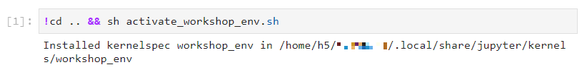

# JupyterHub Teaching Example

Setting up a Jupyter Lab Course involves additional steps, beyond JupyterHub, such as creating
course specific environments and allowing participants to link and activate these environments during
the course. This page includes a work through of these additional steps, with best practice examples
for each part.

## Context

- The common situation described here is that one or several Jupyter Lab Notebooks
(`ipynb` files) are available and prepared. Students are supposed to open these notebooks
through the [ZIH JupyterHub](../access/jupyterhub.md) and work through them during a course.

- These notebooks are typically prepared for specific dependencies (Python packages)
that need to be activated by participants in the course, when opening the notebooks.

- These environments can either be chosen based on the pre-configured
ZIH virtualenv/conda environments,
or built in advance. We will focus on the custom environment approach here.

## Prerequisites

- A public git repository with the notebook files (`ipynb`) and all other starting files required
  by participants. One option to host the repository is the [GitLab of TU Chemnitz](https://gitlab.hrz.tu-chemnitz.de/).
- A [HPC project](../application/project_management.md) for teaching,
  with students as registered participants
- For the tutor, a shell access to the HPC resources and project folder.

## Preparation on the Lecturer's Side

The following part describes several steps for the preparation of a course with the JupyterHub at
ZIH.

### 1. Creating a custom Python environment

Prepare a Python virtual environment (`virtualenv`) or conda virtual environment as described in
[Python virtual environments](../software/python_virtual_environments.md). Note, for preparing a
custom environment for a Jupyter Lab course, all participants will need to have read-access to this
environment. This is best done by storing the environment in either a [workspace](../data_lifecycle/workspaces.md)
with a limited lifetime or in a projects folder (e.g. `/projects/p_lv_jupyter_course/`) without a
limited lifetime.

### 2. Clone the repository and store environment setup

First prepare the `requirements.txt` or the `environment.yml` to persist the environment as
described in [Python virtual environments](../software/python_virtual_environments.md).

Then clone the repository of your course to your home directory or into a directory in the projects
folder and add the file to the repository.

=== "virtualenv"
    ```console
    marie@compute$ git clone git@gitlab.hrz.tu-chemnitz.de:zih/projects/p_lv_jupyter_course/clone_marie/jupyterlab_course.git
    [...]
    marie@compute$ cp requirements.txt /projects/p_lv_jupyter_course/clone_marie/jupyterlab_course
    marie@compute$ cd /projects/p_lv_jupyter_course/clone_marie/jupyterlab_course
    marie@compute$ git add requirements.txt
    marie@compute$ git commit
    marie@compute$ git push

    ```
=== "conda"
    ```console
    marie@compute$ git clone git@gitlab.hrz.tu-chemnitz.de:zih/projects/p_lv_jupyter_course/clone_marie/jupyterlab_course.git
    [...]
    marie@compute$ cp requirements.txt /projects/p_lv_jupyter_course/clone_marie/jupyterlab_course
    marie@compute$ cd /projects/p_lv_jupyter_course/clone_marie/jupyterlab_course
    marie@compute$ git add environment.yml
    marie@compute$ git commit
    marie@compute$ git push

    ```

Now, you can re-create the environment and the whole course from the git repository in the future.

To test the activation of the environment use:

=== "virtualenv"

    ```console
    marie@compute$ source /scratch/ws/1/python_virtual_environment_teaching/env/bin/activate #Activate virtual environment. Example output: (envtest) bash-4.2$

    ```
=== "conda"

    ```console
    marie@compute$ conda activate /scratch/ws/1/conda_virtual_environment_teaching

    ```

### 3. Prepare an activation file

Create a file to install the `ipykernel` to the user-folder, linking the central `workshop_env` to
the ZIH JupyterLab. An `activate_workshop_env.sh` should have the following content:

```console
/projects/jupyterlab_course/workshop_env/bin/python -m ipykernel install --user --name workshop_env --display-name="workshop_env"
```

!!! note
    The file for installing the kernel should also be added to the git repository.

### 4. Prepare the spawn link

Have a look at the instructions to prepare
[a custom spawn link in combination with the git-pull feature](jupyterhub_for_teaching.md#combination-of-quickstart-and-git-pull-feature).

## Usage on the Student's Side

### Preparing activation of the custom environment in notebooks

When students open the notebooks (e.g. through a Spawn Link that pulls the Git files
and notebooks from our repository), the Python environment must be activated first by installing a
Jupyter kernel. This can be done inside the first notebook using a shell command (`.sh`).

Therefore the students will need to run the `activation_workshop_env.sh` file, which can be done
in the first cell of the first notebook (e.g. inside `01_intro.ipynb`).

In a code cell in `01_intro.ipynb`, add:

```console
!cd .. && sh activate_workshop_env.sh
```

When students run this file, the following output signals a successful setup.


{: align="center"}

Afterwards, the `workshop_env` Jupyter kernel can be selected in the top-right corner of Jupyter
Lab.

!!! note
    A few seconds may be needed until the environment becomes available in the list.

## Test spawn link and environment activation

During testing, it may be necessary to reset the workspace to the initial state. There are two steps
involved:

First, remove the cloned git repository in user home folder.

!!! warning
    Check carefully the syntax below, to avoid removing the wrong files.

```console
cd ~
rm -rf ./jupyterlab_course.git
```

Second, the IPython Kernel must be un-linked from the user workshop_env.

```console
jupyter kernelspec uninstall workshop_env
```

## Summary

The following video shows an example of the process of opening the
spawn link and activating the environment, from the students perspective.
Note that this video shows the case for a conda virtual environment.


!!! note
    - The spawn link may not work the first time a user logs in.

    - Students must be advised to _not_ click "Start My Server" or edit the form,
    if the server does not start automatically.

    - If the server does not start automatically, click (or copy & paste) the spawn link again.
