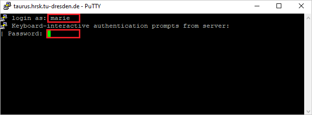
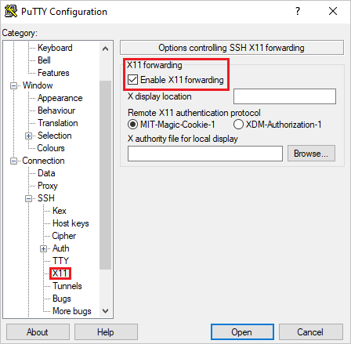

# Connecting from Windows with PuTTY

PuTTY is a free and open-source terminal emulator, serial console and network file transfer application, supports several network protocols, including SCP, SSH. Visit its homepage for more information (https://www.putty.org)

## Download and install

To download go https://www.chiark.greenend.org.uk/~sgtatham/putty/latest.html


Pick the installer suiting best your current system and run it afterwards. Follow the instructions.
 
## Quickstart a new ssh-seccion

1. Start PuTTY and insert the `Host Name` (taurus.hrsk.tu-dresden.de) and change the `Port` (22) if needed.


2. Click "Open" to start a new session. A Terminal will open up as new window. This action will do
basicly the same as using the command `ssh taurus.hrsk.tu-dresden.de:22` in Terminal.



3. After inserting your user name ("marie" in this example) and your password, it will log you in. You can start working on HPC.

## Configured start a new ssh-seccion 

You can preconfigure some values. It will save your time during your  conections in the future.

1. Define the connection target. To do so, start PuTTY, define the hostname (taurus.hrsk.tu-dresden.de) and the port (22).


2. Set your user name. For that choose the tab `Connection` &rarr; `Data` in the navigation tree on the left. 
Insert your user name into the textbox `Auto-login username`. 
The application will basicly perform the same action as the command `ssh marie@taurus.hrsk.tudresden.de:22` in Terminal.


3. Set a SSH-key (optional and recommended for security reason). 

    **Note**: For being able to use a ssh-key to login to HPC, you have to register the key on the system before! 

    Add the public-key to `~/.ssh/authorized_keys` and use the following format.


    ```console
    # <key-type> <public key> <comment>
    ssh-ed25519 <public key> myuser@mylocalhost
    ```
    To configure the ssh-key to use, naviagte to `Connection` &rarr; `SSH` &rarr; `Auth` in the tree left. 
    You will see a textbox for `Private key file for authentifikation`. 
    Insert the path to your local key-file or brows it using the button `Browse...`. 
    This will do the same as the command `ssh -i .ssh/id_red25519 marie@taurus.hrsk.tudresden.de:22` in Terminal.


4. Enable X-forwarding (optional). To do so, navigate to `Connection` &rarr; `SSH` &rarr; `X11` in the tree left. Put the tick in the checkbox for `Enable X11 forwarding`.



1. Save your configurations. Go back to the `Session` in the tree left. Insert a name into the textbox `Saved Sessions` and click
the button `Save`. Afterwards you will see the name in the listbox below.


Now, you can start a configured session by doubleclicking its name inside the listbox.

You can change your saved configurations by selecting its name inside the listbox and clicking the button `Load`. 
Make your changes and save it again under the same name. 
This will overwrite the old configuration permanetly.

You can delete a saved configurations by clicking the button `Delete`. This will remove the configured session permanetly.

**Have Fun!**