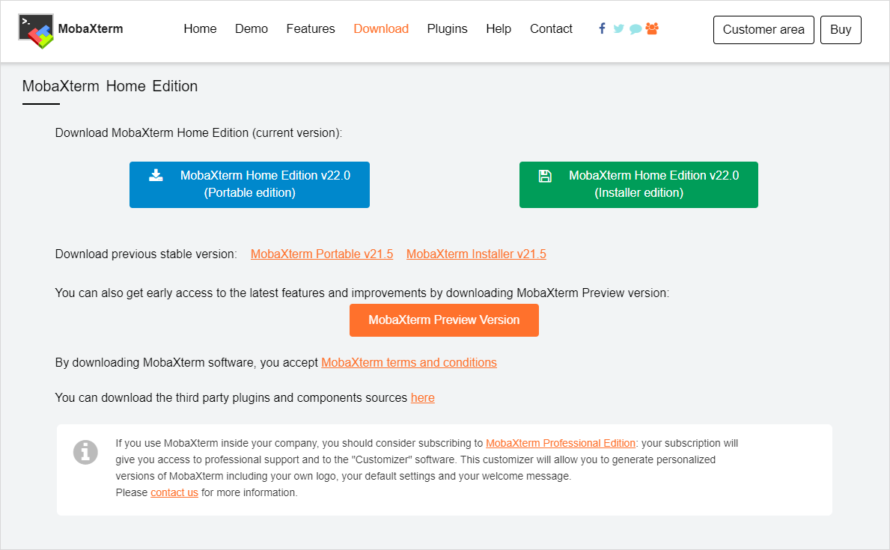
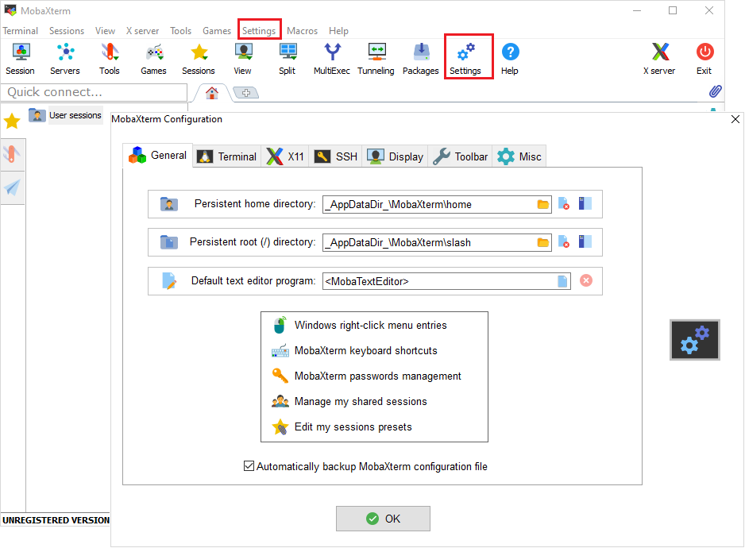

# Connecting from Windows with MobaXterm

MobaXterm is an enhanced terminal for Windows with an X11 server, a tabbed SSH client, network
tools and more.

Visit its homepage for more information (https://mobaxterm.mobatek.net).

## Download and install

To download go to [MobaXterm homepage](https://mobaxterm.mobatek.net/download-home-edition.html)
and download a free home edition.

Pick the installer suiting best your current system and run it afterwards. Follow the instructions.
You should see the following interface after starting the MobaXterm application.

## Configure local settings

Select the tab `Settings` &#8594; `Configuration` or click the button `Settings` in the toolbar. A
new window will open.

Here you can set different options in different tabs:

- `General` - local pathing-options for local MobaXterm-session,
- `Terminal` -  options, which alter your Terminal. e.g. color scheme,
- `X11` - options for X11-forwarding. It is enabled by default,
- `SSH` - general SSH settings e.g. keep-alive, SSH agent, browser-options,
- `Display` - general display-options for the application,
- `Toolbar` - customization of the toolbar,
- `Misc` - options to alter specific actions inside the MobaXterm-application.

## Start a new session

1. Select the tab `Sessions`  &rarr; `New session` or click the button `Session` in the toolbar.

2. Select a SSH section. Insert `Remote host` (taurus.hrsk.tu-dresden.de), `Username` ("marie" in
   this example), and `Port` 22. Near username, you can store credentials or just passphrases for
   specific connection (not recommended).

3. You can configure advanced settings in the same window below. These are

- `Advanced SSH settings` - set defaults for this specific new session. For example, set an SSH key or change the remote environment,
- `Terminal settings` - change some terminal options,
- `Network settings` - configure how the connection is built over the network. For example, by adding a proxy as gateway to the targeted system,
- `Bookmark settings` - specify how the session will be saved to your session list, which is afterwards
accessible by the top left navigation tab named `Sessions`.

4.  Start the session by clicking the button `OK`.

    If it is **not** your first time, your previous sessions are saved and you can find by going to
    the tab `Sessions`  &rarr;  `User sessions` and click the desired session. You can double click
    on one of your previous sessions the left.

5. The last thing to do is to input your HPC password in the command line and to press `enter`.

!!! Caution

    Do not forget to close the session after your jobs are finished. Just enter `exit` in the
    command line and complete with pressing `enter`. So, the system knows that you are off.
    Otherwise, the cores reserved for you cannot be used by other users. Your CPU time stays active
    until your reserved time will be over.

