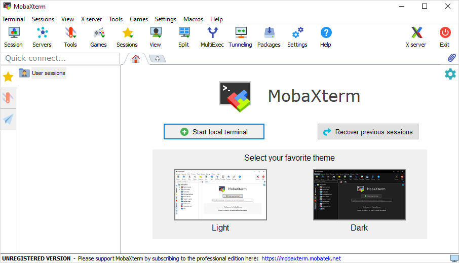
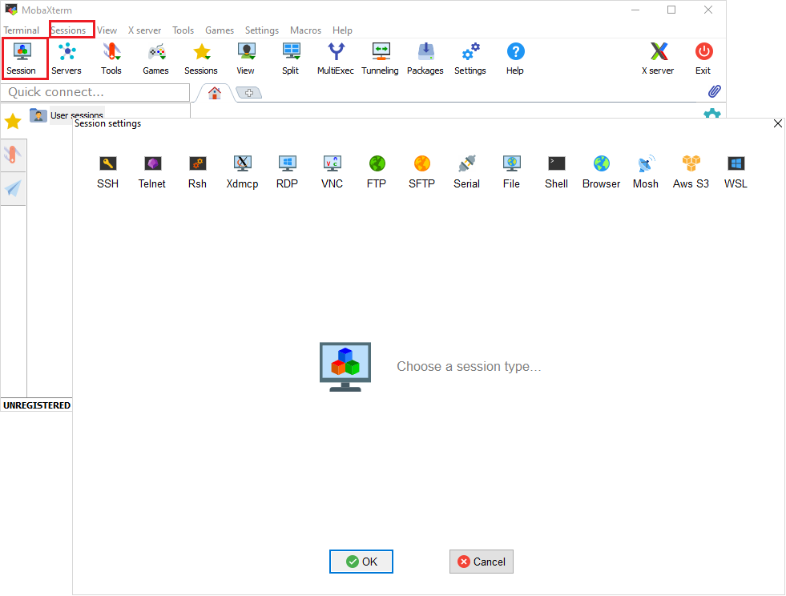
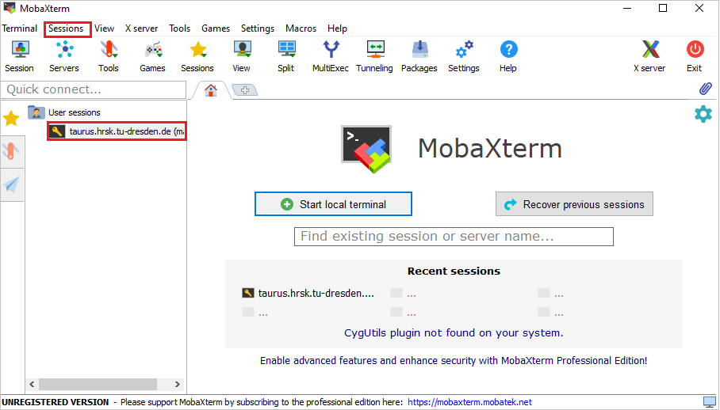

# Connecting from Windows with MobaXterm

MobaXterm is an enhanced terminal for Windows with an X11 server, a tabbed SSH client, network
tools and more.

Visit its homepage for more information (https://mobaxterm.mobatek.net).

## Download and install

To download go to [MobaXterm homepage](https://mobaxterm.mobatek.net/download-home-edition.html)
and download a free home edition.

Pick the installer suiting best your current system and run it afterwards. Follow the instructions.
You should see the following interface after starting the MobaXterm application.

## Configure local settings

Select the menu entry "Settings" &#8594; "Configuration" or click the button "Settings" in the
toolbar. A new window will open.

Here you can set different options in the following tabs:

- "General" - local pathing-options for local MobaXterm-session,
- "Terminal" -  options, which alter your terminal, e.g. color scheme,
- "X11" - options for X11-forwarding. It is enabled by default,
- "SSH" - general SSH settings, e.g. keep-alive, SSH agent, browser-options,
- "Display" - general display-options for the application,
- "Toolbar" - customization of the toolbar,
- "Misc" - options to alter specific actions inside the MobaXterm-application.

## Start a new session

1.  Select the tab "Sessions"  &#8594; "New session" or click the button "Session" in the toolbar.

    

1.  Select a SSH section. Insert "Remote host" (`taurus.hrsk.tu-dresden.de`), "Username" (replace
    `marie` with your ZIH login), and "Port" 22. Using the button right from the username option,
    you can store and manage credentials.

    

1.  Advanced settings can be configured in the same window below. These are
    - "Advanced SSH settings" - set defaults for this specific session. For example, set a SSH key
    or change the remote environment,
    - "Terminal settings" - change terminal options,
    - "Network settings" - configure how the connection is built over the network. For example, by
    adding a proxy as gateway to the targeted system,
    - "Bookmark settings" - specify how the session will be saved to your session list, which is
    afterwards accessible by the button "Sessions".

1.  Start the session by clicking the button "OK".

    Your previous sessions are saved in the bookmarks and can be accessed via the menu entry
    "Sessions"  &#8594;  "User sessions". Alternatively, double click on one of the previous
    sessions on the left panel.

    

1.  The last thing to do is to input your ZIH password in the command line and to press enter.
    The entered symbols of your password are invisible and will not appear as typed in. 

    

!!! Caution

    Do not forget to close the session after your jobs are finished. Just type `exit` in the
    command line and complete with pressing enter.

