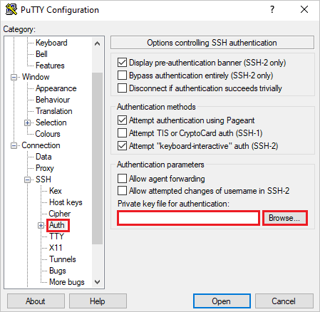

# Connecting from Windows with PuTTY

PuTTY is a free and open-source terminal emulator, serial console and network file transfer
application, supports several network protocols, including SCP, SSH. Visit the
[homepage](https://www.putty.org) for more information.

## Download and install

Download the installer suiting best your current system and run it afterwards. Follow the
instructions for installation.

 

## Start a new SSH session

1.  Start PuTTY and insert the "Host Name" (`taurus.hrsk.tu-dresden.de`) and leave the default
    port (22).

    

1.  Click "Open" to start a new session. A terminal window will open up.

    

1.  After entering your ZIH login and password you will be logged in to one of the login nodes.

## Connection Configuration (optional)

You can pre-configure some connection details additionally. It will save time in the future.

-   Set your user name. For that choose the tab "Connection" &#8594; "Data" in the navigation tree
    on the left. Insert your ZIH username in the text field "Auto-login username".

    

-   Configure SSH-key (recommended for security reason).

    ??? note "Generate your key pair"

        If you do not have your SSH key pair (public and private keys) yet, you can generate
        it using PuTTYgen program, which was installed together with the main PuTTY client.

        {: width=400}

        Click on the button "Generate" to create a new key pair. Move the mouse pointer in the
        respective field as requested. Afterwards save your public and private keys in separate
        files. It is recommended to use a passphrase for the private key.

    To configure the SSH key to use, navigate to "Connection" &#8594; "SSH" &#8594; "Auth" in the
    tree left. Insert the path to your local key-file in a text field "Private key file for
    authentication" or select it with "Browse...".

    

    !!! note "Add public key to ZIH system"
    
        For being able to use a SSH key to login to ZIH system, you have to register the key
        on the system before!

        Login to the ZIH system using your password and add your public-key to
        `~/.ssh/authorized_keys`.

-   Enable X-forwarding. Navigate to "Connection" &#8594; "SSH" &#8594; "X11" in the tree on the
    left. Select the checkbox "Enable X11 forwarding".

    

After editing the connection details save your configuration. Go back to the "Session" in the tree
left. Insert a session bookmark name into the text field "Saved Sessions" and click the button
"Save". Afterwards you will see the name in the list below.

Now, you can start a configured session by double-clicking its name in the list.

You can change your saved configuration by selecting its name in the list and clicking the button
"Load". Make your changes and save it again under the same name. This will overwrite the old
configuration permanently.

You can delete saved configuration by clicking the button "Delete". This will remove the
configured session permanently.