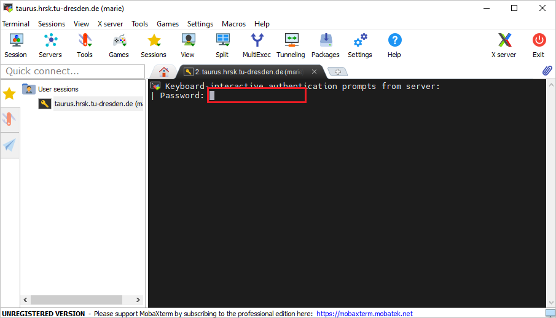
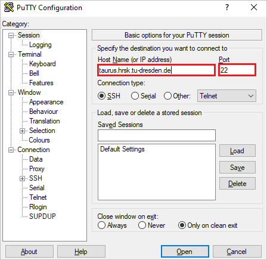

# Connecting from Windows

There several options to connect with SSH from Windows operating system. For more recent versions
of Windows (Windows 10 - version 1809 and higher) it is possible to use built-in terminal (also
known as [Command Prompt](https://en.wikipedia.org/wiki/Cmd.exe)
or [PowerShell](https://en.wikipedia.org/wiki/PowerShell)).

## Connecting from Windows with terminal

Start PowerShell with pressing `Win + R` and typing `powershell`.
Check that SSH client is available by typing `ssh` in a terminal:

```powershell
PS marie@local$ ssh
usage: ssh [-46AaCfGgKkMNnqsTtVvXxYy] [-B bind_interface]
           [-b bind_address] [-c cipher_spec] [-D [bind_address:]port]
           [-E log_file] [-e escape_char] [-F configfile] [-I pkcs11]
           [-i identity_file] [-J [user@]host[:port]] [-L address]
           [-l login_name] [-m mac_spec] [-O ctl_cmd] [-o option] [-p port]
           [-Q query_option] [-R address] [-S ctl_path] [-W host:port]
           [-w local_tun[:remote_tun]] destination [command]
```

If you have similar output as above, just proceed with the documentation for
[connecting with SSH from Linux](ssh_linux.md). Otherwise, refer to Microsoft documentation
regarding [OpenSSH](https://docs.microsoft.com/en-us/windows-hardware/manufacture/desktop/factoryos/connect-using-ssh?view=windows-10).

## Connecting from Windows with MobaXterm

MobaXterm is an enhanced terminal for Windows with an X11 server, a tabbed SSH client, network
tools and more.

Visit its homepage for more information (https://mobaxterm.mobatek.net).

### Download and install

To download go to [MobaXterm homepage](https://mobaxterm.mobatek.net/download-home-edition.html)
and download a free home edition.


Pick the installer suiting best your current system and run it afterwards. Follow the instructions.
You should see the following interface after starting the MobaXterm application.


### Configure local settings

Select the tab `Settings` &#8594 `Configuration` or click the button `Settings` in the toolbar. A
new window will open.


Here you can set different options in different tabs:

- `General` - local pathing-options for local MobaXterm-session,
- `Terminal` -  options, which alter your Terminal. e.g. color scheme,
- `X11` - options for X11-forwarding. It is enabled by default,
- `SSH` - general SSH-settings e.g. keep-alive, ssh agent, browser-options,
- `Display` - general display-options for the application,
- `Toolbar` - customization of the toolbar,
- `Misc` - options to alter specific actions inside the MobaXterm-application.

### Start a new session

1. Select the tab `Sessions`  &rarr; `New session` or click the button `Session` in the toolbar.


2. Select a SSH section. Inseart `Remote host` (taurus.hrsk.tu-dresden.de), `Username` ("marie" in
   this example), and `Port` 22. Near username, you can store credentials or just passphrases for
   specific connection (not recommended).


3. You can configure advanced settings in the same window below. These are

- `Advanced SSH settings` - set defaults for this specific new session. For example, set an ssh-key or change the remote environment,
- `Terminal settings` - change some terminal options,
- `Network settings` - configure how the connection is built over the network. For example, by adding a proxy as gateway to the targeted system,
- `Bookmark settings` - specify how the session will be saved to your session list, which is afterwards
accessible by the top left navigation tab named `Sessions`.

4.  Start the session by clicking the button `OK`.

    If it is **not** your first time, your previous sessions are saved and you can find by going to
    the tab `Sessions`  &rarr;  `User sessions` and click the desired session. You can double click
    on one of your previous sessions the left.


5. The last thing to do is to input your HPC password in the command line and to pres `enter`.



!!! Caution

    Do not forget to close the session after your jobs are finished. Just enter `exit` in the
    command line and complete with pressing `enter`. So, the system knows that you are off.
    Otherwise, the cores reserved for you cannot be used by other users. Your CPU time stays active
    until your reserved time will be over.


## Connecting from Windows with PuTTY

PuTTY is a free and open-source terminal emulator, serial console and network file transfer application, supports several network protocols, including SCP, SSH. Visit its homepage for more information (https://www.putty.org)

### Download and install

To download go https://www.chiark.greenend.org.uk/~sgtatham/putty/latest.html


Pick the installer suiting best your current system and run it afterwards. Follow the instructions.

### Quickstart a new ssh-session

1. Start PuTTY and insert the `Host Name` (taurus.hrsk.tu-dresden.de) and change the `Port` (22) if needed.



2. Click "Open" to start a new session. A Terminal will open up as new window. This action will do
basically the same as using the command `ssh taurus.hrsk.tu-dresden.de:22` in Terminal.


3. After inserting your user name ("marie" in this example) and your password, it will log you in. You can start working on HPC.

### Configured start a new ssh-seccion

You can preconfigure some values. It will save your time during your connections in the future.

1. Define the connection target. To do so, start PuTTY, define the hostname (taurus.hrsk.tu-dresden.de) and the port (22).


2. Set your user name. For that choose the tab `Connection` &rarr; `Data` in the navigation tree on the left.
Insert your user name into the textbox `Auto-login username`.
The application will basically perform the same action as the command `ssh marie@taurus.hrsk.tudresden.de:22` in Terminal.


3. Set a SSH-key (optional and recommended for security reason).

    **Note**: For being able to use a ssh-key to login to HPC, you have to register the key on the system before!

    Add the public-key to `~/.ssh/authorized_keys` and use the following format.


    ```console
    # <key-type> <public key> <comment>
    ssh-ed25519 <public key> myuser@mylocalhost
    ```
    To configure the ssh-key to use, naviagte to `Connection` &rarr; `SSH` &rarr; `Auth` in the tree left.
    You will see a textbox for `Private key file for authentifikation`.
    Insert the path to your local key-file or brows it using the button `Browse...`.
    This will do the same as the command `ssh -i .ssh/id_red25519 marie@taurus.hrsk.tudresden.de:22` in Terminal.


4. Enable X-forwarding (optional). To do so, navigate to `Connection` &rarr; `SSH` &rarr; `X11` in the tree left. Put the tick in the checkbox for `Enable X11 forwarding`.


1. Save your configurations. Go back to the `Session` in the tree left. Insert a name into the textbox `Saved Sessions` and click
the button `Save`. Afterwards you will see the name in the listbox below.


Now, you can start a configured session by double-clicking its name inside the listbox.

You can change your saved configurations by selecting its name inside the listbox and clicking the button `Load`.
Make your changes and save it again under the same name.
This will overwrite the old configuration permanently.

You can delete a saved configurations by clicking the button `Delete`. This will remove the configured session permanently.

**Enjoy!**
