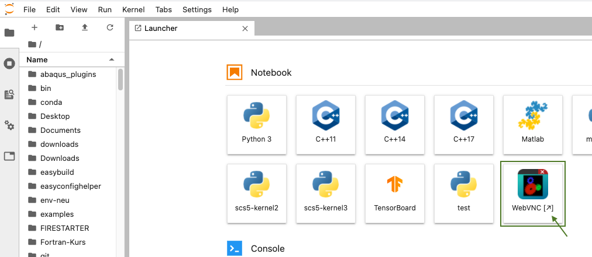

# WebVNC

We provide a Singularity container with a VNC setup that can be used as an alternative to
X-Forwarding to start graphical applications on the cluster.

It utilizes [noVNC](https://novnc.com) to offer a web-based client that you can use with your
browser, so there's no additional client software necessary.

Also, we have prepared a script that makes launching the VNC server much easier.

## Access with JupyterHub

**Check out our new documentation about [Virtual Desktops](../software/virtual_desktops.md).**

Click on the following link to start a session on our JupyterHub. [https://taurus.hrsk.tu-dresden.de/jupyter/hub/spawn#/~(partition~'interactive~cpuspertask~'2~mempercpu~'2583~environment~'production)](https://taurus.hrsk.tu-dresden.de/jupyter/hub/spawn#/~(partition~'interactive~cpuspertask~'2~mempercpu~'2583~environment~'production))
This link starts a Slurm job on the interactive partition (taurusi\[6605-6612\]) with two CPU cores
and 2583 MB memory per core. Optionally you can modify many different Slurm parameters. For this
follow the general [JupyterHub](../access/jupyterhub.md) documentation.

Your browser now should load into JupyterLab which looks like this:


{: align="center"}

Click on the `WebVNC` button. A new tab with the noVNC client will be opened.

## Access with terminal

### Step 1

Start the `runVNC` script in our prepared container in an interactive batch job (here with 4 cores
and 2.5 GB of memory per core):

```console
marie@login$ srun --pty -p interactive --mem-per-cpu=2500 -c 4 -t 8:00:00 singularity exec
/scratch/singularity/xfce.sif runVNC
[...]
```

Of course, you can adjust the batch job parameters to your liking. Note that the default timelimit
in partition interactive is only 30 minutes, so you should specify a longer one with `-t`.

The script will automatically generate a self-signed SSL certificate and place it in your home
directory under the name `self.pem`. This path can be overridden via the --cert parameter to
`runVNC`.

On success, it will print you an URL and a one-time password:

```console
[...]
Note: Certificate file /home/user/self.pem already exists. Skipping generation.  Starting VNC
server...  Server started successfully.  Please browse to: https://172.24.146.46:5901/vnc.html
The one-time password is: 71149997
```

### Step 2

Direct access to the compute nodes is not allowed, therefore you have to create a tunnel from your laptop or workstation through the specific compute
node and port as follows.

```console
marie@local$ ssh -NL <local port>:<compute node>:<remote port> <zih login>@tauruslogin.hrsk.tu-dresden.de
```

e.g.

```console
marie@local$ ssh NL 5901:172.24.146.46:5901 rotscher@tauruslogin.hrsk.tu-dresden.de
```

### Step 3

Open your local web-browser and connect to the following URL.

```
https://localhost:<local port>/vnc.html
```

e.g.

```
https://localhost:5901/vnc.html
```

Since you are using a self-signed certificate and the node does not have a public DNS name, your
browser will not be able to verify it and you will have to add an exception (via the "Advanced"
button).

### Step 4

On the website, click the `Connect` button and enter the one-time password that was previously
displayed in order to authenticate. You will then see an Xfce4 desktop and can start a terminal in
there, where you can use the "ml" or "module" command as usual to load and then run your graphical
applications. Enjoy!
