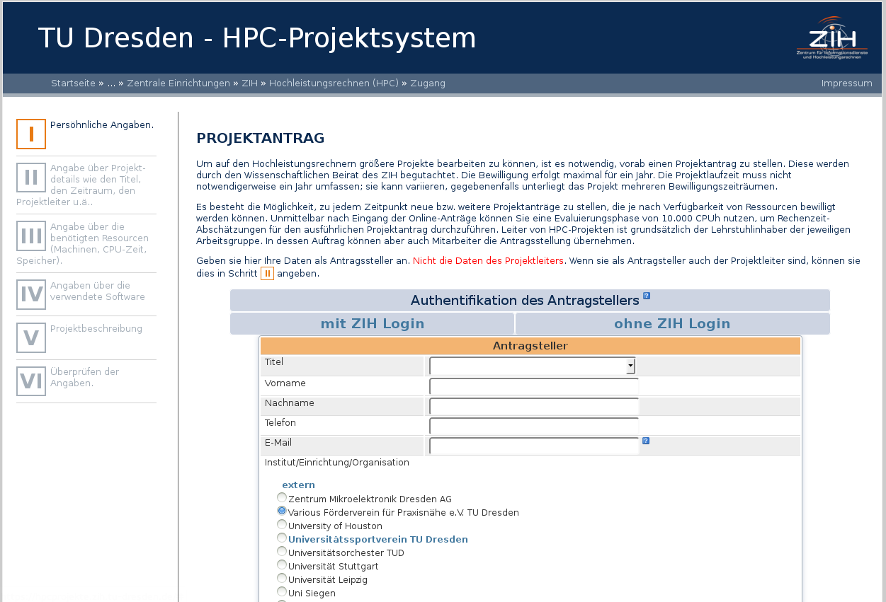
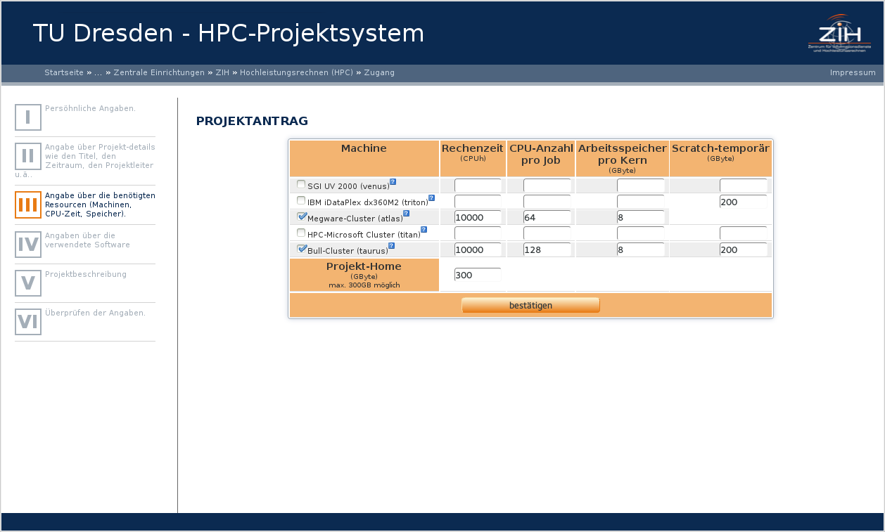
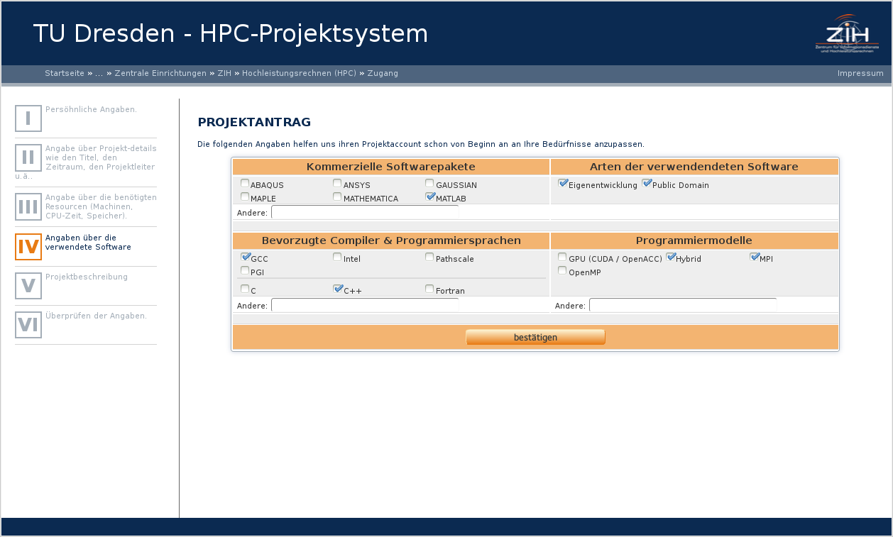
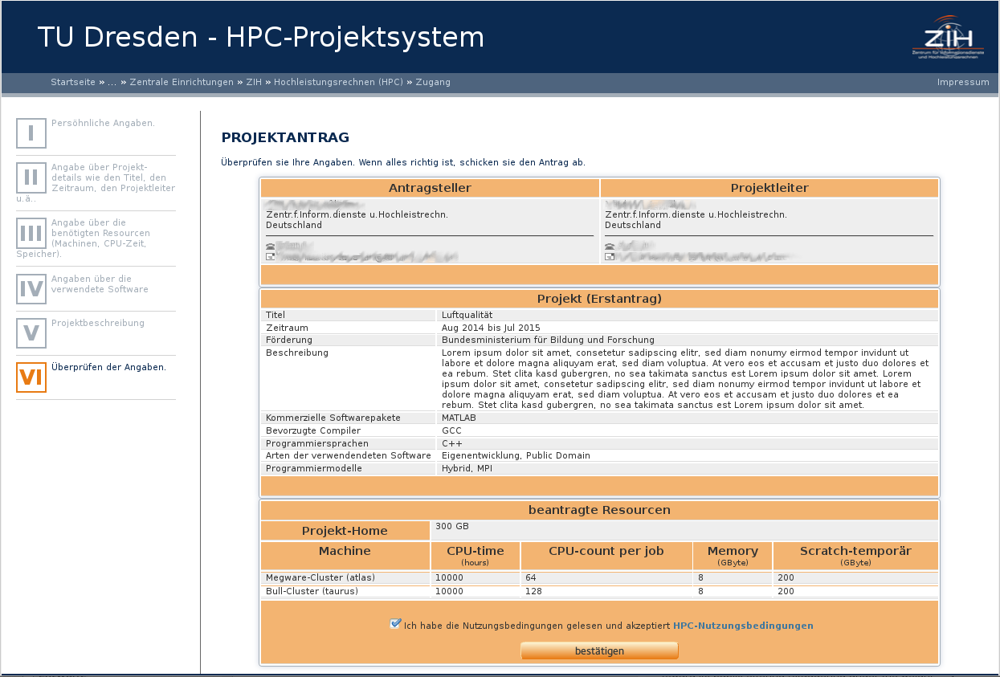

# Project Request Form

## First Step: Requester

{: align="center"}

The first step is asking for the personal information of the requester.
**That's you**, not the leader of this project!
If you have an ZIH-Login, you can use it.
If not, you have to fill in the whole information.

## Second Step: Project Details

![picture 3: Project Details >][1]
{: align="center"}

This Step is asking for general project Details.

Any project have:

* a title, at least 20 characters long
* a valid duration
    * Projects starts at the first of a month and ends on the last day of a month. So you are not
      able to send on the second of a month a project request which start in this month.
    * The approval is for a maximum of one year. Be careful: a duration from "May, 2013" till
      "May 2014" has 13 month.
* a selected science, according to the DFG:
  http://www.dfg.de/dfg_profil/gremien/fachkollegien/faecher/index.jsp
* a sponsorship a kind of request a project leader/manager The leader of this project should hold a
  professorship (university) or is the head of the research group.
    * If you are this person, leave this fields free.

## Third step: Hardware

{: align="center"}

This step inquire the required hardware. The
[hardware specifications](../jobs_and_resources/hardware_overview.md) might help you to estimate,
e. g. the compute time.

Please fill in the total computing time you expect in the project runtime. The compute time is
given in cores per hour (CPU/h), this refers to the 'virtual' cores for nodes with hyperthreading.
If they require GPUs, then this is given as GPU units per hour (GPU/h). Please add 6 CPU hours per
GPU hour in your application.

The project home is a shared storage in your project. Here you exchange data or install software
for your project group in userspace. The directory is not intended for active calculations, for this
the scratch is available.

## Fourth Step: Software

{: align="center"}

Any information you will give us in this step, helps us to make a rough estimate, if you are able
to realize your project. For example, some software requires its own licenses.

## Fifth Step: Project Description

![picture 6: Project Description >][2]
{: align="center"}

Please enter a short project description here. This is especially important for trial accounts and
courses. For normal HPC projects a detailed project description is additionally required, which you
can upload here.

## Sixth Step: Summary

{: align="center"}

Check your entries and confirm the terms of use.

[1]: misc/request_step2_details.png "Project Details"
[2]: misc/request_step5_description.png "Project Description"
