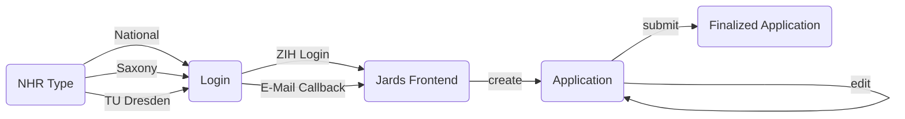

# Project Request Form Jards

This page describes the steps to fill the form on
[https://hpcprojekte.zih.tu-dresden.de/](https://hpcprojekte.zih.tu-dresden.de/application/).

If you have not already reached the login form through a specialized page,
here you have an overview of the possible project applications.

Since 2021, HPC at universities has been restructured by the NHR network.
The network consists of nine centers, which operate the systems and offer
a coordinated consulting service on the methodological competence of scientific HPC.
The aim is to provide scientists at German universities with computing capacity
for their research and to strengthen their skills in the efficient use of this resource.

Due to the structuring there are different ways to access [HPC resources](https://doc.zih.tu-dresden.de/jobs_and_resources/hardware_overview/).

## Workflow

=== "NHR Type"

    ### NHR Type

    Since January 2021 ZIH, TU Dresden is a NHR-center (Nationales Hochleistungsrechnen).
    More details can be found in [https://tu-dresden.de/zih/hochleistungsrechnen/nhr-center](https://tu-dresden.de/zih/hochleistungsrechnen/nhr-center).

    At ZIH, TU Dresden we have 3 different application categories for applying for HPC resources: NHR, Saxony and TUD/TIER3.

    ![Picture 1: Select Application][1]
    {: align="center"}

    ??? abstract "National NHR Application:"

        #### NHR

        This application is:

        * for researchers from all over Germany there is the possibility
          to apply for HPC resources at the NHR Center of the TU Dresden
        * for all research projects related to our focus topics
          [https://tu-dresden.de/zih/hochleistungsrechnen/nhr-center](https://tu-dresden.de/zih/hochleistungsrechnen/nhr-center), application to our NHR center is recommended
        * for other focuses other NHR centers are available [https://www.nhr-gs.de/ueber-uns/nhr-verein](https://www.nhr-gs.de/ueber-uns/nhr-verein)

        Application Login:

        * [https://hpcprojekte.zih.tu-dresden.de/application/login.php?appkind=nhr](https://hpcprojekte.zih.tu-dresden.de/application/login.php?appkind=nhr)

    ??? abstract "Saxony Application:"

        #### Saxony

        This application is:

        * for researchers from Saxon universities
        * to apply at the NHR Center of the TU-Dresden for further focus topics
          which are not covered by an NHR application

        Application Login:

        * [https://hpcprojekte.zih.tu-dresden.de/application/login.php?appkind=saxony](https://hpcprojekte.zih.tu-dresden.de/application/login.php?appkind=saxony)

    ??? abstract "TU Dresden (Tier 3) Application:"

        #### TU Dresden

        This application is:

        * for researchers of the TU Dresden with entitlement to special HPC contingents of the TU Dresden.
          (This includes, for example, appointment commitments)

        Application Login:

        * [https://hpcprojekte.zih.tu-dresden.de/application/login.php?appkind=tier3](https://hpcprojekte.zih.tu-dresden.de/application/login.php?appkind=tier3)

    !!! hint "ScaDS.AI Application:"

        ### ScaDS.AI

        ScaDS.AI is not a NHR Type. If you need an application for ScaDS.AI, you know how.

=== "Login"

    ### Login

    !!! info ZIH login
        For the application of a project no ZIH Login is necessary. Only if you want to use the resources yourself, a login is required: [https://tu-dresden.de/zih/hochleistungsrechnen/hpc](https://tu-dresden.de/zih/hochleistungsrechnen/hpc).

    #### With TU Dresden Account

    If you have a ZIH Login, you can use it in the form.

    ![Login via TU Dresden Account][2]

    #### With E-Mail Callback

    If you do not have a ZIH login, you can have a login session emailed to you, just enter your e-mail address in the form.

    ![Login via E-Mail Callback][3]

    Click on the link in the mail.

    ![Calback Mail][4]

=== "Jards Frontend"

    ### Jards Frontend

    After logging in, you will land on the overview page, which is divided into 3 parts.

    #### Overview

    In the first part you will get information about the site. Please pay attention to the title of the page and what type of request you are making.

    ![Overview][7]

    #### Active Applications

    In this section you can see all applications that have not yet been sent. You can edit these applications at any time.
    ![Active Application][6]

    ##### New Application

    To make a new request, press the button at the end of the listing.

    !!! hint "Create New Application"
        Be aware of, when you press the 'New Project Application' button, your project will be assigned a unique project ID.
        If you are not sure about some details, you can save them and edit them later.

    If you decide to create a project proposal for the same project again, you will receive a new unique project ID.

    ![New Application][8]

    !!! info New Application Type
        Please pay attention to the title of the page and what type of request you are making

    #### Finalized Applications

    Applications that have already been sent can be viewed in this section. These applications can no longer be updated and are under review and will be activated in case of a positive result.

    ![Finalized Application][5]

=== "Application"

    ### Application

    No matter which application you submit, the procedure is always identical.

    ??? abstract "Project Type"

        Choose the project type. Please note the information about the project types on the page.

        The project application differs depending on the type of application - and thus which components of our HPC system - resources are applied for.

        ![Project Type Selection][21]

    ??? abstract "Principal Investigator (PI) and Person to Contact (PC)"

        Choose the principal investigator and the person to contact. On the Button 'change my role ...' below, you can change your organisational part in the project.

        Keep in mind that the principal investigator (PI) has to be:

        * institute director
        * chair holder
        * research group leader

        ![Principal Investigator (PI)][22]

        If you have not yet submitted an application to us, you will be asked to provide your information.

        ![Principal Investigator (PI)][23]
        ![Principal Investigator (PI)][24]

    ??? abstract "Resources"
        Choose the needed resources. Typically, you can choose between GPU and CPU.

        !!! info
            You can only choose after you have specified a project type.

        For each choosen resource there are some questions after the project data.

        ![Resource Selection][12]

        Questions for CPU resources could be:

        - How much computing time is required for your project in the upcoming compute time period of one year (in core-hours)?
        - What is your job size and how many cores do you need?
        - Define your memory: How many GB per core do you need?

        !!! hint "Hint"
            If you have chosen only CPU resources, please be aware to specify here only resources for pure CPU nodes. Resources needed on accelerators (GPUs) must be specified in the corresponding section. If you like to change your computing time requirements go one slide back.

        ![CPU][13]

        Questions for CPU resources could be:

        - How much computing time is required on GPU nodes for your HPC project (in GPU-hours)?
        - How many GPU do you use for a single job?
        - How much GB of memory do you use for your typical job?
        - Which GPU programming scheme (CUDA, OpenACC, etc.) do you use?
        - Which software do you deploy on GPUs (own code, third party)?

        !!! hint "Hint"
            If you have chosen both CPU and GPU resources, but you do not need compute time on GPUs type in 0 here to be able to continue with your project application in Jards.

        ![GPU][14]

    ??? abstract "Project Data"
        In this step, the basic conditions of the project must be specified.

        Depending on the selected project type, these can be different.

        For example:

        - How much time do you plan for your HPC project (add ending date)?
        - What is your title of your HPC project (max. 250 char)?
        - Define your keywords to explain your HPC project best.
        - Please add a short project description (max. 6000 char).
        - Explain your plans for this granting period (max. 500 char).
        - Are you doing commissioned research (yes/no)?
        - Who is sponsoring your HPC project?
        - Classify your HPC project according to the following main and sub categories.
        - Which methods (physical, mathematical, numerical, ...) are used?
        - Which reasons make the use of this supercomputer necessary?

        !!! hint "Commissioned Research"
            Are you doing commissioned research?

            Commissioned research means direct order by private third parties to the TU Dresden as well as indirect assignments by private third parties on a promoting institution (university , research institution, or similar institutions). All research projects sponsored by public institutions such as state, country DFG , EU etc. are excluded.

            This specification is very important. In the end you must confirm this information in writing. For this purpose, a PDF is generated, which you must send back to us.

        ![Project Data][28]
        ![Project Data][29]
        ![Project Data][30]

    ??? abstract "Software"
        Next you need to specify which software you want to use.

        Here are the following categories, you should answer:

        - Commercial Software Packages
        - Compilers
        - Programming Languages
        - Other packages, not named here.
        - Use own-developed packages, please name here and provide the links to the open source software.
        - Parallelization strategy

        !!!hint "Information About Required Software"
            This is important for us, because we need to see if the software is installed, there is a valid license and it is available under the appropriate architecture. The biggest problem is the imagination of the license writers. We have to abide by these conditions. Even if we try to provide the common HPC software including licenses, not every software vendor offers appropriate licenses.

        ![Software][31]
        ![Software][32]

    ??? abstract "Data Management"
        The last thing to specify is the I/O behavior. All this information helps us to check and, if necessary, to create the necessary conditions.

        For example:

        * How much memory do you need.
        * How do your calculations behave (many small files or one big file)?
        * Fetch data from external? How?

        ![Data][33]
        ![Data][34]

    ??? abstract "Upload Full Projectdescription"
        On some project types a detailed project description is needed to complete the application.

        You can find a Template on this page:
        [https://tu-dresden.de/zih/hochleistungsrechnen/zugang/projektantrag?set_language=en](https://tu-dresden.de/zih/hochleistungsrechnen/zugang/projektantrag?set_language=en).

=== "Finalized Application"

    ### Finalized Application

    The final step is to complete the application process. The application is submitted to us and approved for review. Editing is no longer possible.

    In the next step you will receive an email with the data of the application as a PDF. In it you will find a template for the confirmation of the commissioned research.

    ![Finalize][18]

    !!! danger "Important"
        Please send the confirmation of commissioned research signed back to us, even if it is not commissioned research.

[1]: misc/application_1.png "Select Application"
[2]: misc/idm_login.png "Login via TU Dresden Account"
[3]: misc/email_login.png "Login via E-Mail Callback"
[4]: misc/email_link.png "Login via E-Mail Callback"
[5]: misc/finalized_application.png "Finalize"
[6]: misc/active_application.png
[7]: misc/overview_application.png
[8]: misc/new_application.png
[10]: misc/app_project_type.png "Project Type Selection"
[11]: misc/app_pi.png "PI Selection"
[12]: misc/app_resources.png "Resource Selection"
[13]: misc/app_resource_cpu.png "Resource CPU"
[14]: misc/app_resource_gpu.png "Resource GPU"
[15]: misc/app_project_data.png "Project Data"
[16]: misc/app_software.png "Software"
[17]: misc/app_data.png "Data"
[18]: misc/app_finalize.png "Finalize"

[19]: misc/nhr_1a_applicationlist.png
[20]: misc/nhr_1b_applicationlist.png
[21]: misc/nhr_2_projecttype.png
[22]: misc/nhr_3_choose_pi_pc.png
[23]: misc/nhr_4_data_pi.png
[24]: misc/nhr_5_data_pc.png
[25]: misc/nhr_6_resources.png
[26]: misc/nhr_7a_CPUresources.png
[27]: misc/nhr_7b_GPUresources.png
[28]: misc/nhr_8a_project_data.png
[29]: misc/nhr_8b_project_data.png
[30]: misc/nhr_8c_project_data.png
[31]: misc/nhr_9a_software.png
[32]: misc/nhr_9b_software.png
[33]: misc/nhr_10a_data_mgmt.png
[34]: misc/nhr_10b_data_mgmt.png
[35]: misc/nhr_11_upload_regular.png
[36]: misc/nhr_11_upload_trial_project.png
