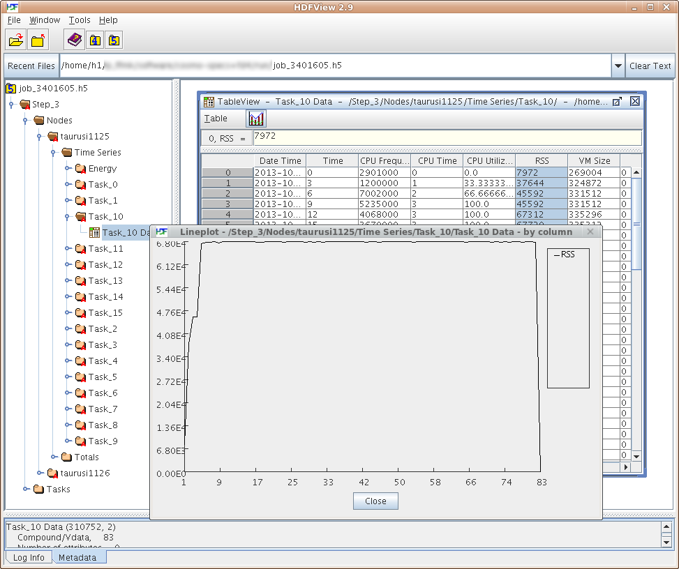

# Job Profiling

!!! info "2022-05-24"

    After upgrading to Slurm 20.11.9 job profiling is not working.
    We looking forward to activate job profiling with the next Slurm version again.
    The plan is to upgrade within the next weeks to Slurm 21.08.X.

Slurm offers the option to gather profiling data from every task/node of the job. Analyzing this
data allows for a better understanding of your jobs in terms of elapsed time, runtime and I/O
behavior, and many more.

The following data can be gathered:

* Task data, such as CPU frequency, CPU utilization, memory consumption (RSS and VMSize), I/O
* Energy consumption of the nodes
* Infiniband data (currently deactivated)
* Lustre filesystem data (currently deactivated)

The data is sampled at a fixed rate (i.e. every 5 seconds) and is stored in a HDF5 file.

!!! note "Data hygiene"

    Please be aware that the profiling data may be quiet large, depending on job size, runtime, and
    sampling rate. Always remove the local profiles from `/lustre/scratch2/profiling/${USER}`,
    either by running `sh5util` as shown above or by simply removing those files.

## Examples

The following examples of `srun` profiling command lines are meant to replace the current `srun`
line within your job file.

??? example "Create profiling data"

    (--acctg-freq is the sampling rate in seconds)

    ```console
    # Energy and task profiling
    srun --profile=All --acctg-freq=5,energy=5 -n 32 ./a.out
    # Task profiling data only
    srun --profile=All --acctg-freq=5 -n 32 ./a.out
    ```

??? example "Merge the node local files"

    ... in `/lustre/scratch2/profiling/${USER}` to single file.

    ```console
    # (without -o option output file defaults to job_$JOBID.h5)
    sh5util -j <JOBID> -o profile.h5
    # in jobscripts or in interactive sessions (via salloc):
    sh5util -j ${SLURM_JOBID} -o profile.h5
    ```

??? example "View data"

    ```console
    marie@login$ module load HDFView
    marie@login$ hdfview.sh profile.h5
    ```


{: align="center"}

More information about profiling with Slurm:

- [Slurm Profiling](http://slurm.schedmd.com/hdf5_profile_user_guide.html)
- [`sh5util`](http://slurm.schedmd.com/sh5util.html)

## Memory Consumption of a Job

If you are only interested in the maximal memory consumption of your job, you don't need profiling
at all. This information can be retrieved from within [job files](../jobs_and_resources/slurm.md#batch-jobs) as follows:

```bash
#!/bin/bash

#SBATCH [...]

module purge
module load [...]

srun a.exe

# Retrieve max. memory for this job for all nodes
srun max_mem.sh
```

The script `max_mem.sh` is:

```bash
#!/bin/bash

echo -n "$(hostname): "
cat /sys/fs/cgroup/memory/slurm/uid_${SLURM_JOB_UID}/job_${SLURM_JOB_ID}/memory.max_usage_in_bytes
```

!!! note

  * Make sure that the script `max_mem.sh` is executable (e.g., `chmod +x max_mem.sh`) and add the
    path to this script if it is not within the same directory.
  * The `srun` command is necessary to gather the max. memory from all nodes within this job.
    Otherwise, you would only get the data from one node.
