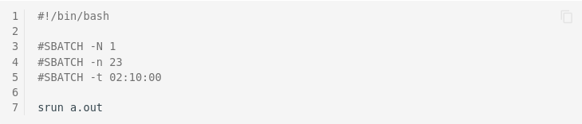
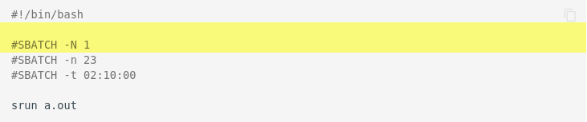

# Content Rules

!!! cite "George Bernard Shaw"

    The golden rule is that there are no golden rules.

## Motivation and Rationale

This page holds rules regarding the layout, content, and writing of this
documentation. The goals are to provide a comprehensive, consistent, up-to-date and well-written
documentation that is pure joy to read and use. It shall help to find answers and provide knowledge
instead of being the bottleneck and a great annoyance. Therefore, we set up some rules which
are outlined in the following.

!!! tip

    Following these rules when contributing speeds up the review process. Furthermore, your
    changes will not be blocked by the automatic checks implementened in the CI pipeline.

## Responsibility and License

This documentation and the repository have two licenses (cf. [Legal Notice](../legal_notice.md)):

* All documentation is licensed under [CC BY 4.0](https://creativecommons.org/licenses/by/4.0/).
* All software components are licensed under [MIT license](../license_mit.txt).

These licenses also apply to your contributions.

!!! note

    Each user is fully and solely responsible for the content he/she creates and has to ensure that
    he/she has the right to create it under the laws which apply.

If you are in doubt, please contact us either via
[GitLab Issue](https://gitlab.hrz.tu-chemnitz.de/zih/hpcsupport/hpc-compendium/-/issues)
or via [Email](mailto:hpcsupport@zih.tu-dresden.de).

## Quick Overview

* All documentation is written in [Markdown](#markdown).
* Type spaces (not tabs) both in Markdown files and in `mkdocs.yml`.
* Respect the line limit of 100 characters (exception: links).
* Do not add large binary files or high resolution images to the repository (cf.
   [adding images and attachments](#grapics-and-attachments)).
* [Admonitions](#admonitions) may be actively used for longer code examples, warnings, tips,
   important information etc.
* Respect the [writing style](#writing-style) and the rules for
  [spelling and technical wording](#spelling-and-technical-wording).
* For code blocks:
    * Use [syntax highlighting and appropriate prompts](#code-blocks-and-command-prompts).
    * Respect [data privacy](#data-privacy-and-generic-names).
    * Stick to the [rules on optional and required arguments](#unix-rules).

## Detailed Overview

### Pages Structure and New Page

The documentation and pages structure is defined in the configuration file
[mkdocs.yml](https://gitlab.hrz.tu-chemnitz.de/zih/hpcsupport/hpc-compendium/-/blob/main/doc.zih.tu-dresden.de/mkdocs.yml):

```Markdown
nav:
  - Home: index.md
  - Application for Login and Resources:
    - Overview: application/overview.md
    - Terms of Use: application/terms_of_use.md
    - Request for Resources: application/request_for_resources.md
    - Project Request Form: application/project_request_form.md
    - Project Management: application/project_management.md
    - Acknowledgement: application/acknowledgement.md
  - Access to ZIH Systems:
    - Overview: access/overview.md
  [...]
```

Follow these two steps to **add a new page** to the documentation:

1. Create a new Markdown file under `docs/subdir/file_name.md` and put the documentation inside.
The sub-directory and file name should follow the pattern `fancy_title_and_more.md`.
1. Add `subdir/file_name.md` to the configuration file `mkdocs.yml` by updating the navigation
   section. Yes, the order of files is crucial and defines the structure of the content. Thus,
   carefully consider the right spot and section for the new page.

Make sure that the new page **is not floating**, i.e., it can be reached directly from
the documentation structure.

### Markdown

All documentation is written in Markdown. Please keep things simple, i.e., avoid using fancy
Markdown dialects.

#### Brief How-To on Markdown

| Purpose | Markdown | Rendered HTML |
|---|---|---|
| Bold text | `**Bold Text**`  | **Bold Text**  |
| Italic text | `*Italic Text*`   | *Italic Text*  |
| Headings | `# Level 1`, `## Level 2`, `### Level 3`, ...   |  |
| External link | `[website of TU Dresden](https://tu-dresden.de)` | [website of TU Dresden](https://tu-dresden.de) |
| Internal link | `[Slurm page](../jobs_and_resources/slurm.md)` | [Slurm page](../jobs_and_resources/slurm.md)|
| Internal link to section | `[section on batch jobs](../jobs_and_resources/slurm.md#batch-jobs)` | [section on batch jobs](../jobs_and_resources/slurm.md#batch-jobs) |

Further tips can be found at this
[cheat sheet](https://github.com/adam-p/markdown-here/wiki/Markdown-Cheatsheet).

#### Graphics and Attachments

Please use images and graphics for illustration purposes and to improve understandability.
All graphics and attachments are saved within `misc` directory of the respective sub directory in
`docs`.

!!! example "Syntax"

    The syntax to insert a graphic or attachment into a page is

    ```markdown
    
    {: align="center"}
    ```

The attribute `align` is optional. By default, graphics are left aligned. **Note:** It is crucial to
have `{: align="center"}` on a new line.
It is possible to add captions for tables and figures using `{: summary="This is a table caption"}`.
The `summary` and `align` parameters can be combined as well:
`{: summary="This is a table caption" align="top"}`.

!!! warning

    Do not add large binary files or high resolution images to the repository. See this valuable
    document for [image optimization](https://web.dev/fast/#optimize-your-images).

#### Special Feature: Admonitions

[Admonitions](https://squidfunk.github.io/mkdocs-material/reference/admonitions/), also known as
call-outs, may be actively used to highlight examples, warnings, tips, important information etc.
Admonitions are an excellent choice for including side content without significantly interrupting
the document flow.

Several different admonitions are available within the used
[material theme](https://squidfunk.github.io/mkdocs-material/), e.g., `note`, `info`, `example`,
`tip`, `warning` and `cite`. Please refer to the
[documentation page](https://squidfunk.github.io/mkdocs-material/reference/admonitions/#supported-types)
for a comprehensive overview.

!!! example "Syntax"

    All admonitions blocks start with `!!! <type>` and the following content block is indented by
    (exactly) four spaces.
    If no title is provided, the title corresponds to the admonition type.

    ```markdown
    !!! note "Descriptive title"

        Lorem ipsum dolor sit amet, consetetur sadipscing elitr, sed diam nonumy eirmod
        tempor invidunt ut labore et dolore magna aliquyam erat, sed diam voluptua. At
        vero eos et accusam et justo duo dolores et ea rebum.
    ```

!!! node Folding

    Admonitions can be made foldable by using `???` instead of `!!!`. A small toggle on the right
    side is displayed. The block is open by default if `???+` is used. Long code examples should be
    folded by default.

### Writing Style

* Assume that a future reader is eager to start typing commands. Thus, encourage the reader by
  addressing him/her directly:
    * Example: Use `You can/should ...` instead of `Users can/should ...`
    * Example: Use `Your contribution is highly welcome` instead of `Contributions from user-side
      are highly welcome`
* Be brief! Provide the main idea/commands first, special cases later. If it is not necessary to
  know how a special piece of software works, don't explain it.
* Provide the often-used commands first.
* Use active over passive voice
    * Write with confidence. This confidence should be reflected in the documentation, so that
      the readers trust and follow it.
    * Example: `We recommend something` instead of `Something is recommended.`
* Capitalize headings, e.g. *Exclusive Reservation of Hardware*
* Give keywords in link texts, e.g. [Code Blocks](#code-blocks-and-syntax-highlighting) is more
  descriptive than [this subsection](#code-blocks-and-syntax-highlighting)
* Avoid using tabs both in markdown files and in `mkdocs.yaml`. Type spaces instead.

### Spelling and Technical Wording

To provide a consistent and high quality documentation, and help users to find the right pages,
there is a list of conventions w.r.t. spelling and technical wording.

* Language settings: en_us

| Do | Don't |
|----|-------|
| I/O | IO |
| Slurm | SLURM |
| filesystem(s) | file system(s) |
| ZIH system(s) | Taurus, HRSKII, our HPC systems, etc. |
| workspace | work space |
|       | HPC-DA |
| partition `ml` | ML partition, ml partition, `ml` partition, "ml" partition, etc. |

### Code Blocks and Command Prompts

* Use ticks to mark code blocks and commands, not italic font.
* Specify language for code blocks ([see below](#code-blocks-and-syntax-highlighting)).
* All code blocks and commands should be runnable from a login node or a node within a specific
  partition (e.g., `ml`).
* It should be clear from the [prompt](#prompts), where the command is run (e.g., local machine,
  login node or specific partition).

#### Code Blocks and Syntax Highlighting

Providing code blocks and snippets is the meat and bones of this documentation.
Code blocks and command examples should give the general idea of invocation and be as precise as
possible, i.e., allowing for copy-and-paste. Please mark replaceable code parts and optional and
required arguments as outlined in the section [required and optional arguments](#unix-rules) below.
Long, non-meaningful output should be ommitted.

We make use of the extension
[pymdownx.highlight](https://squidfunk.github.io/mkdocs-material/reference/code-blocks/) for syntax
highlighting. There is a complete list of supported
[language short codes](https://pygments.org/docs/lexers/).

??? note "Syntax for commandline"

    For normal commands executed in the terminal, use the language short code `console`.

    ````markdown
    ```console
    marie@login$ module list
    [...]
    ```
    ````

??? note "Syntax for job files and scripts"

    Use the language short code `bash` for job files and shell scripts.

    ````markdown
    ```bash
    #!/bin/bash
    #SBATCH --nodes=1
    #SBATCH --time=01:00:00
    #SBATCH --output=slurm-%j.out

    module load foss

    srun a.out
    ```
    ````

??? note "Syntax for Python"

    `python` for Python source code:

    ````markdown
    ```python
    from time import gmtime, strftime
    print(strftime("%Y-%m-%d %H:%M:%S", gmtime()))
    ```
    ````

    And `pycon` for Python console:

    ````markdown
    ```pycon
    >>> from time import gmtime, strftime
    >>> print(strftime("%Y-%m-%d %H:%M:%S", gmtime()))
    2021-08-03 07:20:33
    ```
    ````

??? note "Line numbers"

    More sugar can be applied by adding line numbers.

    ````markdown
    ```bash linenums="1"
    #!/bin/bash

    #SBATCH --nodes=1
    #SBATCH --ntasks=23
    #SBATCH --time=02:10:00

    srun a.out
    ```
    ````

    _Result_:

    

    Specific Lines can be highlighted by using

    ```` markdown
    ```bash hl_lines="2 3"
    #!/bin/bash

    #SBATCH --nodes=1
    #SBATCH --ntasks=23
    #SBATCH --time=02:10:00

    srun a.out
    ```
    ````

    _Result_:

    

#### Data Privacy and Generic Names

Where possible, replace login, project name and other private data with clearly recognizable
placeholders. In particular, use the generic login `marie` and the project title `p_number_crunch`
as placeholders.

```console
marie@login$ ls -l
drwxr-xr-x   3 marie p_number_crunch      4096 Jan 24  2020 code
drwxr-xr-x   3 marie p_number_crunch      4096 Feb 12  2020 data
-rw-rw----   1 marie p_number_crunch      4096 Jan 24  2020 readme.md
```

#### Placeholders

Placeholders represent arguments or code parts that can be adapted to the user's needs. Use them to
give a general idea of how a command or code snippet can be used, e. g. to explain the meaning of
some command argument:

```bash
marie@login$ sacct -j <job id>
```

Here, a placeholder explains the intention better than just a specific value:

```console
marie@login$ sacct -j 4041337
```

Please be aware, that a reader often understands placeholders easier if you also give an example.
Therefore, always add an example!

#### Mark Omissions

If showing only a snippet of a long output, omissions are marked with `[...]`.

#### Unix Rules

Stick to the Unix rules on optional and required arguments, and selection of item sets:

* `<required argument or value>`
* `[optional argument or value]`
* `{choice1|choice2|choice3}`

#### List of Prompts

We follow this rules regarding prompts to make clear where a certain command or example is executed.
This should help to avoid errors.

| Host/Partition         | Prompt           |
|------------------------|------------------|
| Localhost              | `marie@local$`   |
| Login nodes            | `marie@login$`   |
| Arbitrary compute node | `marie@compute$` |
| `haswell` partition    | `marie@haswell$` |
| `ml` partition         | `marie@ml$`      |
| `alpha` partition      | `marie@alpha$`   |
| `romeo` partition      | `marie@romeo$`   |
| `julia` partition      | `marie@julia$`   |
| `dcv` partition        | `marie@dcv$`     |

* **Always use a prompt**, even there is no output provided for the shown command.
* All code blocks which specify some general command templates, e.g. containing `<` and `>`
  (see [placeholders](#placeholders) and [unix rules](#unix-rules)), should use `bash` for the code
  block. Additionally, an example invocation, perhaps with output, should be given with the normal
  `console` code block. See also
  [Code Block description below](#code-blocks-and-syntax-highlighting).
* Using some magic, the prompt as well as the output is identified and will not be copied! Stick to
* the [generic user name](#data-privacy-and-generic-names) `marie`.

#### Long Options

The general rule is to provide long over short parameter names where possible to ease
understanding. This holds especially for Slurm options, but also for other commands.

??? example

    | Do | Don't |
    |----|-------|
    | `srun --nodes=2 --ntasks-per-node=4 [...]`| `srun -N 2 -n 4 [...]` |
    | `module [...]` | `ml [...]` |
