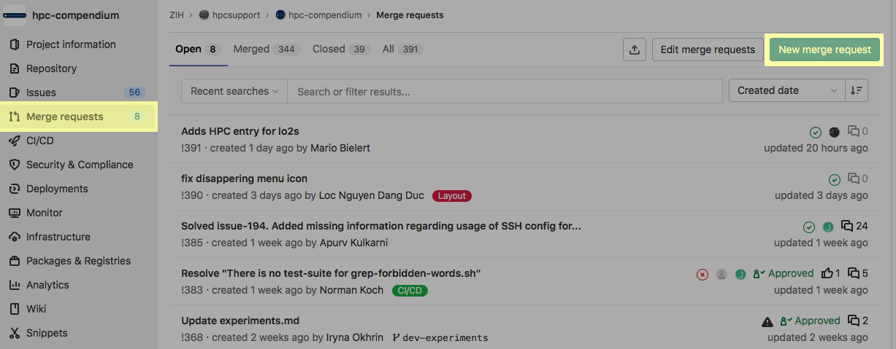

# Contribution Guide for Browser-based Editing  

In the following, it is outlined how to contribute to the
[HPC documentation](https://doc.zih.tu-dresden.de/) of
[TU Dresden/ZIH](https://tu-dresden.de/zih/) by means of GitLab's web interface using a standard web browser only.

## Preparation

First of all you need a user account on 
[gitlab.hrz.tu-chemnitz.de](https://gitlab.hrz.tu-chemnitz.de).
Secondly, you need access to the project "zih/hpcsupport/hpc-compendium" (ID: 8840).
Please, contact martin.schroschk@tu-dresden.de to be added the list of editors. 
Choose "ZIH/hpcsupport/hpc-compendium" in your list of projects.
You will find this document amongst other README files in the list of files at the right hand side.
All articles are stored in the folder "doc.zih.tu-dresden.de".

## Create your private copy of the repository

Your contribution starts by creating your own independent copy of the reposotory that will hold your edits or addtions. 
A private copy is created by creating a branch by clicking on "preview->hpc-compendium/ + new branch" as depicted in this figure: 

If you are not familiar with the basics of git-based document revision control yet, please have a look at [tutorials like these](https://docs.gitlab.com/ee/gitlab-basics/).
Define a branch name that briefly decribes what you plan to change.
For example: "edits-in-document-xyz". Click on "Create branch" as depicted in this figure:

As a result, you should now see your branch's name on top of your list of repository files as depcited here:

## Adding a new article

Navigate the depcited document hierarchie under "doc.zih.tu-dresden.de/docs" to find a topic that fits best to your article. 
To start a completely new article, klick on "+ New file" as depcited here:

Set a file name that corresponds well to your article like "application-xyz.md"
Once you completed your initial edits, klick on "commit".

## Editing existing articles

Navigate the depcited document hierarchie under "doc.zih.tu-dresden.de/docs" until you find the article to be edited.
Clickick on the articles name opens a textual representation of the article.
In the top right corner of it you find the button "Edit" to be clicked in order to make changes.
Once you completed your changes click on "Commit changes".
You might want to add a comment about the changes you made under "Commit message".
Feel free to do as many changes and commits in your private copy (branch) of the repository.

## Submitting articles for publication

Once you are satisfied with your edits you are ready for publication.
Therefore, your edits need to undergo an internal review process.
This process is triggered by doing a "merge-request", which serves the purpose of merging your edits into the public copy of the article repository (after successful review).
Click on "Merge requests" (in the menue to the left) as depcited below.
Then, click on the button "New merge request".
Select your source branch (for exmaple "edits-in-document-xyz") and click on "Compare branches and continue".
The next screen will give you an overview of your changes. 
Once you checked them, click on "Create merge request".

## Revision of articles 

As stated earlier, all changes undergo a review process.
This covers automated checks and the review by a maintainer.
You can follow this process under merge requests (where you intiated the merge request). 
If you are asked to make corrections or changes, follow the directions as indicated.
Once your merge request has been accepted your request for publication and your corresponding private copy with your changes will dissapear and your changes will appear on the branch "preview". 
At this point there is nothing else to do for you. 
Except probably for waiting a little while until your changes become visible on the offical web site.

