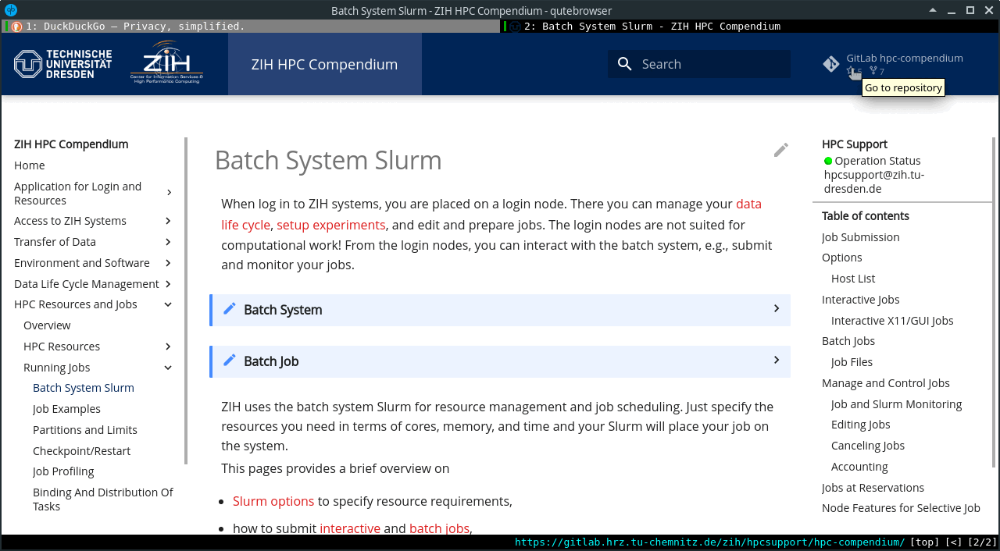

# How-To Contribute

!!! cite "Chinese proverb"

    Ink is better than the best memory.

In principle, there are three possible ways how to contribute to this documentation.

## Contribute via Issue

Users can contribute to the documentation via the
[GitLab issue tracking system](https://gitlab.hrz.tu-chemnitz.de/zih/hpcsupport/hpc-compendium/-/issues).
For that, open an issue to report typos and missing documentation or request for more precise
wording etc. ZIH staff will get in touch with you to resolve the issue and improve the
documentation.

??? tip "Create an issue in GitLab"

    
    {: align=center}

!!! warning "HPC support"

    Non-documentation issues and requests need to be send as ticket to
    [hpcsupport@zih.tu-dresden.de](mailto:hpcsupport@zih.tu-dresden.de).

## Contribute via Web IDE

If you have a web browser (most probably you are using it to read this page) and want to contribute
to the documentation, you are good to go. GitLab offers a rich and versatile web interface to work
with repositories. To start fixing typos and edit source files, please find more information on
[Contributing via web browser](contribute_browser.md).

## Contribute via Local Clone

For experienced Git users, we provide a Docker container that includes all checks of the CI engine
used in the back-end. Using them should ensure that merge requests will not be blocked
due to automatic checking.
The page on [Contributing via local clone](contribute_container.md) provides you with the details
about how to setup and use your local clone.

## Content rules

To ensure quality and to make it easier for readers to understand all content, we follow some
[content rules](content_rules.md). If you follow these rules, you can be sure, that reviews of
your changes take less time and your improvements appear faster on the official web site.
