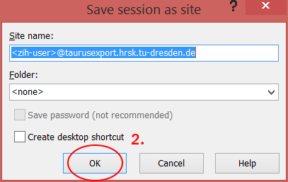
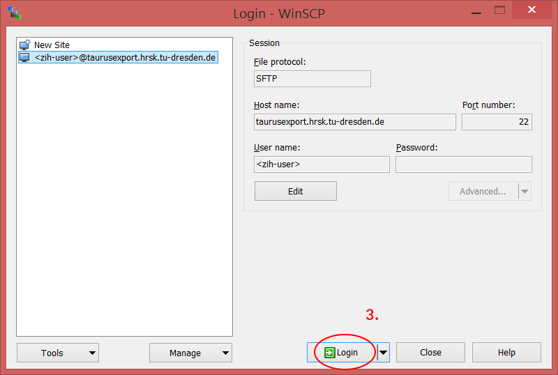

# Transfer Data to/from ZIH Systems via Export Nodes

To copy large data to/from ZIH systems, the so-called **export nodes** should be used. While it is
possible to transfer small files directly via the login nodes, they are not intended to be used that
way. Furthermore, longer transfers will hit the CPU time limit on the login nodes, i.e. the process
get killed. The **export nodes** have a better uplink (10 GBit/s) allowing for higher bandwidth. Note
that you cannot log in via SSH to the export nodes, but only use `scp`, `rsync` or `sftp` on them.

The export nodes are reachable under the hostname `taurusexport.hrsk.tu-dresden.de` (or
`taurusexport3.hrsk.tu-dresden.de` and `taurusexport4.hrsk.tu-dresden.de`).

Please keep in mind that there are different
[filesystems](../data_lifecycle/file_systems.md#recommendations-for-filesystem-usage). Choose the
one that matches your needs.

## Access From Linux

There are at least three tools to exchange data between your local workstation and ZIH systems. They
are explained in the following section in more detail.

!!! important
    The following explanations require that you have already set up your
    [SSH configuration](../access/ssh_login.md#configuring-default-parameters-for-ssh).

### SCP

The tool [`scp`](https://www.man7.org/linux/man-pages/man1/scp.1.html)
(OpenSSH secure file copy) copies files between hosts on a network. To copy all files
in a directory, the option `-r` has to be specified.

??? example "Example: Copy a file from your workstation to ZIH systems"

    ```bash
    marie@local$ scp <file> taurusexport:<target-location>

    # Add -r to copy whole directory
    marie@local$ scp -r <directory> taurusexport:<target-location>
    ```

    For example, if you want to copy your data file `mydata.csv` to the directory `input` in your
    home directory, you would use the following:

    ```console
    marie@local$ scp mydata.csv taurusexport:input/
    ```

??? example "Example: Copy a file from ZIH systems to your workstation"

    ```bash
    marie@local$ scp taurusexport:<file> <target-location>

    # Add -r to copy whole directory
    marie@local$ scp -r taurusexport:<directory> <target-location>
    ```

    For example, if you have a directory named `output` in your home directory on ZIH systems and
    you want to copy it to the directory `/tmp` on your workstation, you would use the following:

    ```console
    marie@local$ scp -r taurusexport:output /tmp
    ```

### SFTP

The tool [`sftp`](https://man7.org/linux/man-pages/man1/sftp.1.html) (OpenSSH secure file transfer)
is a file transfer program, which performs all operations over an encrypted SSH transport. It may
use compression to increase performance.

`sftp` is basically a virtual command line, which you could access and exit as follows.

```console
# Enter virtual command line
marie@local$ sftp taurusexport
# Exit virtual command line
sftp> exit
# or
sftp> <Ctrl+D>
```

After that you have access to the filesystem on ZIH systems, you can use the same commands as on
your local workstation, e.g., `ls`, `cd`, `pwd` etc. If you would access to your local workstation
from this virtual command line, then you have to prefix the command with the letter `l`
(`l`ocal),e.g., `lls`, `lcd` or `lpwd`.

??? example "Example: Copy a file from your workstation to ZIH systems"

    ```console
    marie@local$ sftp taurusexport
    # Copy file
    sftp> put <file>
    # Copy directory
    sftp> put -r <directory>
    ```

??? example "Example: Copy a file from ZIH systems to your local workstation"

    ```console
    marie@local$ sftp taurusexport
    # Copy file
    sftp> get <file>
    # Copy directory
    sftp> get -r <directory>
    ```

### Rsync

[`Rsync`](https://man7.org/linux/man-pages/man1/rsync.1.html), is a fast and extraordinarily
versatile file copying tool. It can copy locally, to/from another host over any remote shell, or
to/from a remote `rsync` daemon. It is famous for its delta-transfer algorithm, which reduces the
amount of data sent over the network by sending only the differences between the source files and
the existing files in the destination.

Type following commands in the terminal when you are in the directory of
the local machine.

??? example "Example: Copy a file from your workstation to ZIH systems"

    ```console
    # Copy file
    marie@local$ rsync <file> taurusexport:<target-location>
    # Copy directory
    marie@local$ rsync -r <directory> taurusexport:<target-location>
    ```

??? example "Example: Copy a file from ZIH systems to your local workstation"

    ```console
    # Copy file
    marie@local$ rsync taurusexport:<file> <target-location>
    # Copy directory
    marie@local$ rsync -r taurusexport:<directory> <target-location>
    ```

## Access From Windows

### Command Line

Windows 10 (1809 and higher) comes with a
[built-in OpenSSH support](https://docs.microsoft.com/en-us/windows-server/administration/openssh/openssh_overview)
including the above described [SCP](#scp) and [SFTP](#sftp).

### GUI - Using WinSCP

First you have to install [WinSCP](http://winscp.net/eng/download.php).

Then you have to execute the WinSCP application and configure some
option as described below.


{: align="center"}


{: align="center"}


{: align="center"}


{: align="center"}

After your connection succeeded, you can copy files from your local workstation to ZIH systems and
the other way around.


{: align="center"}
