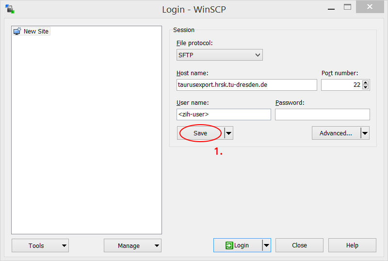
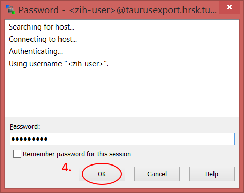
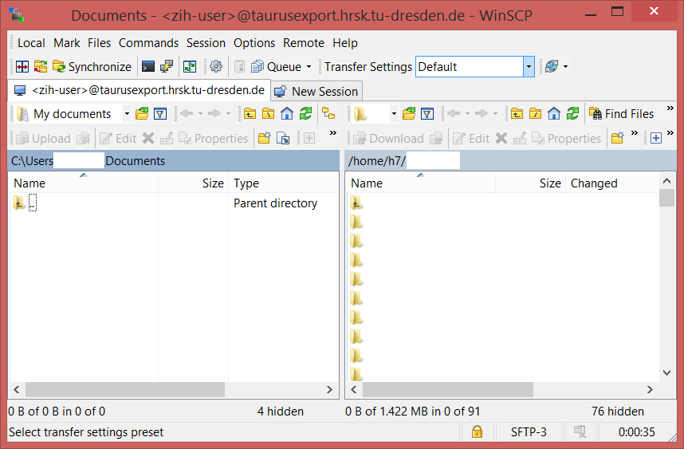

# Export Nodes: Transfer Data to/from ZIH's Filesystems

To copy large data to/from ZIH systems, the so-called **export nodes** should be used. While it is
possible to transfer small files directly via the login nodes, they are not intended to be used that
way. Furthermore, longer transfers will hit the CPU time limit on the login nodes, i.e. the process
get killed. The **export nodes** have a better uplink (10 GBit/s) allowing for higher bandwidth. Note
that you cannot log in via SSH to the export nodes, but only use `scp`, `rsync` or `sftp` on them.

The export nodes are reachable under the hostname `taurusexport.hrsk.tu-dresden.de` (or
`taurusexport3.hrsk.tu-dresden.de` and `taurusexport4.hrsk.tu-dresden.de`).

## Access From Linux

There are at least three tool to exchange data between your local workstation and ZIH systems. All
are explained in the following section in more detail.

!!! important
    The following explanations require that you have already set up you [SSH configuration
    ](../access/ssh_login.md#configuring-default-parameters-for-ssh).

### SCP

The tool [`scp`](https://www.man7.org/linux/man-pages/man1/scp.1.html)
(OpenSSH secure file copy) copies files between hosts on a network. To copy all files
in a directory, the option `-r` has to be specified.

??? example "Example: Copy a file from your workstation to ZIH systems"

    ```console
    marie@local$ scp <file> <zih-user>@taurusexport.hrsk.tu-dresden.de:<target-location>

    # Add -r to copy whole directory
    marie@local$ scp -r <directory> <zih-user>@taurusexport.hrsk.tu-dresden.de:<target-location>
    ```

??? example "Example: Copy a file from ZIH systems to your workstation"

    ```console
    marie@login$ scp <zih-user>@taurusexport.hrsk.tu-dresden.de:<file> <target-location>

    # Add -r to copy whole directory
    marie@login$ scp -r <zih-user>@taurusexport.hrsk.tu-dresden.de:<directory> <target-location>
    ```

### SFTP

The tool [`sftp`](https://man7.org/linux/man-pages/man1/sftp.1.html) (OpenSSH secure file transfer)
is a file transfer program, which performs all operations over an encrypted SSH transport. It may
use compression to increase performance.

`sftp` is basically a virtual command line, which you could access and exit as follows.

```console
# Enter virtual command line
marie@local$ sftp <zih-user>@taurusexport.hrsk.tu-dresden.de
# Exit virtual command line
sftp> exit
# or
sftp> <Ctrl+D>
```

After that you have access to the filesystem on ZIH systems, you can use the same commands as on
your local workstation, e.g., `ls`, `cd`, `pwd` etc. If you would access to your local workstation
from this virtual command line, then you have to prefix the command with the letter `l`
(`l`ocal),e.g., `lls`, `lcd` or `lpwd`.

??? example "Example: Copy a file from your workstation to ZIH systems"

    ```console
    marie@local$ sftp <zih-user>@taurusexport.hrsk.tu-dresden.de
    # Copy file
    sftp> put <file>
    # Copy directory
    sftp> put -r <directory>
    ```

??? example "Example: Copy a file from ZIH systems to your local workstation"

    ```console
    marie@local$ sftp <zih-user>@taurusexport.hrsk.tu-dresden.de
    # Copy file
    sftp> get <file>
    # Copy directory
    sftp> get -r <directory>
    ```

### Rsync

[`Rsync`](https://man7.org/linux/man-pages/man1/rsync.1.html), is a fast and extraordinarily
versatile file copying tool. It can copy locally, to/from another host over any remote shell, or
to/from a remote `rsync` daemon. It is famous for its delta-transfer algorithm, which reduces the
amount of data sent over the network by sending only the differences between the source files and
the existing files in the destination.

Type following commands in the terminal when you are in the directory of
the local machine.

??? example "Example: Copy a file from your workstation to ZIH systems"

    ```console
    # Copy file
    marie@local$ rsync <file> <zih-user>@taurusexport.hrsk.tu-dresden.de:<target-location>
    # Copy directory
    marie@local$ rsync -r <directory> <zih-user>@taurusexport.hrsk.tu-dresden.de:<target-location>
    ```

??? example "Example: Copy a file from ZIH systems to your local workstation"

    ```console
    # Copy file
    marie@local$ rsync <zih-user>@taurusexport.hrsk.tu-dresden.de:<file> <target-location>
    # Copy directory
    marie@local$ rsync -r <zih-user>@taurusexport.hrsk.tu-dresden.de:<directory> <target-location>
    ```
!!!info
    User can also use SSH configuration file to transfer the data from/to the ZIH systems. Please refer to 'Connecting from Linux' section on [Connecting with SSH](../access/ssh_login.md) page for more information on how to create and use the SSH configuration file. In the newly created profile, simply replace values in front of `HostName` with name of the export node as shown below.

    ```bash
    Host <configuration_profile_name>
      # Use name of the export node after HostName
      HostName taurusexport.hrsk.tu-dresden.de
    [...]
    ```

    Once the configuration is created, user can initiate transfer simply using any of the tools mentioned above. 
    
    ```console
    # Transfer from ZIH system
    marie@local$ rsync -r <configuration_profile_name>:<directory_or_file> <target-location>

    # Transfer to ZIH system
    marie@local$ rsync -r <file_or_folder_on_local_machine> <configuration_profile_name>:<target-location>
    ```

## Access From Windows

First you have to install [WinSCP](http://winscp.net/eng/download.php).

Then you have to execute the WinSCP application and configure some
option as described below.


{: align="center"}


{: align="center"}


{: align="center"}


{: align="center"}

After your connection succeeded, you can copy files from your local workstation to ZIH systems and
the other way around.


{: align="center"}
