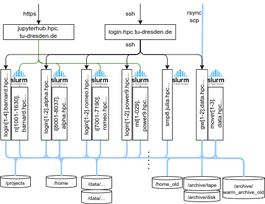

# Architectural Re-Design 2023

With the replacement of the Taurus system by the cluster `Barnard` in 2023,
the rest of the installed hardware had to be re-connected, both with
Infiniband and with Ethernet.

{: align=center}

## Compute Systems

For the users, all compute clusters now act as seperate entities. They have their own
login nodes of the same hardware and their own Slurm batch systems. It is now no longer up
to the batch system to decide if a job runs on AMD or Intel hardware. The users now chose
the hardware by the choice of the correct login node.

The login nodes can be used for smaller interactive jobs on the clusters. There are
restrictions in place, though, wrt. usable resources and time per user. For larger
computations, please use interactive jobs.

## Storage Systems

The `/project` is mounted via NFS, without change (incl. snapshots). We now have `/home`
as a Lustre filesystem on NVMe disks. This comes now without snapshots, and without backup
to tape. For convenience, we will make the old home available as `/home_old` on the
datamover nodes for the data migration period.

`/warm_archive` is mounted on the data movers, only.

### Scratch Filesystems

With emerging technologies and new players in the file system market,
