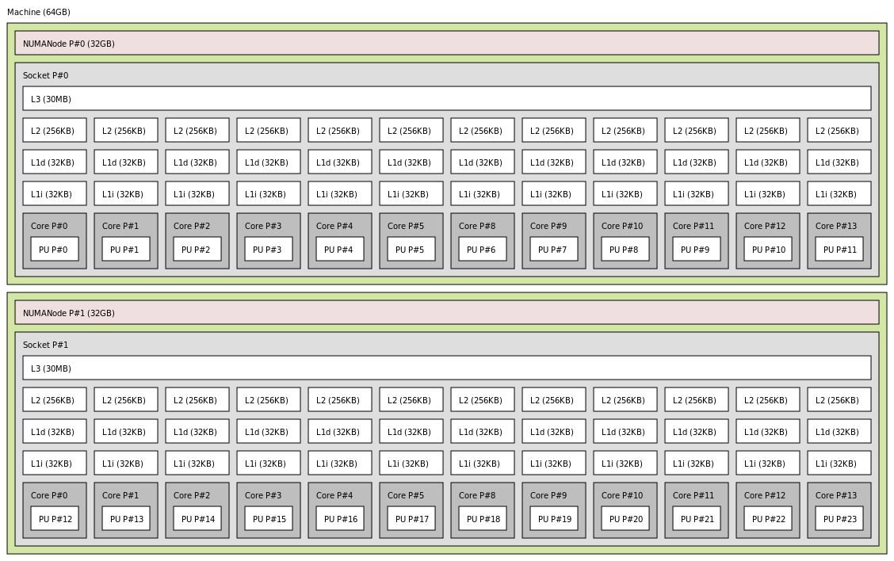
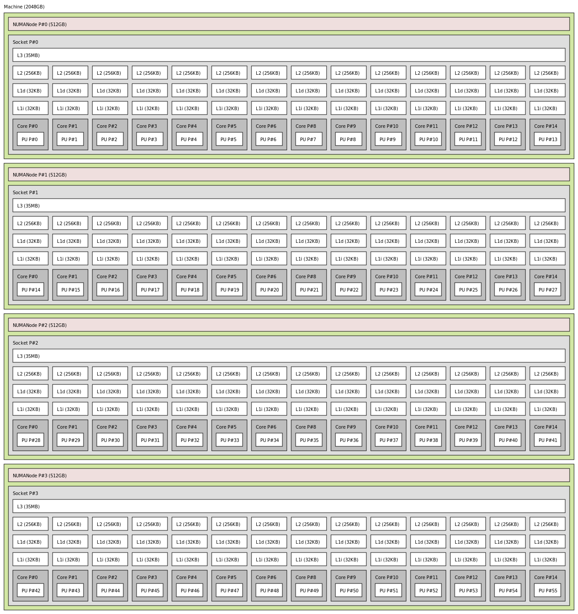

# HPC Resources

HPC resources in ZIH systems comprise the *High Performance Computing and Storage Complex* and its
extension *High Performance Computing – Data Analytics*. In total it offers scientists
about 60,000 CPU cores and a peak performance of more than 1.5 quadrillion floating point
operations per second. The architecture specifically tailored to data-intensive computing, Big Data
analytics, and artificial intelligence methods with extensive capabilities for energy measurement
and performance monitoring provides ideal conditions to achieve the ambitious research goals of the
users and the ZIH.

## Login and Export Nodes

- 3 Login-Nodes `tauruslogin[3-6].hrsk.tu-dresden.de`
    - Each login node is equipped with 2x Intel(R) Xeon(R) CPU E5-2680 v3 with 24 cores in total @
      2.50 GHz, Multithreading disabled, 64 GB RAM, 128 GB SSD local disk
    - IPs: 141.30.73.\[102-105\]
- 2 Data-Transfer-Nodes `taurusexport[3-4].hrsk.tu-dresden.de`
    - DNS Alias `taurusexport.hrsk.tu-dresden.de`
    - 2 Servers without interactive login, only available via file transfer protocols
      (`rsync`, `ftp`)
    - IPs: 141.30.73.82/83
    - Further information on the usage is documented on the site
      [Export Nodes](../data_transfer/export_nodes.md)

## AMD Rome CPUs + NVIDIA A100

- 34 nodes, each with
    - 8 x NVIDIA A100-SXM4 Tensor Core-GPUs
    - 2 x AMD EPYC CPU 7352 (24 cores) @ 2.3 GHz, Multithreading disabled
    - 1 TB RAM
    - 3.5 TB local memory at NVMe device at `/tmp`
- Hostnames: `taurusi[8001-8034]`
- Slurm partition: `alpha`
- Further information on the usage is documented on the site [AMD Rome Nodes](rome_nodes.md)

## Island 7 - AMD Rome CPUs

- 192 nodes, each with
    - 2 x AMD EPYC CPU 7702 (64 cores) @ 2.0 GHz, Multithreading enabled,
    - 512 GB RAM
    - 200 GB local memory on SSD at `/tmp`
- Hostnames: `taurusi[7001-7192]`
- Slurm partition: `romeo`
- Further information on the usage is documented on the site [AMD Rome Nodes](rome_nodes.md)

## Large SMP System HPE Superdome Flex

- 1 node, with
    - 32 x Intel(R) Xeon(R) Platinum 8276M CPU @ 2.20 GHz (28 cores)
    - 47 TB RAM
- Configured as one single node
- 48 TB RAM (usable: 47 TB - one TB is used for cache coherence protocols)
- 370 TB of fast NVME storage available at `/nvme/<projectname>`
- Hostname: `taurussmp8`
- Slurm partition: `julia`
- Further information on the usage is documented on the site [HPE Superdome Flex](sd_flex.md)

## IBM Power9 Nodes for Machine Learning

For machine learning, we have IBM AC922 nodes installed with this configuration:

- 32 nodes, each with
    - 2 x IBM Power9 CPU (2.80 GHz, 3.10 GHz boost, 22 cores)
    - 256 GB RAM DDR4 2666 MHz
    - 6 x NVIDIA VOLTA V100 with 32 GB HBM2
    - NVLINK bandwidth 150 GB/s between GPUs and host
- Hostnames: `taurusml[1-32]`
- Slurm partition: `ml`

## Island 6 - Intel Haswell CPUs

- 612 nodes, each with
    - 2 x Intel(R) Xeon(R) CPU E5-2680 v3 (12 cores) @ 2.50 GHz, Multithreading disabled
    - 128 GB local memory on SSD
- Varying amounts of main memory (selected automatically by the batch system for you according to
  your job requirements)
  * 594 nodes with 2.67 GB RAM per core (64 GB in total): `taurusi[6001-6540,6559-6612]`
    - 18 nodes with 10.67 GB RAM per core (256 GB in total): `taurusi[6541-6558]`
- Hostnames: `taurusi[6001-6612]`
- Slurm Partition: `haswell`

??? hint "Node topology"

    
    {: align=center}

## Island 2 Phase 2 - Intel Haswell CPUs + NVIDIA K80 GPUs

- 64 nodes, each with
    - 2 x Intel(R) Xeon(R) CPU E5-E5-2680 v3 (12 cores) @ 2.50 GHz, Multithreading disabled
    - 64 GB RAM (2.67 GB per core)
    - 128 GB local memory on SSD
    - 4 x NVIDIA Tesla K80 (12 GB GDDR RAM) GPUs
- Hostnames: `taurusi[2045-2108]`
- Slurm Partition: `gpu2`
- Node topology, same as [island 4 - 6](#island-6-intel-haswell-cpus)

## SMP Nodes - up to 2 TB RAM

- 5 Nodes, each with
    - 4 x Intel(R) Xeon(R) CPU E7-4850 v3 (14 cores) @ 2.20 GHz, Multithreading disabled
    - 2 TB RAM
- Hostnames: `taurussmp[3-7]`
- Slurm partition: `smp2`

??? hint "Node topology"

    
    {: align=center}
