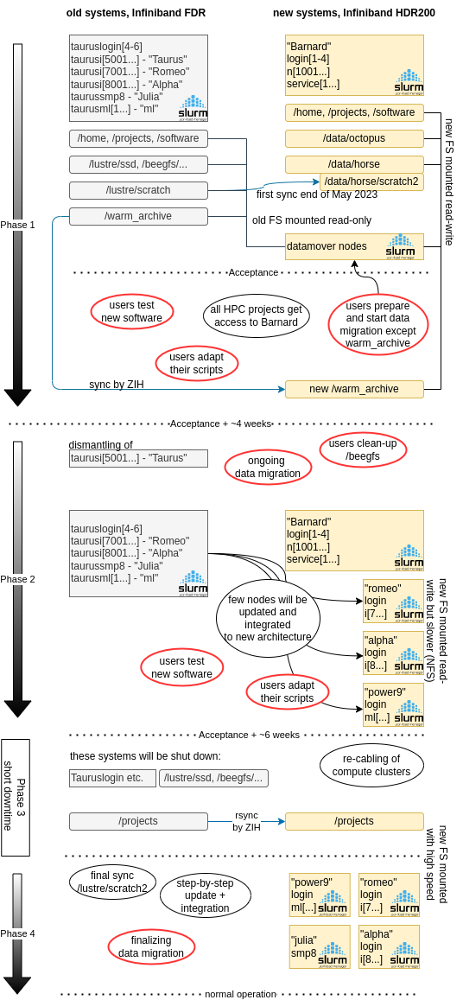

# Migration 2023

## Brief Overview over Coming Changes

All components of Taurus will be dismantled step by step.

### New Hardware

The new HPC system "Barnard" from Bull comes with these main properties:

* 630 compute nodes based on Intel Sapphire Rapids
* new Lustre-based storage systems
* HDR Infiniband network large enough to integrate existing and near-future non-Bull hardware
* To help our users to find the best location for their data we now use the name of
animals (size, speed) as mnemonics.

More details can be found in the [overview](/jobs_and_resources/hardware_overview_2023).

### New Architecture

Over the last decade we have been running our HPC system of high heterogeneity with a single
Slurm batch system. This made things very complicated, especially to inexperienced users.
To lower this hurdle we now create homogenous clusters with their own Slurm instances and with
cluster specific login nodes running on the same CPU. Job submission is possible only
from within the cluster (compute or login node).

All clusters will be integrated to the new Infiniband fabric and have then the same access to
the shared filesystems. This recabling requires a brief downtime of a few days.

[Details on architecture](/jobs_and_resources/architecture_2023).

### New Software

The new nodes run on Linux RHEL 8.7. For a seamless integration of other compute hardware,
all operating system will be updated to the same versions of OS, Mellanox and Lustre drivers.
With this all application software was re-built consequently using GIT and CI for handling
the multitude of versions.

We start with `release/23.04` which is based on software reqeusts from user feedbacks of our
HPC users. Most major software versions exist on all hardware platforms.

## Migration Path

Please make sure to have read [Details on architecture](/jobs_and_resources/architecture_2023) before
further reading.

The migration can only be successful as a joint effort of HPC team and users. Here is a description
of the action items.

|When?|TODO ZIH |TODO users |Remark |
|---|---|---|---|
| done (May 2023) |first sync /scratch to /data/horse/old_scratch2| |copied 4 PB in about 3 weeks|
| done (June 2023) |enable access to Barnard| |initialized LDAP tree with Taurus users|
| done (July 2023) | |install new software stack|tedious work |
| ASAP | |adapt scripts|new Slurm version, new resources, no partitions|
| August 2023 | |test new software stack on Barnard|new versions sometimes require different prerequisites|
| August 2023| |test new software stack on other clusters|a few nodes will be made available with the new sw stack, but with the old filesystems|
| ASAP | |prepare data migration|The small filesystems `/beegfs` and `/lustre/ssd`, and `/home` are mounted on the old systems "until the end". They will *not* be migrated to the new system.|
| July 2023 | sync `/warm_archive` to new hardware| |using datamover nodes with Slurm jobs |
| September 2023 |prepare recabling of older hardware (Bull)| |integrate other clusters in the IB infrastructure |
| Autumn 2023 |finalize integration of other clusters (Bull)| |**~2 days downtime**, final rsync and migration of `/projects`, `/warm_archive`|
| Autumn 2023 ||transfer last data from old filesystems | `/beegfs`, `/lustre/scratch`, `/lustre/ssd` are no longer available on the new systems|

### Data Migration

Why do users need to copy their data? Why only some? How to do it best?

* The sync of hundreds of terabytes can only be done planned and carefully.
(/scratch, /warm_archive, /projects). The HPC team will use multiple syncs
to not forget the last bytes. During the downtime, /projects will be migrated.
* User homes are relatively small and can be copied by the scientists.
Keeping in mind that maybe deleting and archiving is a better choice.
* For this, datamover nodes are available to run transfer jobs under Slurm.

### A Graphical Overview

(red: user action required):

{: align=center}
