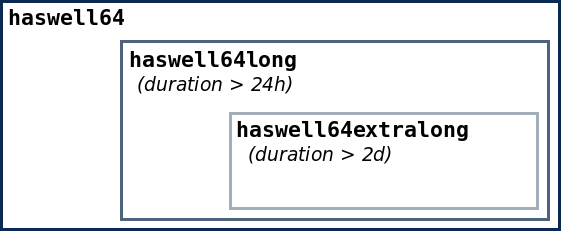

# Partitions and Limits

There is no such thing as free lunch at ZIH systems. Since compute nodes are operated in multi-user
node by default, jobs of several users can run at the same time at the very same node sharing
resources, like memory (but not CPU). On the other hand, a higher throughput can be achieved by
smaller jobs. Thus, restrictions w.r.t. [memory](#memory-limits) and
[runtime limits](#runtime-limits) have to be respected when submitting jobs.

## Runtime Limits

!!! warning "Runtime limits on login nodes"

    There is a time limit of 600 seconds set for processes on login nodes. Each process running
    longer than this time limit is automatically killed. The login nodes are shared ressources
    between all users of ZIH system and thus, need to be available and cannot be used for productive
    runs.

    ```
    CPU time limit exceeded
    ```

    Please submit extensive application runs to the compute nodes using the [batch system](slurm.md).

!!! note "Runtime limits are enforced."

    A job is canceled as soon as it exceeds its requested limit. Currently, the maximum run time
    limit is 7 days.

Shorter jobs come with multiple advantages:

- lower risk of loss of computing time,
- shorter waiting time for scheduling,
- higher job fluctuation; thus, jobs with high priorities may start faster.

To bring down the percentage of long running jobs we restrict the number of cores with jobs longer
than 2 days to approximately 50% and with jobs longer than 24 to 75% of the total number of cores.
(These numbers are subject to change.) As best practice we advise a run time of about 8h.

!!! hint "Please always try to make a good estimation of your needed time limit."

    For this, you can use a command line like this to compare the requested timelimit with the
    elapsed time for your completed jobs that started after a given date:

    ```console
    marie@login$ sacct -X -S 2021-01-01 -E now --format=start,JobID,jobname,elapsed,timelimit -s COMPLETED
    ```

Instead of running one long job, you should split it up into a chain job. Even applications that are
not capable of checkpoint/restart can be adapted. Please refer to the section
[Checkpoint/Restart](../jobs_and_resources/checkpoint_restart.md) for further documentation.


{: align="center" summary="Partitions image"}

## Memory Limits

!!! note "Memory limits are enforced."

    Jobs which exceed their per-node memory limit are killed automatically by the batch system.

Memory requirements for your job can be specified via the `sbatch/srun` parameters:

`--mem-per-cpu=<MB>` or `--mem=<MB>` (which is "memory per node"). The **default limit** regardless
of the partition it runs on is quite low at **300 MB** per CPU. If you need more memory, you need
to request it.

ZIH systems comprise different sets of nodes with different amount of installed memory which affect
where your job may be run. To achieve the shortest possible waiting time for your jobs, you should
be aware of the limits shown in the following table.

???+ hint "Partitions and memory limits"

    | Partition          | Nodes                                    | # Nodes | Cores per Node  | MB per Core | MB per Node | GPUs per Node     |
    |:-------------------|:-----------------------------------------|:--------|:----------------|:------------|:------------|:------------------|
    | `interactive`      | `taurusi[6605-6612]`                     | `8`     | `24`            | `2541`      | `61000`     | `-`               |
    | `haswell64`        | `taurusi[4037-4104,5001-5612,6001-6604]` | `1284`  | `24`            | `2541`      | `61000`     | `-`               |
    | `haswell64ht`      | `taurusi[4018-4036]`                     | `18`    | `24 (HT: 48)`   | `1270*`     | `61000`     | `-`               |
    | `haswell128`       | `taurusi[4105-4188]`                     | `84`    | `24`            | `5250`      | `126000`    | `-`               |
    | `haswell256`       | `taurusi[4189-4232]`                     | `44`    | `24`            | `10583`     | `254000`    | `-`               |
    | `broadwell`        | `taurusi[4233-4264]`                     | `32`    | `28`            | `2214`      | `62000`     | `-`               |
    | `smp2`             | `taurussmp[3-7]`                         | `5`     | `56`            | `36500`     | `2044000`   | `-`               |
    | `gpu2`**           | `taurusi[2045-2103]`                     | `59`    | `24`            | `2583`      | `62000`     | `4 (2 dual GPUs)` |
    | `hpdlf`            | `taurusa[3-16]`                          | `14`    | `12`            | `7916`      | `95000`     | `3`               |
    | `ml`**             | `taurusml[1-32]`                         | `32`    | `44 (HT: 176)`  | `1443*`     | `254000`    | `6`               |
    | `romeo`**          | `taurusi[7001-7192]`                     | `192`   | `128 (HT: 256)` | `1972*`     | `505000`    | `-`               |
    | `julia`            | `taurussmp8`                             | `1`     | `896`           | `54006`     | `48390000`  | `-`               |
    | `alpha`**          | `taurusi[8001-8034]`                     | `34`    | `48 (HT: 96)`   | `10312*`    | `990000`    | `8`               |
    {: summary="Partitions and limits table" align="bottom"}

## Slurm Partitions

The available compute nodes are grouped into logical (possibly overlapping) sets, the so-called
**partitions**. You can submit your job to a certain partition using the Slurm option
`--partition=<partition-name>`.

Some nodes have multithreading (SMT) enabled, so for every physical core allocated
(e.g., with `SLURM_HINT=nomultithread`), you will always get `MB per Core`*`number of threads`,
because the memory of the other threads is allocated implicitly, too.

Some partitions have a *interactive* counterpart for interactive jobs. The corresponding partitions
is suffixed with `-interactive` (e.g. `ml-interactive`) and have the same configuration.

There is also a meta partition `haswell`, which contain partition `haswell64`, `haswell128`,
`haswell256` and `smp2`and this is also the default partition. If you specify no partition or
partition `haswell` a Slurm plugin will choose the partition which fits to your memory requirements.
There are some other partitions, which are not specified in the table above, but those partitions
should not be used directly.

<!-- partitions_and_limits_table -->
| Partition | Nodes | # Nodes | Cores per Node [SMT] | MB per Core [SMT] | MB per Node | GPUs per Node |
|:--------|:------|--------:|---------------:|------------:|------------:|--------------:|
| gpu2 | taurusi[2045-2103] | 59 | 24 | 2584 | 62000 | 4|
| gpu2-interactive | taurusi[2045-2103] | 59 | 24 | 2584 | 62000 | 4|
| haswell64ht | taurusi[4019-4036] | 18 | 24 [48] | 2542 [1271] | 61000 | -|
| interactive | taurusi[6605-6612] | 8 | 24 | 2542 | 61000 | -|
| smp2 | taurussmp[3-7] | 5 | 56 | 36500 | 2044000 | -|
| ml-interactive | taurusml[1-2] | 2 | 44 [176] | 5773 [1444] | 254000 | 6|
| nvme | taurusnvme[1-90] | 90 | 16 [32] | 3750 [1875] | 60000 | 8|
| romeo-interactive | taurusi[7001-7002] | 2 | 128 [256] | 3946 [1973] | 505000 | -|
| julia | taurussmp8 | 1 | 896 | 54007 | 48390000 | -|
| alpha | taurusi[8003-8034] | 32 | 48 [96] | 20625 [10313] | 990000 | 8|
| alpha-interactive | taurusi[8001-8002] | 2 | 48 [96] | 20625 [10313] | 990000 | 8|
{: summary="Partitions and limits table" align="bottom"}
