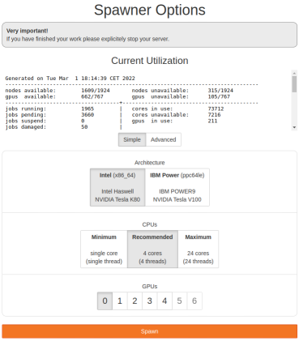
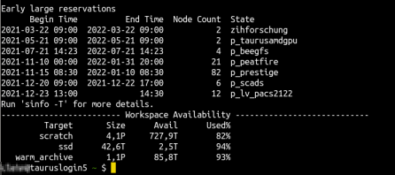

# Quick Start

This page is intended to provide the key information on starting to work on the ZIH High
Performance Computing (HPC) system and is of particular importance to new users.
It is a map of the compendium as it provides an overview of the most relevant topics and
directs to the corresponding detailed articles within the compendium.

The topics covered include:

* Applying for the ZIH HPC login: things to know about obtaining access to the ZIH HPC
* Accessing the ZIH HPC system: the list of options and corresponding instructions
* Handling Data: the do's and don'ts of importing, transferring, managing data of your project
* Accessing software: understanding ZIH HPC software options for your software needs
* Running a job: linking all of the above together to successfully setup and execute your code/program

## Introductory Instructions

The ZIH HPC system is a Linux system (as most HPC systems). Some basic Linux knowledge is
therefore needed. In preparation, explore the [collection](https://hpc-wiki.info/hpc/Shell)
of the most important Linux commands needed on the HPC system.

To work on the ZIH HPC system and to follow the instructions on this page as well as other
compendium pages, it is important to be familiar with the
[basic terminology](https://hpc-wiki.info/hpc/HPC-Dictionary) such as
[SSH](https://hpc-wiki.info/hpc/SSH), [cluster](https://hpc-wiki.info/hpc/HPC-Dictionary#Cluster),
[login node](https://hpc-wiki.info/hpc/HPC-Dictionary#Login_Node),
[compute node](https://hpc-wiki.info/hpc/HPC-Dictionary#Backend_Node),
[local and shared filesystem](https://hpc-wiki.info/hpc/HPC-Dictionary#File_System),
[command line (CLI) or shell](https://hpc-wiki.info/hpc/Shell).

If you are new to HPC, we recommend visiting the introductory article about HPC at
[https://hpc-wiki.info/hpc/Getting_Started](https://hpc-wiki.info/hpc/Getting_Started).

Throughout the compendium `marie@login` is used as an indication of working on the ZIH HPC command
line and `marie@local` as working on your local machine's command line. `marie` stands-in for your
username.

## Obtaining Access

To use the ZIH HPC system, an ZIH HPC login is needed. It is different from the ZIH login (which
members of the TU Dresden have), but has the same credentials.

The ZIH HPC system is structured by so-called HPC projects. To work on the ZIH HPC system, there
are two possibilities:

* Creating a [new project](../application/project_request_form.md)
* Joining an existing project: e.g. new researchers in an existing project, students in projects for
teaching purposes. The details will be provided to you by the project administrator.

A HPC project on the ZIH HPC system includes: a project directory, project group, project members
(at least admin and manager), and resource quotas for compute time (CPU/GPU hours) and storage.

One important aspect for HPC projects is a collaborative working style (research groups, student
groups for teaching purposes). Thus, granting appropriate file permissions and creating a unified
and consistent software environment for multiple users is essential.
This aspect is considered for all the following recommendations.

## Accessing the ZIH HPC System

The ZIH HPC system can be accessed only within the TU Dresden campus networks.
Access from outside is possible by establishing a [VPN connection](https://tu-dresden.de/zih/dienste/service-katalog/arbeitsumgebung/zugang_datennetz/vpn#section-4).

There are different ways to access the ZIH HPC system (which are described in more detail below),
depending on the user's needs and previous knowledge:

* [JupyterHub](../access/jupyterhub.md): browser based connection, easiest way for beginners
* [SSH connection](../access/ssh_login.md) (command line/terminal/console): "classical" connection,
command line knowledge is required
* [Desktop Visualization](../access/desktop_cloud_visualization.md),
  [Graphical User Interfaces (GUIs)](../access/graphical_applications_with_webvnc.md) and similar:
  e.g. commercial software such as Ansys, LS-DYNA (are not covered here).

Next, the mentioned access methods are described step by step.

### JupyterHub

1. Access JupyterHub here [https://taurus.hrsk.tu-dresden.de/jupyter](https://taurus.hrsk.tu-dresden.de/jupyter).
1. Start by clicking on the `Start my server` button and you will see two Spawner Options,
`Simple` and `Advanced`.
1. The `Simple` view offers a minimal selection of parameters to choose from. The `Advanced`
view gives more opportunities. To get started, choose the `Simple` view, follow the image below
for choice of parameters and then click `Spawn`

{: align="center"}
1. You will see:

1. Once it loads, you will see the possibility between opening a `Notebook`, `Console` or `Other`.
Note that you will now be working in your home directory as opposed to a specific workspace
(see [Data Management and Data Transfer](#data-management-and-data-transfer) section below for more details).

!!! caution "Stopping session on JupyterHub"
    Once you are done with your work on the ZIH HPC system, explicitly stop the session by logging
    out by clicking `File` &#8594 `Log Out` &#8594 `Stop My Server`.
    Alternatively, choose `File` &#8594 `Hub control panel` &#8594 `Stop My Server`.

Explore the [JupyterHub](../access/jupyterhub.md) page for more information.

### SSH Connection (Command Line)

The more "classical" way to work with HPC is based on the command line. After following
the instructions below, you will be on one of the login nodes.
This is the starting point for many tasks such as running programs and data management.

!!! hint "Using SSH key pair"

    We recommend to create an SSH key pair by following the
    [instructions here](../access/ssh_login.md#before-your-first-connection).
    Using an SSH key pair is beneficial for security reasons, although it is not necessary to work
    with the ZIH HPC system.

=== "Windows 10 and higher/Mac/Linux users"

    Windows users might need to install [Windows Terminal](https://www.microsoft.com/en-us/p/windows-terminal/9n0dx20hk701?activetab=pivot:overviewtab).

    1. Open a terminal/shell/console and type in
    ```console
    marie@local$ ssh marie@taurus.hrsk.tu-dresden.de
    ```

    1. After typing in your password, you end up seeing something like the following image.

    
    {: align="center"}

=== "Users of older versions of Windows"

    Install and set up [MobaXTerm](../access/ssh_login_mobaxterm) or [PuTTY](../access/ssh_login_putty).

For more information explore the [access compendium page](../access/ssh_login.md).
[Configuring default parameters](../access/ssh_login.md#configuring-default-parameters-for-ssh)
makes connecting more comfortable.

## Data Management and Data Transfer

First, it is shown how to create a workspace, then how to transfer data within and to/from the ZIH
HPC system. Also keep in mind to set the file permissions when collaborating with other researchers.

### Create a Workspace

There are different areas for storing your data on the ZIH HPC system, called [Filesystems](../data_lifecycle/file_systems.md).
You need to create a [workspace](../data_lifecycle/workspaces.md) for your data (see example
below) on one of these filesystems.

The filesystems have different [properties](../data_lifecycle/file_systems.md) (available space,
storage time limit, permission rights). Therefore, choose the one that fits your project best.
To start we recommend the Lustre filesystem **scratch**.

!!! example "Creating a workspace on Lustre filesystem scratch"

    The following command creates a workspace

    ```console
    marie@login$ ws_allocate -F scratch -r 7 -m marie.testuser@tu-dresden.de -n test-workspace -d 90
    Info: creating workspace.
    /scratch/ws/marie-test-workspace
    remaining extensions  : 10
    remaining time in days: 90
    ```

    To explain:

    - `ws_allocate` - command to allocate
    - `-F scratch` - on the scratch filesystem
    - `-r 7 -m marie.testuser@tu-dresden.de` - send a reminder to `marie.testuser@tu-dresden.de` 7 days before expiration
    - `-n test-workspace` - workspace's name
    - `-d 90` - a life time of 90 days

    The path to this workspace is `/scratch/ws/marie-test-workspace`. You will need it when
    transferring data or running jobs.

Find more [information on workspaces in the compendium](../data_lifecycle/workspaces.md).

### Transferring Data **Within** the ZIH HPC System

The approach depends on the data volume: up to 100 MB or above.

???+ example "`cp`/`mv` for small data (up to 100 MB)"

    Use the command `cp` to copy the file `example.R` from your ZIH home directory to a workspace:

     ```console
     marie@login$ cp /home/marie/example.R /scratch/ws/marie-test-workspace
     ```

    Analogously use command `mv` to move a file.

    Find more examples for the `cp` command on [bropages.org](http://bropages.org/cp) or use
    manual pages with `man cp`.

???+ example "`dtcp`/`dtmv` for medium to large data (above 100 MB)"

    Use the command `dtcp` to copy the directory `/warm_archive/ws/large-dataset` from one
    filesystem location to another:

    ```console
    marie@login$ dtcp -r /warm_archive/ws/large-dataset /scratch/ws/marie-test-workspace/data
    ```
    Analogously use the command `dtmv` to move a file.

    More details on the [datamover](../data_transfer/datamover.md) are available in the data
    transfer section.

### Transferring Data **To/From** the ZIH HPC System

???+ example "`scp` for transferring data from/to the ZIH HPC system"

    Copy the file `example.R` from your local machine to a workspace on the ZIH system:

    ```console
    marie@local$ scp /home/marie/Documents/example.R marie@taurusexport.hrsk.tu-dresden.de:/scratch/ws/0/your_workspace/
    Password:
    example.R                                                     100%  312    32.2KB/s   00:00``
    ```

    Note, the target path contains `taurusexport.hrsk.tu-dresden.de`, which is one of the
    so called [export nodes](../data_transfer/export_nodes.md) that allows for data transfer from/to the outside.

???+ example "`scp` to transfer data from the ZIH HPC system to local machine"

    Copy the file `results.csv` from a workspace on the ZIH HPC system to your local machine:

    ```console
    marie@local$ scp marie@taurusexport.hrsk.tu-dresden.de:/scratch/ws/0/marie-test-workspace/results.csv /home/marie/Documents/
    ```

    Feel free to explore further [examples](http://bropages.org/scp) of the `scp` command.
    Furthermore, checkout other possibilities on the compendium for working with the
    [export nodes](../data_transfer/export_nodes.md).

!!! caution "Terabytes of data"

    If you are planning to move terabytes or even more from an outside machine into the ZIH system,
    please contact the ZIH [HPC support](mailto:hpcsupport@tu-dresden.de) in advance.

### Permission Rights Are Crucial In a Collaborative Setting

Whenever working within a collaborative setting, take care of the file permissions.
Esp. after creating and transferring data, file permission configuration might be necessary.

**By default, workspaces are accessible only for the user who created the workspace.**
Files created by a user in the project directory have read-only access for other group members
by default. Therefore, the correct file permissions must be configured (using `chmod`
and `chgrp`) for all files in the project home and the workspaces that should be fully
accessible (read, write, execute) to your collaborator group.
Please refer to an [overview on users and permissions](https://hpc-wiki.info/hpc/Introduction_to_Linux_in_HPC/Users_and_permissions)
in Linux.

??? example "Checking and changing file permissions"

    The following example checks for file permissions (`ls -la`) of the file dataset.csv and adds
    permissions for write access for the group (`chmod g+w`).

    ```console
    marie@login$ ls -la /scratch/ws/0/marie-training-data/dataset.csv # list file permissions
    -rw-r--r-- 1 marie p_number_crunch 0 12. Jan 15:11 /scratch/ws/0/marie-training-data/dataset.csv

    marie@login$ chmod g+w /scratch/ws/0/marie-training-data/dataset.csv # add write permissions

    marie@login$ ls -la /scratch/ws/0/marie-training-data/dataset.csv # list file permissions again
    -rw-rw-r-- 1 marie p_number_crunch 0 12. Jan 15:11 /scratch/ws/0/marie-training-data/dataset.csv
    ```

??? hint "GUI-based data management"

    - Transferring data and managing file permissions for smaller amounts of data can be handled
    by SSH clients.
    - More so for Linux-based systems, `sshfs` (a command-line tool for safely mounting a remote
    folder from a server to a local machine) can be used to mount user home, project home or
    workspaces within the local folder structure.
    Data can be transferred directly with drag and drop in your local file explorer.
    Moreover, this approach makes it possible to edit files with your common editors and tools on
    the local machine.
    - Windows users can use [SFTP Drive](https://www.nsoftware.com/sftp/drive/) utility, to mount
    remote filesystems as Windows drives.

## Software Environment

The [software](../software/overview.md) on the ZIH HPC system is not installed system-wide,
but is provided within the so-called [modules](../software/modules.md). In order to use specific
software you need to "load" the respective module.

!!! note

    Different partitions might have different versions available of the same software.
    See [software](../software/overview.md) for more details.

- Use `module spider <software>` command to check all available versions of the software.

```console
marie@login$ module spider Python
--------------------------------------------------------------------------------------------------------------------------------
  Python:
--------------------------------------------------------------------------------------------------------------------------------
    Description:
      Python is a programming language that lets you work more quickly and integrate your systems more effectively.

     Versions:
        Python/2.7.14-foss-2018a
        [...]
        Python/3.8.6
        Python/3.9.5-bare
        Python/3.9.5
     Other possible modules matches:
        Biopython  Boost.Python  GitPython  IPython  PythonAnaconda  flatbuffers-python  netcdf4-python  protobuf-python  python

--------------------------------------------------------------------------------------------------------------------------------
  To find other possible module matches execute:

      $ module -r spider '.*Python.*'

--------------------------------------------------------------------------------------------------------------------------------
  For detailed information about a specific "Python" package (including how to load the modules) use the module's full name.
  Note that names that have a trailing (E) are extensions provided by other modules.
  For example:

     $ module spider Python/3.9.5
--------------------------------------------------------------------------------------------------------------------------------
```

We now see the list of versions of Python that are available.

- To get information on a specific module, use `module spider <software>/<version>` call.

```console  hl_lines="9 10 11"
marie@login$ module spider Python/3.9.5
--------------------------------------------------------------------------------------------------------------------------------
  Python: Python/3.9.5
--------------------------------------------------------------------------------------------------------------------------------
    Description:
      Python is a programming language that lets you work more quickly and integrate your systems more effectively.


    You will need to load all module(s) on any one of the lines below before the "Python/3.9.5" module is available to load.

      modenv/hiera  GCCcore/10.3.0

    This module provides the following extensions:

      alabaster/0.7.12 (E), appdirs/1.4.4 (E), asn1crypto/1.4.0 (E), atomicwrites/1.4.0 (E), attrs/21.2.0 (E), Babel/2.9.1 (E), bcrypt/3.2.0 (E), bitstring/3.1.7 (E), blist/1.3.6 (E), CacheControl/0.12.6 (E), cachy/0.3.0 (E), certifi/2020.12.5 (E), cffi/1.14.5 (E), chardet/4.0.0 (E), cleo/0.8.1 (E), click/7.1.2 (E), clikit/0.6.2 (E), colorama/
      [...]

    Help:
      Description
      ===========
      Python is a programming language that lets you work more quickly and integrate your systems
       more effectively.


      More information
      ================
       - Homepage: https://python.org/


      Included extensions
      ===================
      alabaster-0.7.12, appdirs-1.4.4, asn1crypto-1.4.0, atomicwrites-1.4.0,
      attrs-21.2.0, Babel-2.9.1, bcrypt-3.2.0, bitstring-3.1.7, blist-1.3.6,
      [...]
```

In some cases it is required to load additional modules before loading the desired software.
In the example above, these are `modenv/hiera` and `GCCcore/10.3.0`.

- Load prerequisites and the desired software:

```console
marie@login$ module load modenv/hiera  GCCcore/10.3.0  # load prerequisites

The following have been reloaded with a version change:
  1) modenv/scs5 => modenv/hiera

Module GCCcore/10.3.0 loaded.

marie@login$ module load Python/3.9.5   # load desired version of software
Module Python/3.9.5 and 11 dependencies loaded.
```

For additional information refer to the detailed documentation on [modules](../software/modules.md).

!!! hint "Special hints on different software"

    Special hints on different software can be in the section "Environment and Software", e.g.
    for [Python](../software/data_analytics_with_python.md), [R](../software/data_analytics_with_r.md),
    [Mathematica/MatLab](../software/mathematics.md), etc.

!!! hint "Hint on Python packages"

    The usage of virtual environments and, therefore, the usage of workspaces is recommended,
    especially for Python. Please check out the module system, even for specific Python packages,
    e.g. `tqdm`, `torchvision`, `tensorboard`, etc. to get a better idea of what is available.
    The Python (and other) package ecosystem is very heterogeneous and dynamic, with daily updates.
    The central update cycle for software on the ZIH HPC system occurs approximately every six
    months.

## Running a Program/Job

Running programs on an HPC machine is called **running jobs**.
Since all computational resources are shared with other users, these resources need to be
allocated. For managing these allocations a so-called job scheduler or a batch system is used.
On the ZIH system, the job scheduler used is [Slurm](https://slurm.schedmd.com/quickstart.html).
It is possible to run a job [interactively](../jobs_and_resources/slurm.md#interactive-jobs)
(real time execution) or submit a [batch job](../jobs_and_resources/slurm.md#batch-jobs)
(scheduled execution).

For beginners, we highly advise to run the job interactively. To do so, use the `srun` command.

Here, among the other options it is possible to define a partition you would like to work on
(`--partition`), the number of tasks (`--ntasks`), number of CPUs per task (`--cpus-per-task`),
the amount of time you would like to keep this interactive session open (`--time`), memory per
CPU (`--mem-per-cpu`) and many others.
See [Slurm documentation](../jobs_and_resources/slurm.md#interactive-jobs) for more details.

```console
marie@login$ srun --partition=haswell --ntasks=1 --cpus-per-task=4 --time=1:00:00 --mem-per-cpu=1700 --pty bash -l #allocate 4 cores for the interactive job
marie@haswell$ module load Python #load necessary packages
marie@haswell$ cd /scratch/ws/0/marie-test-workspace/ #go to your created workspace
marie@haswell$ python test.py #execute your file
Hello, World!
```

For more information, follow the [interactive jobs](../jobs_and_resources/slurm.md#interactive-jobs)
or the [batch job](../jobs_and_resources/slurm.md#batch-jobs) documentation.
