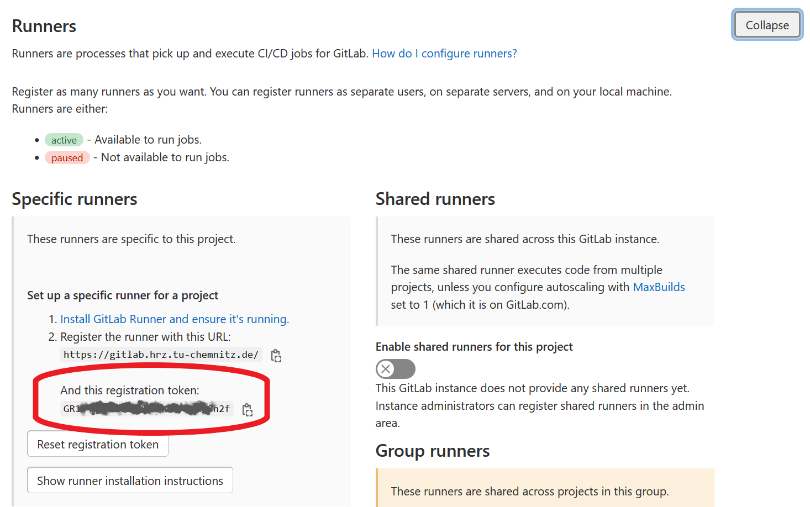

# CI/CD on HPC

We provide a **GitLab Runner** that allows you to run a GitLab pipeline on the ZIH systems. With
that you can continuously build, test, and benchmark your HPC software in the target environment.

## Requirements

- You (and ideally every involved developer) need an [HPC-Login](../application/overview.md).
- You manage your source code in a repository at the [TU Chemnitz GitLab instance](https://gitlab.hrz.tu-chemnitz.de)

## Setup process with Authentication tokens

1. Open your repository in the browser.

2. Click left on *Settings* and then click on *CI/CD*

3. *Expand* the *Runners* section

4. Click on *New Project Runner*

5. Type in some *Tags* like *normal*

6. Click on *create runner*

7.  then follow the steps


## Setup process with Registration token (deprecated)

1. Open your repository in the browser.

2. Hover *Settings* and then click on *CI/CD*

    
    { align=center }

3. *Expand* the *Runners* section

    
    { align=center }

4. Copy the *registration token*

    
    { align=center }

5. Now, you can request the registration of your repository with the
   [HPC-Support](../support/support.md). In the ticket, you need to add the URL of the GitLab
   repository and the registration token.

!!! warning

    At the moment, only repositories hosted at the TU Chemnitz GitLab are supported.

## GitLab pipelines

As the ZIH provides the CI/CD as an GitLab runner, you can run any pipeline already working on other
runners with the CI/CD at the ZIH systems. This also means, to configure the actual steps performed
once your pipeline runs, you need to define the `.gitlab-ci.yml` file in the root of your
repository. There is a [comprehensive
documentation](https://gitlab.hrz.tu-chemnitz.de/help/ci/index.md) and a [reference for the
`.gitlab-ci.yml` file](https://gitlab.hrz.tu-chemnitz.de/help/ci/yaml/index) available at every
GitLab instance. There's also a [quick start
guide](https://gitlab.hrz.tu-chemnitz.de/help/ci/quick_start/index.md).

The main difference to other GitLab runner is that every pipeline jobs will be scheduled as an
individual HPC job on the ZIH systems. Therefore, an important aspect is the possibility to set
Slurm parameters. While scheduling jobs allows to run code directly on the target system, it also
means that a single pipeline has to wait for resource allocation. Hence, you want to restrict,
which commits will run the complete pipeline, or which commits only run a part of the pipeline.

### Passing Slurm parameters

You can pass Slurm parameters via the [`variables`
keyword](https://gitlab.hrz.tu-chemnitz.de/help/ci/yaml/index#variables), either globally for the
whole yaml file, or on a per-job base.

Use the variable `SCHEDULER_PARAMETERS` and define the same parameters you would use for [`srun` or
`sbatch`](../jobs_and_resources/slurm.md).

!!! warning

    The parameters `--job-name`, `--output`, and `--wait` are handled by the GitLab runner and must
    not be used. If used, the run will fail.

!!! tip

    Make sure to set the `--account` such that the allocation of HPC resources is accounted
    correctly.

!!! example

    The following YAML file defines a configuration section `.test-job`, and two jobs,
    `test-job-haswell` and `test-job-ml`, extending from that. The two job share the
    `before_script`, `script`, and `after_script` configuration, but differ in the
    `SCHEDULER_PARAMETERS`. The `test-job-haswell` and `test-job-ml` are scheduled on the partition
    `haswell` and partition `ml`, respectively.

    ``` yaml
    .test-job:
    before_script:
        - date
        - pwd
        - hostname
    script:
        - date
        - pwd
        - hostname
    after_script:
        - date
        - pwd
        - hostname

    test-job-haswell:
    extends: .test-job
    variables:
        SCHEDULER_PARAMETERS: -p haswell


    test-job-ml:
    extends: .test-job
    variables:
        SCHEDULER_PARAMETERS: -p ml
    ```

## Current limitations

- Every runner job is currently limited to **one hour**. Once this time limit passes, the runner job
  gets canceled regardless of the requested runtime from Slurm. This time *includes* the waiting
  time for HPC resources.

## Pitfalls and Recommendations

- While the [`before_script`](https://gitlab.hrz.tu-chemnitz.de/help/ci/yaml/index#before_script)
  and [`script`](https://gitlab.hrz.tu-chemnitz.de/help/ci/yaml/index#script) array of commands are
  executed on the allocated resources, the
  [`after_script`](https://gitlab.hrz.tu-chemnitz.de/help/ci/yaml/index#after_script) runs on the
  GitLab runner node. We recommend that you do not use `after_script`.

- It is likely that all your runner jobs will be executed in a slightly different directory on the
  shared filesystem. Some build systems, for example CMake, expect that the configure and build is
  executed in the same directory. In this case, we recommend to use one job for configure and
  build.
