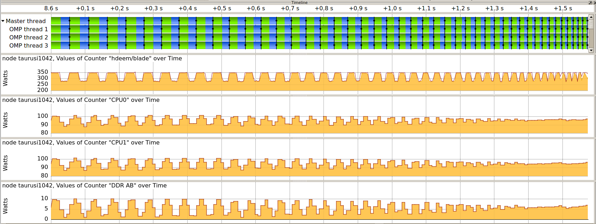

# Energy Measurement Infrastructure

The Intel Haswell nodes of ZIH system are equipped with power instrumentation that allow the
recording and accounting of power dissipation and energy consumption data. The data is made
available through several different interfaces, which are described below.

## Summary of Measurement Interfaces

| Interface                                  | Sensors         | Rate                            |
|:-------------------------------------------|:----------------|:--------------------------------|
| Dataheap (C, Python, VampirTrace, Score-P) | Blade, (CPU)    | 1 sample/s                          |
| HDEEM\* (C, Score-P)                       | Blade, CPU, DDR | 1000 samples/s (Blade), 100 samples/s (VRs) |
| HDEEM Command Line Interface               | Blade, CPU, DDR | 1000 samples/s (Blade), 100 samples/s (VR)  |
| Slurm Accounting (`sacct`)                 | Blade           | Per Job Energy                  |
| Slurm Profiling (HDF5)                     | Blade           | Up to 1 sample/s                    |

!!! note

    Please specify `--partition=haswell --exclusive` along with your job request if you wish to use
    HDEEM.

### Accuracy, Temporal and Spatial Resolution

In addition to the above mentioned interfaces, you can access the measurements through a
[C API](#using-the-hdeem-c-api) to get the full temporal and spatial resolution:

- ** Blade:** 1000 samples/s for the whole node, includes both sockets, DRAM,
  SSD, and other on-board consumers. Since the system is directly
  water cooled, no cooling components are included in the blade
  consumption.
- **Voltage regulators (VR):** 100 samples/s for each of the six VR
  measurement points, one for each socket and four for eight DRAM
  lanes (two lanes bundled).

The GPU blades also have 1 sample/s power instrumentation but have a lower accuracy.

HDEEM measurements have an accuracy of 2 % for Blade (node) measurements, and 5 % for voltage
regulator (CPU, DDR) measurements.

## Command Line Interface

The HDEEM infrastructure can be controlled through command line tools. They are commonly used on
the node under test to start, stop, and query the measurement device.

- `startHdeem`: Start a measurement. After the command succeeds, the
  measurement data with the 1000 / 100 samples/s described above will be
  recorded on the Board Management Controller (BMC), which is capable
  of storing up to 8h of measurement data.
- `stopHdeem`: Stop a measurement. No further data is recorded and
  the previously recorded data remains available on the BMC.
- `printHdeem`: Read the data from the BMC. By default, the data is
  written into a CSV file, whose name can be controlled using the
  `-o` argument.
- `checkHdeem`: Print the status of the measurement device.
- `clearHdeem`: Reset and clear the measurement device. No further
  data can be read from the device after this command is executed
  before a new measurement is started.

!!! note

    Please always execute `clearHdeem` before `startHdeem`. 

## Integration in Application Performance Traces

The per-node power consumption data can be included as metrics in application traces by using the
provided metric plugins for Score-P (and VampirTrace). The plugins are provided as modules and set
all necessary environment variables that are required to record data for all nodes that are part of
the current job.

For 1 sample/s Blade values (Dataheap):

- [Score-P](scorep.md): use the module `scorep-dataheap`
- [VampirTrace](../archive/vampirtrace.md): use the module `vampirtrace-plugins/power-1.1`
  (**Remark:** VampirTrace is outdated!)

For 1000 samples/s (Blade) and 100 samples/s (CPU{0,1}, DDR{AB,CD,EF,GH}):

- [Score-P](scorep.md): use the module `scorep-hdeem`. This
  module requires a recent version of `scorep/sync-...`. Please use
  the latest that fits your compiler and MPI version.

By default, the modules are set up to record the power data for the nodes they are used on. For
further information on how to change this behavior, please use module show on the respective module.

!!! example "Example usage with `gcc`"

  ```console
  marie@haswell$ module load scorep/trunk-2016-03-17-gcc-xmpi-cuda7.5
  marie@haswell$ module load scorep-dataheap
  marie@haswell$ scorep gcc application.c -o application
  marie@haswell$ srun ./application
  ```

Once the application is finished, a trace will be available that allows you to correlate application
functions with the component power consumption of the parallel application.

!!! note

    For energy measurements, only tracing is supported in Score-P/VampirTrace.
    The modules therefore disables profiling and enables tracing,
    please use [Vampir](vampir.md) to view the trace.


{: align="center"}

By default, `scorep-dataheap` records all sensors that are available. Currently this is the total
node consumption and the CPUs. `scorep-hdeem` also records all available sensors
(node, 2x CPU, 4x DDR) by default. You can change the selected sensors by setting the environment
variables:

!!! note

    The power measurement modules `scorep-dataheap` and `scorep-hdeem` are
    dynamic and only need to be loaded during execution.
    However, `scorep-hdeem` does require the application to be linked with
    a certain version of Score-P.

??? hint "For HDEEM"
    `export SCOREP_METRIC_HDEEM_PLUGIN=Blade,CPU*`

??? hint "For Dataheap"
    `export SCOREP_METRIC_DATAHEAP_PLUGIN=localhost/watts`

For more information on how to use Score-P, please refer to the [respective documentation](scorep.md).

## Access Using Slurm Tools

[Slurm](../jobs_and_resources/slurm.md) maintains its own database of job information, including
energy data. There are two main ways of accessing this data, which are described below.

### Post-Mortem Per-Job Accounting

This is the easiest way of accessing information about the energy consumed by a job and its job
steps. The Slurm tool `sacct` allows users to query post-mortem energy data for any past job or job
step by adding the field `ConsumedEnergy` to the `--format` parameter:

```console
marie@login $ sacct --format="jobid,jobname,ntasks,submit,start,end,ConsumedEnergy,nodelist,state" -j 3967027
       JobID    JobName   NTasks              Submit               Start                 End ConsumedEnergy        NodeList      State
------------ ---------- -------- ------------------- ------------------- ------------------- -------------- --------------- ----------
3967027            bash          2014-01-07T12:25:42 2014-01-07T12:25:52 2014-01-07T12:41:20                    taurusi1159  COMPLETED
3967027.0         sleep        1 2014-01-07T12:26:07 2014-01-07T12:26:07 2014-01-07T12:26:18              0     taurusi1159  COMPLETED
3967027.1         sleep        1 2014-01-07T12:29:06 2014-01-07T12:29:06 2014-01-07T12:29:16          1.67K     taurusi1159  COMPLETED
3967027.2         sleep        1 2014-01-07T12:33:25 2014-01-07T12:33:25 2014-01-07T12:33:36          1.84K     taurusi1159  COMPLETED
3967027.3         sleep        1 2014-01-07T12:34:06 2014-01-07T12:34:06 2014-01-07T12:34:11          1.09K     taurusi1159  COMPLETED
3967027.4         sleep        1 2014-01-07T12:38:03 2014-01-07T12:38:03 2014-01-07T12:39:44         18.93K     taurusi1159  COMPLETED
```

This example job consisted of 5 job steps, each executing a sleep of a different length. Note that the
`ConsumedEnergy` metric is only applicable to exclusive jobs.

### Slurm Energy Profiling

The `srun` tool offers several options for profiling job steps by adding the `--profile` parameter.
Possible profiling options are `All`, `Energy`, `Task`, `Lustre`, and `Network`. In all cases, the
profiling information is stored in an HDF5 file that can be inspected using available HDF5 tools,
e.g., `h5dump`. The files are stored under `/scratch/profiling/` for each job, job step, and node. A
description of the data fields in the file can be found
[in the official documentation](http://slurm.schedmd.com/hdf5_profile_user_guide.html#HDF5).
In general, the data files
contain samples of the current **power** consumption on a per-second basis:

```console
marie@login $ srun --partition haswell64 --acctg-freq=2,energy=1 --profile=energy sleep 10
srun: job 3967674 queued and waiting for resources
srun: job 3967674 has been allocated resources
marie@login $ h5dump /scratch/profiling/marie/3967674_0_taurusi1073.h5
[...]
  DATASET "Energy_0000000002 Data" {
    DATATYPE  H5T_COMPOUND {
      H5T_STRING {
        STRSIZE 24;
        STRPAD H5T_STR_NULLTERM;
        CSET H5T_CSET_ASCII;
        CTYPE H5T_C_S1;
      } "Date_Time";
      H5T_STD_U64LE "Time";
      H5T_STD_U64LE "Power";
      H5T_STD_U64LE "CPU_Frequency";
    }
    DATASPACE  SIMPLE { ( 1 ) / ( 1 ) }
    DATA {
    (0): {
        "",
        1389097545,  # timestamp
        174,         # power value
        1
      }
    }
  }
```

## Using the HDEEM C API

Please specify `--partition=haswell --exclusive` along with your job request if you wish to use HDEEM.

Please download the official documentation at
[http://www.bull.com/download-hdeem-library-reference-guide](http://www.bull.com/download-hdeem-library-reference-guide).

The HDEEM header and sample code are locally installed on the nodes.

??? hint "HDEEM header location"

    `/usr/include/hdeem.h`

??? hint "HDEEM sample location"

    `/usr/share/hdeem/sample/`

## Further Information and Citing

More information can be found in the paper
[HDEEM: high definition energy efficiency monitoring](http://ieeexplore.ieee.org/xpls/abs_all.jsp?arnumber=7016382)
by Daniel Hackenberg et al. Please cite this paper if you are using HDEEM for your scientific work.
