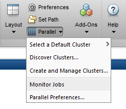

# Mathematics Applications

!!! cite "Galileo Galilei"

    Nature is written in mathematical language.

<!--*Please do not run expensive interactive sessions on the login nodes.  Instead, use* `srun --pty-->
<!--...` *to let the batch system place it on a compute node.*-->

## Mathematica

Mathematica is a general computing environment, organizing many algorithmic, visualization, and user
interface capabilities within a document-like user interface paradigm.

### Fonts

To remotely use the graphical front-end, you have to add the Mathematica fonts to the local
font manager.

#### Linux Workstation

You need to copy the fonts from ZIH systems to your local system and expand the font path

```console
marie@local$ scp -r taurusexport:/sw/global/applications/mathematica/10.0/SystemFiles/Fonts/Type1/ ~/.fonts
marie@local$ xset fp+ ~/.fonts/Type1
```

!!! important "SCP command"

    The previous SCP command requires that you have already set up your [SSH configuration
    ](../access/ssh_login.md#configuring-default-parameters-for-ssh).

#### Windows Workstation

You have to add additional Mathematica fonts at your local PC
[download fonts archive](misc/Mathematica-Fonts.zip).

If you use **Xming** as X-server at your PC (refer to
[remote access from Windows](../access/ssh_login.md), follow these steps:

1. Create a new folder `Mathematica` in the directory `fonts` of the installation directory of Xming
   (mostly: `C:\\Programme\\Xming\\fonts\\`)
1. Extract the fonts archive into this new directory `Mathematica`.  In result you should have the
   two directories `DBF` and `Type1`.
1. Add the path to these font files into the file `font-dirs`.  You can find it in
   `C:\\Programme\\Xming\\`.

```shell-session
# font-dirs
# comma-separated list of directories to add to the default font path
# defaults are built-ins, misc, TTF, Type1, 75dpi, 100dpi
# also allows entries on individual lines
C:\Programme\Xming\fonts\dejavu,C:\Programme\Xming\fonts\cyrillic
C:\Programme\Xming\fonts\Mathematica\DBF
C:\Programme\Xming\fonts\Mathematica\Type1
C:\WINDOWS\Fonts
```

### Mathematica and Slurm

Please use the batch system Slurm for running calculations. This is a small example for a batch
script, that you should prepare and start with the command `sbatch <scriptname>`. The File
`mathtest.m` is your input script that includes the calculation statements for Mathematica. The file
`mathtest.output` will hold the results of your calculations.

```bash
#!/bin/bash
#SBATCH --output=mathtest.out
#SBATCH --error=mathtest.err
#SBATCH --time=00:05:00
#SBATCH --ntasks=1

module load Mathematica
math -run < mathtest.m > mathtest.output
```

(also [Link](https://rcc.uchicago.edu/docs/software/environments/mathematica/index.html)).

!!! note

    Mathematica licenses are limited.

There exist two types, MathKernel and SubMathKernel licenses. Every sequential job you start will
consume a MathKernel license of which we only have 39. We do have, however, 312 SubMathKernel
licenses, so please, don't start many sequential jobs but try to parallelize your calculation,
utilizing multiple SubMathKernel licenses per job, in order to achieve a more reasonable license
usage.

## MATLAB

[MATLAB](https://de.mathworks.com/products/matlab.html) is a numerical computing environment and
programming language. Created by The MathWorks, MATLAB allows easy matrix manipulation, plotting of
functions and data, implementation of algorithms, creation of user interfaces, and interfacing with
programs in other languages.  Although it specializes in numerical computing, an optional toolbox
interfaces with the Maple symbolic engine, allowing it to be part of a full computer algebra system.

Running MATLAB via the batch system could look like this (for 2 Gb RAM per core and 12 cores
reserved). Please adapt this to your needs!

```console
marie@login$ module load MATLAB
marie@login$ srun --time=8:00 --cpus-per-task=12 --mem-per-cpu=2000 --pty --x11=first bash
marie@compute$ matlab
```

With following command you can see a list of installed software - also
the different versions of MATLAB.

```console
marie@login$ module avail MATLAB
```

Please choose one of these, then load the chosen software with the command:

```bash
marie@login$ module load MATLAB/<version>
```

Or use:

```console
marie@login$ module load MATLAB
```

(then you will get the most recent MATLAB version.
[Refer to the modules section for details.](../software/modules.md#modules))

### Interactive

If X-server is running and you logged in at ZIH systems, you should allocate a CPU for your work
with command

```console
marie@login$ srun --pty --x11=first bash
```

- now you can call "matlab" (you have 8h time to work with the MATLAB-GUI)

### Non-interactive

Using Scripts

You have to start matlab-calculation as a Batch-Job via command

```console
marie@login$ srun --pty matlab -batch <basename_of_your_matlab_script>
# NOTE: you must omit the file extension ".m" here, because -r expects a matlab command or function call, not a file-name.
```

!!! info "License occupying"

    While running your calculations as a script this way is possible, it is generally frowned upon,
    because you are occupying MATLAB licenses for the entire duration of your calculation when doing so.
    Since the available licenses are limited, it is highly recommended you first compile your script via
    the MATLAB Compiler (`mcc`) before running it for a longer period of time on our systems.  That way,
    you only need to check-out a license during compile time (which is relatively short) and can run as
    many instances of your calculation as you'd like, since it does not need a license during runtime
    when compiled to a binary.

You can find detailed documentation on the MATLAB compiler at
[MathWorks' help pages](https://de.mathworks.com/help/compiler/).

### Using the MATLAB Compiler

Compile your `.m` script into a binary:

```bash
marie@login$ mcc -m name_of_your_matlab_script.m -o compiled_executable -R -nodisplay -R -nosplash
```

This will also generate a wrapper script called `run_compiled_executable.sh` which sets the required
library path environment variables in order to make this work. It expects the path to the MATLAB
installation as an argument, you can use the environment variable `$EBROOTMATLAB` as set by the
module file for that.

Then run the binary via the wrapper script in a job (just a simple example, you should be using an
[sbatch script](../jobs_and_resources/slurm.md#job-submission) for that)

```bash
marie@login$ srun ./run_compiled_executable.sh $EBROOTMATLAB
```

### Parallel MATLAB

#### With 'local' Configuration

- If you want to run your code in parallel, please request as many cores as you need!
- Start a batch job with the number `N` of processes, e.g., `srun --cpus-per-task=4 --pty
  --x11=first bash -l`
- Run MATLAB with the GUI or the CLI or with a script
- Inside MATLAB use `parpool open 4` to start parallel processing

!!! example "Example for 1000*1000 matrix-matrix multiplication"

    ```bash
    R = distributed.rand(1000);
    D = R * R
    ```

- Close parallel task using `delete(gcp('nocreate'))`

#### With parfor

- Start a batch job with the number `N` of processes (,e.g., `N=12`)
- Inside use `matlabpool open N` or `matlabpool(N)` to start parallel processing. It will use
  the 'local' configuration by default.
- Use `parfor` for a parallel loop, where the **independent** loop iterations are processed by `N`
  processes

!!! example

    ```bash
    parfor i = 1:3
        c(:,i) = eig(rand(1000));
    end
    ```

Please refer to the documentation `help parfor` for further information.

### MATLAB Parallel Computing Toolbox

In the following, the steps to configure MATLAB to submit jobs to a cluster, retrieve results, and
debug errors are outlined.

#### Configuration – MATLAB client on the cluster

After logging into the HPC system, you configure MATLAB to run parallel jobs on the HPC system by
calling the shell script `configCluster.sh`.  This only needs to be called once per version of
MATLAB.

```console
marie@login$ module load MATLAB
marie@login$ configCluster.sh
```

Jobs will now default to the HPC system rather than submit to the local machine.

#### Installation and Configuration – MATLAB client off the cluster

The MATLAB support package for ZIH Systems can be found as follows:

* Windows:
    * [tud.nonshared.R2021b.zip](misc/tud.nonshared.R2021b.zip)
    * [tud.nonshared.R2022a.zip](misc/tud.nonshared.R2022a.zip)
* Linux/macOS:
    * [tud.nonshared.R2021b.tar.gz](misc/tud.nonshared.R2021b.tar.gz)
    * [tud.nonshared.R2022a.tar.gz](misc/tud.nonshared.R2022a.tar.gz)

Download the appropriate archive file and start MATLAB. The archive file should be extracted
in the location returned by calling

```matlabsession
>> userpath
```

Configure MATLAB to run parallel jobs on ZIH Systems by calling `configCluster`. `configCluster`
only needs to be called once per version of MATLAB.

```matlabsession
>> configCluster
```

Submission to the remote cluster requires SSH credentials. You will be prompted for your SSH
username and password or identity file (private key). The username and location of the private key
will be stored in MATLAB for future sessions. Jobs will now default to the cluster rather than
submit to the local machine.

!!! note

    If you would like to submit to the local machine then run the following command:

    ```matlab
    >> % Get a handle to the local resources
    >> c = parcluster('local');
    ```

#### Configuring Jobs

Prior to submitting the job, you can specify various parameters to pass to your jobs, such as queue,
e-mail, walltime, etc. *Only `MemPerCpu` and `QueueName` are required*.

```matlabsession
>> % Get a handle to the cluster
>> c = parcluster;

[REQUIRED]

>> % Specify memory to use, per core (default: 2gb)
>> c.AdditionalProperties.MemPerCpu = '4gb';

>> % Specify the walltime (e.g., 5 hours)
>> c.AdditionalProperties.WallTime = '05:00:00';

[OPTIONAL]

>> % Specify the account to use
>> c.AdditionalProperties.Account = 'account-name';

>> % Request constraint
>> c.AdditionalProperties.Constraint = 'a-constraint';

>> % Request job to run on exclusive node(s) (default: false)
>> c.AdditionalProperties.EnableExclusive = true;

>> % Request email notification of job status
>> c.AdditionalProperties.EmailAddress = 'user-id@tu-dresden.de';

>> % Specify number of GPUs to use (GpuType is optional)
>> c.AdditionalProperties.GpusPerNode = 1;
>> c.AdditionalProperties.GpuType = 'gpu-card';

>> % Specify the queue to use
>> c.AdditionalProperties.Partition = 'queue-name';

>> % Specify a reservation to use
>> c.AdditionalProperties.Reservation = 'a-reservation';
```

Save changes after modifying `AdditionalProperties` for the above changes to persist between MATLAB
sessions.

```matlabsession
>> c.saveProfile
```

To see the values of the current configuration options, display `AdditionalProperties`.

```matlabsession
>> % To view current properties
>> c.AdditionalProperties
```

You can unset a value when no longer needed.

```matlabsession
>> % Turn off email notifications
>> c.AdditionalProperties.EmailAddress = '';
>> c.saveProfile
```

#### Interactive Jobs - MATLAB Client on the Cluster

To run an interactive pool job on the ZIH systems, continue to use `parpool` as you’ve done before.

```matlabsession
>> % Get a handle to the cluster
>> c = parcluster;

>> % Open a pool of 64 workers on the cluster
>> pool = c.parpool(64);
```

Rather than running local on your machine, the pool can now run across multiple nodes on the
cluster.

```matlabsession
>> % Run a parfor over 1000 iterations
>> parfor idx = 1:1000
      a(idx) = …
   end
```

Once you are done with the pool, delete it.

```matlabsession
>> % Delete the pool
>> pool.delete
```

#### Independent Batch Job

Use the batch command to submit asynchronous jobs to the HPC system. The `batch` command will return
a job object which is used to access the output of the submitted job. See the MATLAB documentation
for more help on `batch`.

```matlabsession
>> % Get a handle to the cluster
>> c = parcluster;

>> % Submit job to query where MATLAB is running on the cluster
>> job = c.batch(@pwd, 1, {},  ...
       'CurrentFolder','.', 'AutoAddClientPath',false);

>> % Query job for state
>> job.State

>> % If state is finished, fetch the results
>> job.fetchOutputs{:}

>> % Delete the job after results are no longer needed
>> job.delete
```

To retrieve a list of currently running or completed jobs, call `parcluster` to retrieve the cluster
object. The cluster object stores an array of jobs that were run, are running, or are queued to
run. This allows us to fetch the results of completed jobs. Retrieve and view the list of jobs as
shown below.

```matlabsession
>> c = parcluster;
>> jobs = c.Jobs;
```

Once you have identified the job you want, you can retrieve the results as done previously.

`fetchOutputs` is used to retrieve function output arguments; if calling `batch` with a script, use
`load` instead. Data that has been written to files on the cluster needs be retrieved directly
from the filesystem (e.g. via ftp). To view results of a previously completed job:

```matlabsession
>> % Get a handle to the job with ID 2
>> job2 = c.Jobs(2);
```

!!! note

    You can view a list of your jobs, as well as their IDs, using the above `c.Jobs` command.

    ```matlabsession
    >> % Fetch results for job with ID 2
    >> job2.fetchOutputs{:}
    ```

#### Parallel Batch Job

You can also submit parallel workflows with the `batch` command. Let’s use the following example
for a parallel job, which is saved as `parallel_example.m`.

```matlab
function [t, A] = parallel_example(iter)

if nargin==0
    iter = 8;
end

disp('Start sim')

t0 = tic;
parfor idx = 1:iter
    A(idx) = idx;
    pause(2)
    idx
end
t = toc(t0);

disp('Sim completed')

save RESULTS A

end
```

This time when you use the `batch` command, to run a parallel job, you will also specify a MATLAB
Pool.

```matlabsession
>> % Get a handle to the cluster
>> c = parcluster;

>> % Submit a batch pool job using 4 workers for 16 simulations
>> job = c.batch(@parallel_example, 1, {16}, 'Pool',4, ...
       'CurrentFolder','.', 'AutoAddClientPath',false);

>> % View current job status
>> job.State

>> % Fetch the results after a finished state is retrieved
>> job.fetchOutputs{:}
ans =
  8.8872
```

The job ran in 8.89 seconds using four workers. Note that these jobs will always request N+1 CPU
cores, since one worker is required to manage the batch job and pool of workers. For example, a
job that needs eight workers will consume nine CPU cores.

You might run the same simulation but increase the Pool size. This time, to retrieve the results later,
you will keep track of the job ID.

!!! note

    For some applications, there will be a diminishing return when allocating too many workers, as
    the overhead may exceed computation time.

    ```matlabsession
    >> % Get a handle to the cluster
    >> c = parcluster;

    >> % Submit a batch pool job using 8 workers for 16 simulations
    >> job = c.batch(@parallel_example, 1, {16}, 'Pool', 8, ...
           'CurrentFolder','.', 'AutoAddClientPath',false);

    >> % Get the job ID
    >> id = job.ID
    id =
      4
    >> % Clear job from workspace (as though you quit MATLAB)
    >> clear job
    ```

Once you have a handle to the cluster, you can call the `findJob` method to search for the job with
the specified job ID.

```matlabsession
>> % Get a handle to the cluster
>> c = parcluster;

>> % Find the old job
>> job = c.findJob('ID', 4);

>> % Retrieve the state of the job
>> job.State
ans =
  finished
>> % Fetch the results
>> job.fetchOutputs{:};
ans =
  4.7270
```

The job now runs in 4.73 seconds using eight workers. Run code with different number of workers to
determine the ideal number to use. Alternatively, to retrieve job results via a graphical user
interface, use the Job Monitor (Parallel > Monitor Jobs).


{: summary="Retrieve job results via GUI using the Job Monitor." align="center"}

#### Debugging

If a serial job produces an error, call the `getDebugLog` method to view the error log file.  When
submitting independent jobs, with multiple tasks, specify the task number.

```matlabsession
>> c.getDebugLog(job.Tasks(3))
```

For Pool jobs, only specify the job object.

```matlabsession
>> c.getDebugLog(job)
```

When troubleshooting a job, the cluster admin may request the scheduler ID of the job.  This can be
derived by calling `schedID`.

```matlabsession
>> schedID(job)
ans =
  25539
```

#### Further Reading

To learn more about the MATLAB Parallel Computing Toolbox, check out these resources:

* [Parallel Computing Coding
    Examples](https://www.mathworks.com/help/parallel-computing/examples.html)
* [Parallel Computing Documentation](http://www.mathworks.com/help/distcomp/index.html)
* [Parallel Computing Overview](http://www.mathworks.com/products/parallel-computing/index.html)
* [Parallel Computing
    Tutorials](http://www.mathworks.com/products/parallel-computing/tutorials.html)
* [Parallel Computing Videos](http://www.mathworks.com/products/parallel-computing/videos.html)
* [Parallel Computing Webinars](http://www.mathworks.com/products/parallel-computing/webinars.html)
