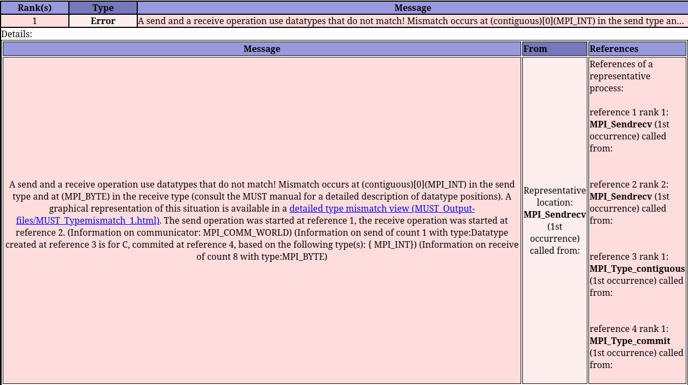

# MPI Error Detection

MPI as the de-facto standard for parallel applications of the message passing paradigm offers
more than one hundred different API calls with complex restrictions. As a result, developing
applications with this interface is error prone and often time consuming. Some usage errors of MPI
may only manifest on some platforms or some application runs, which further complicates the
detection of these errors. Thus, special debugging tools for MPI applications exist that
automatically check whether an application conforms to the MPI standard and whether its MPI calls
are safe. At ZIH, we maintain and support **MUST** for this task, though different types of these
tools exist (see last section).

## MUST

[MUST](https://itc.rwth-aachen.de/must/) checks if your application conforms to the MPI
standard and will issue warnings if there are errors or non-portable constructs. You can apply MUST
without modifying your source code, though we suggest to add the debugging flag `-g` during
compilation.

See also [MUST Introduction Slides](misc/parallel_debugging_must.pdf).

### Setup and Modules

You need to load a module file in order to use MUST. Each MUST installation uses a specific
combination of a compiler and an MPI library, make sure to use a combination that fits your needs.
Right now we provide two combinations, [contact us](../support/support.md) if you need further
combinations. You can query for the available modules with:

```console
marie@login$ module avail must
   MUST/1.6.0-rc3-intel-2018a    MUST/1.7.2-intel-2020a (D)
```

You can load a MUST module as follows:

```console
marie@login$ module load MUST
Module MUST/1.7.2-intel-2020a and 16 dependencies loaded.
```

Besides loading a MUST module, no further changes are needed during compilation and linking.

### Running your Application with MUST

In order to launch your application with MUST you need to replace the `srun` command with
`mustrun --must:mpiexec srun --must:np -n`:

```console
marie@login$ mustrun --must:mpiexec srun --must:np -n -n <number of MPI processes> ./<your binary>
```

Besides replacing the `srun` command you need to be aware that **MUST always allocates an extra
process**, i.e. if you issue a `mustrun --must:mpiexec srun --must:np -n -n 4 ./<your binary>` then
MUST will start **5 processes** instead. This is usually not critical. However, in interactive and
batch jobs **make sure to allocate an extra CPU for this task**.

Suppose your application is called `fancy-program` and is normally run with 4 processes.
The MUST workflow should then be

```console
marie@login$ module load MUST

# Compile your application with the debugging flag "-g" on the correct architecture, e.g.:
marie@login$ srun -n 1 -p <partition> mpicc -g -o fancy-program fancy-program.c

# Allocate interactive session with 1 extra process for MUST
marie@login$ salloc -n 5 -p <partition>

marie@login$ mustrun --must:mpiexec srun --must:np -n --must:stacktrace backward -n 4 ./fancy-program
[MUST] MUST configuration ... centralized checks with fall-back application crash handling (very slow)
[MUST] Weaver ... success
[MUST] Code generation ... success
[MUST] Build file generation ... success
[MUST] Configuring intermediate build ... success
[MUST] Building intermediate sources ... success
[MUST] Installing intermediate modules ... success
[MUST] Generating P^nMPI configuration ... success
[MUST] Search for linked P^nMPI ... not found ... using LD_PRELOAD to load P^nMPI ... success
[MUST] Executing application:
{...}
[MUST] Execution finished, inspect "/home/marie/MUST_Output.html"!
```

With the additional flag `--must:stacktrace backward` you can produce an additional stacktrace
with line number of the error location which allows to pinpoint the error location in your code.
This might slow down code execution slightly.

Finally, MUST assumes that your application may crash at any time. To still gather correctness
results under this assumption is extremely expensive in terms of performance overheads. Thus, if
your application does not crash, you should add `--must:nocrash` to the `mustrun` command to make
MUST aware of this knowledge. Overhead is drastically reduced with this switch.
Further details on alternative launch modes are described in the MUST documentation.

### Result Files

After running your application with MUST you will have its output in the working directory of your
application. The output is named `MUST_Output.html`. Open this files in a browser to analyze the
results. The HTML file is color coded:

- Entries in green represent notes and useful information
- Entries in yellow represent warnings
- Entries in red represent errors

### Example Usage of MUST

In this section, we provide a detailed example explaining the usage of MUST. The example is taken
from the [MUST documentation v1.7.2](https://hpc.rwth-aachen.de/must/files/Documentation-1.7.2.pdf).

??? example "example.c"

    This C programm contains three MPI usage errors. Save it as `example.c`.

    ```
    #include <stdio.h>
    #include <mpi.h>

    int main (int argc , char ** argv) {
      int rank ,
          size ,
          sBuf [ 2 ] = { 1 , 2 } ,
          rBuf [ 2 ] ;
      MPI_Status status ;
      MPI_Datatype newType ;

      MPI_Init(&argc ,&argv ) ;
      MPI_Comm_rank (MPI_COMM_WORLD, &rank ) ;
      MPI_Comm_size (MPI_COMM_WORLD, &size ) ;

       // Enough tasks?
      if ( size < 2 ) {
        printf("This test needs at least 2 processes ! \n");
        MPI_Finalize();
        return 1 ;
      }

      // Say hello
      printf("Hello, I am rank %d of %d processes. \n", rank , size);

      //) Create a datatype
      MPI_Type_contiguous( 2, MPI_INT, &newType);
      MPI_Type_commit(&newType);

      // 2) Use MPI Sendrecv to perform a ring communication
      MPI_Sendrecv(sBuf, 1, newType, (rank+1)%size, 123,
                   rBuf, sizeof(int)*2, MPI_BYTE, (rank=1+size) %size, 123 , MPI_COMM_WORLD, &status ) ;

      // 3) Use MPI Send and MPI Recv to perform a ring communication
      MPI_Send(sBuf, 1, newType, (rank+1)%size, 456, MPI_COMM_WORLD);
      MPI_Recv(rBuf, sizeof(int)*2, MPI_BYTE, (rank=1+size)%size, 456, MPI_COMM_WORLD, &status);

      // Say bye bye
      printf("Signing off, rank %d. \n" , rank);

      MPI_Finalize();
      return 0 ;
    }
    /*EOF*/
    ```

??? example "Compile and execute"

    The first step is to prepare the environment by loading a MUST module.

    ```console
    marie@login$ module purge
    marie@login$ module load MUST
    Module MUST/1.7.2-intel-2020a and 16 dependencies loaded.
    ```

    Now, you compile the `example.c` program using the MPI compiler wrapper. The compiled binary is
    called `example`.

    ```console
    marie@login$ mpicc example.c -g -o example
    ```

    Finally, you execute the example application on the compute nodes. As you can see, the following
    command line will submit a job to the batch system.

    ```
    marie@login $ mustrun --must:mpiexec srun --must:np -n -n 4 --time 00:10:00 example
    [MUST] MUST configuration ... centralized checks with fall-back application crash handling (very slow)
    [MUST] Information: overwritting old intermediate data in directory "/scratch/ws/0/marie-must/must_temp"!
    [MUST] Using prebuilt infrastructure at /sw/installed/MUST/1.7.2-intel-2020a/modules/mode1-layer2
    [MUST] Weaver ... success
    [MUST] Generating P^nMPI configuration ... success
    [MUST] Search for linked P^nMPI ... not found ... using LD_PRELOAD to load P^nMPI ... success
    [MUST] Executing application:
    srun: job 32765491 queued and waiting for resources
    srun: job 32778008 has been allocated resources
    Hello , I am rank 2 of 4 processes.
    Hello , I am rank 3 of 4 processes.
    Hello , I am rank 0 of 4 processes.
    Hello , I am rank 1 of 4 processes.
    ============MUST===============
    ERROR: MUST detected a deadlock, detailed information is available in the MUST output file. You should either investigate details with a debugger or abort, the operation of MUST will stop from now.
    ===============================
    ```

??? example "Analysis of MUST output files and MPI usage errors"

    MUST produces an `MUST_Output.html` file and a directory `MUST_Output-files` with additional
    html files. Copy the files to your local host, e.g.

    ```console
    marie@local$ scp -r taurus.hrsk.tu-dresden.de:/scratch/ws/0/marie-must/{MUST_Output-files,MUST_Output.html}
    ```

    and open the file `MUST_Output.html` using a webbrowser. MUST detects all three MPI usage errors
    within this example:

    * A type mismatch
    * A send-send deadlock
    * A leaked datatype

    The type mismatch is reported as follows:

    
    {: align="center" summary="Type mismatch error report from MUST."}

    MUST also offers a detailed page for the type mismatch error.

    
    {: summary="Retrieve job results via GUI using the Job Monitor." align="center"}

    In order not to exceed the scope of this example, we do not explain the MPI usage errors in more
    details. Please, feel free to deep-dive into the error description provided in the official
    [MUST documentation v1.7.2](https://hpc.rwth-aachen.de/must/files/Documentation-1.7.2.pdf) (Sec.
    4).

## Further MPI Correctness Tools

Besides MUST, there exist further MPI correctness tools, these are:

- Marmot (predecessor of MUST)
- MPI checking library of the Intel Trace Collector
- ISP (From Utah)
- Umpire (predecessor of MUST)

ISP provides a more thorough deadlock detection as it investigates alternative execution paths,
however its overhead is drastically higher as a result. Contact our support if you have a specific
use cases that needs one of these tools.
