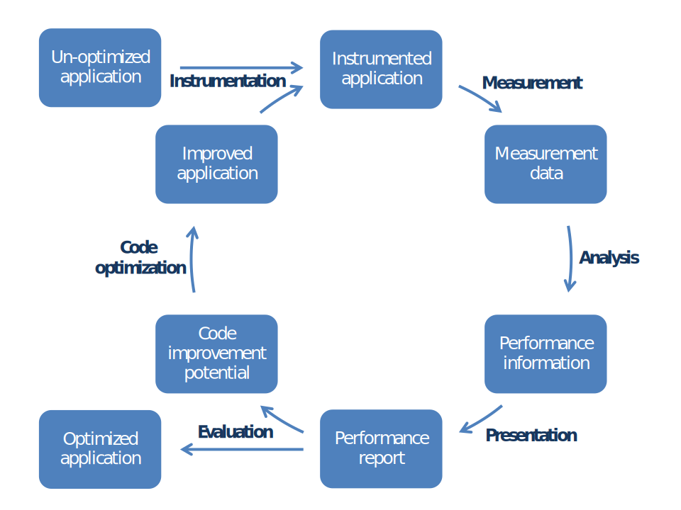

# Performance Engineering Overview

!!! cite "Walter J. Doherty, 1970 [^1]"

    Fundamentally, performance is the degree to which a computing system meets the expectations of
    the person involved with it.

Performance engineering encompasses the techniques applied during a systems development life cycle
to ensure the non-functional requirements for performance (such as throughput, latency, or memory
usage) will be met.
Often, it is also referred to as systems performance engineering within systems engineering, and
software performance engineering or application performance engineering within software engineering
[[Wikipedia]](https://en.wikipedia.org/wiki/Performance_engineering).

[^1]: Scheduling TSS/360 for responsiveness. In: AFIPS '70 (Fall): Proceedings of the November
  17-19, 1970, fall joint computer conference, November 1970, Pages 97–111

## Objectives

??? hint "Some good reasons to think about performance in HPC"

    - Increase research output by ensuring the system can process transactions within the requisite time
      frame
    - Eliminate system failure requiring scrapping and writing off the system development effort due to
      performance objective failure
    - Eliminate avoidable system tuning efforts
    - Avoid additional and unnecessary hardware acquisition costs
    - Reduce increased software maintenance costs due to performance problems in production
    - Reduce additional operational overhead for handling system issues due to performance problems
    - Identify future bottlenecks by simulation over prototype

## Installed Tools in a Nutshell

| Tool                 | Task                                         | Easiness    | Details  | Overhead  | Re-compilation |
|----------------------|----------------------------------------------|-------------|----------|-----------|-----------------
| [lo2s](#lo2s)        | Create performance [trace](#trace)           | easy        | medium   | low       | (no)[^2]       |
| [MUST](#must)        | Check MPI correctness                        | medium      | medium   | variable  | no             |
| [PAPI](#papi)        | Read portable CPU counters                   | advanced    | medium   | variable  | yes            |
| [Perf](#perf-tools)  | Produce and visualize [profile](#profile)    | easy        | medium   | low       | (no)[^2]       |
| [PIKA](#pika)        | Show performance [profile](#profile) and [trace](#trace) | very easy | low | very low | no         |
| [Score-P](#score-p)  | Create performance [trace](#trace)           | complex     | high     | variable  | yes            |
| [Slurm](#slurm-profiler) | Produce and visualize simple [trace](#trace)| easy     | low      | low       | no             |
| [Vampir](#vampir)    | Visualize performance [trace](#trace)        | complex     | high     | n.a.      | n.a.           |

[^2]: Re-compilation is not required. Yet, to obtain more details it is recommended to re-compile with the `-g` compiler option, which adds debugging information to the executable of an application.

## Approach and Terminology

Performance engineering typically is a cyclic process.
The following figure shows such a process and its potential stages.

### Instrumentation

!!! hint "Instrumentation is a common term for preparing the performance measurement"

The engineering process typically begins with the original application in its unmodified state.
First, this application needs to be instrumented, i.e. it must be prepared to enable the
measurement of the performance properties.
There are different ways to do this, including manual instrumentation of the source code by the
user, automatic instrumentation by the compiler, linking against pre-instrumented libraries, or
interrupt-driven sampling during run time.

### Measurement

!!! note "During measurement, raw performance data is collected"

When an instrumented application is executed, the additional instructions introduced during the
instrumentation phase collect and record the data required to evaluate the performance properties
of the code.
Unfortunately, the measurement itself has a certain influence on the performance of the instrumented
code.
Whether the perturbations introduced have a significant effect on the behavior depends on the
specific structure of the code to be investigated.
In many cases, the perturbations will be rather small, so that the overall results can be considered
to be a realistic approximation of the corresponding properties of the non-instrumented code.
Yet, it is always advisable to compare the runtime of instrumented applications with their original
non-instrumented counterpart.

#### Profile

!!! hint "Performance profiles hold aggregated data (e.g. total time spent in function `foo()`)"

A performance profile provides aggregated metrics like _time_ or _number of calls_ for a list of
functions, loops or similar as depicted in the following table:

| Function | Total Time | Calls | Percentage |
|----------|-----------:|------:|-----------:|
| `main()` |        2 s |     1 |       1%   |
| `foo()`  |       80 s |   100 |      40%   |
| `bar()`  |      118 s |  9000 |      59%   |

#### Trace

<!-- markdownlint-disable-next-line line-length -->
!!! hint "Traces consist of a sorted list of timed application events/samples (e.g. enter function `foo()` at 0.11 s)."

In contrast to performance [profiles](#profile), performance traces consist of individual
application samples or events that are recorded with a timestamp.
A trace that corresponds to the profile recording above could look as follows:

| Timestamp | Data Type      | Parameter       |
|----------:|----------------|-----------------|
|    0.10 s | Enter Function | `main()`        |
|    0.11 s | Enter Function | `foo()`         |
|    0.12 s | Enter Function | `bar()`         |
|    0.15 s | Exit Function  | `bar()`         |
|    0.16 s | Enter Function | `bar()`         |
|    0.17 s | Exit Function  | `bar()`         |
|           | _many more events..._  |         |
|  200.00 s | Exit Function  | `main()`        |

<!-- markdownlint-disable-next-line line-length -->
!!! hint "Traces enable more sophisticated analysis at the cost of potentially very large amounts of raw data."

Apparently, the size of a performance trace depends on the recorded time whereas a profile does not.
Likewise, a trace can tell you when a specific action in your application happened whereas a profile
will tell you how much time in total a class of actions takes.

### Analysis

!!! note "Well defined performance metrics are derived from raw performance data during analysis"

The collected raw data is typically processed by a analysis tool (profiler, consistency checker, you
name it) to derive meaningful, well-defined performance metrics like data rates, data dependencies,
performance events of interest, etc.
This step is typically hidden to the user and taken care of automatically once the raw data was
collected.
Some tools, however, provide an independent analysis front-end that allows specifying the type of
analysis to carry out on the raw data.

### Presentation

!!! note "Presenting performance metrics graphically fosters human intuition"

After processing the raw performance data, the resulting metrics are usually presented in the form
of a report that makes use of tables or charts known from programs like Excel.
In this step, the reduction of the data complexity simplifies the evaluation of the data by software
developers.
Yet, data reductions have the potential to hide important facts or details.

### Evaluation

!!! note "The evaluation of performance metrics requires tools and lots of thinking"

During the evaluation phase, the metrics and findings in a performance report are compared to the
behavior/performance as expected by software developers.
This step typically requires a fair amount of knowledge about the application under test or software
performance in general.
The application is considered to behave sufficiently well or weaknesses have been identified which
potentially can be improved.
An application or its configuration is changed in the later case.
After evaluating an application's performance, the cyclic engineering process is either completed or
restarted from beginning.

## Installed Tools Summary

At ZIH, the following performance engineering tools are installed and maintained:

### lo2s

!!! hint "Easy to use application and system performance trace recorder supporting Vampir"

[lo2s](lo2s.md) records the status of an application at fixed intervals (statistical sampling).
It does not require any [instrumentation](#instrumentation).
The [measurement](#measurement) of a given application is done by pre-fixing the application's
executable with `lo2s`.
The data analysis of the fixed metrics is fully integrated and does not require any user actions.
Performance data is written to a [traces](#trace) repository at the current directory.
See [lo2s](lo2s.md) for further details.
Once the data have been recorded, the tool [Vampir](vampir.md) needs to be invoked to study the data
graphically.

### MUST

<!-- markdownlint-disable-next-line line-length -->
!!! hint "Advanced communication error detection for applications using the Message Passing Interface (MPI) standard."

[MUST](mpi_usage_error_detection.md) checks your application for communication errors if the MPI
library is used.
It does not require any [instrumentation](#instrumentation).
The checks of a given MPI application are done by simply replacing `srun` with `mustrun` when the
application is started.
The data analysis of the fixed metrics is fully integrated and does not require any user actions.
The correctness results are written to an HTML-formatted output file, which can be inspected with a
web browser.

### PAPI

!!! hint "Portable reading of CPU performance metrics like FLOPS"

The [PAPI](papi.md) library allows software developers to read CPU performance counters in a
platform-independent way.
Native usage of the library requires to manually [instrument](#instrumentation) an application by
adding library calls to the source code of the application under investigation.
Data [measurement](#measurement) happens whenever the PAPI library is called.
The data obtained is raw data.
Software developers have to process the data by themselves to obtain meaningful metrics.
Tools like [Score-P](#score-p) have built-in support for PAPI.
Therefore, native usage of the PAPI library is usually not needed.

### Perf Tools

!!! hint "Easy to use Linux-integrated performance data recording and analysis"

[Linux perf](perf_tools.md) reads and analyses CPU performance counters for any given application.
It does not require any [instrumentation](#instrumentation).
The [measurement](#measurement) of a given application is done by simply prefixing the application
executable with `perf`.
Perf has two modes of operation (`perf stat`, `perf record`), which both record [profile](#profile)
raw data.
While the first mode is very basic, the second mode records more data.
Use `perf report` to analyze the raw output data of `perf record` and produce a performance report.
See [Linux perf](perf_tools.md) for further details.

### PIKA

!!! hint "Very easy to use performance visualization of entire batch jobs"

[PIKA](pika.md) allows users to study their active and completed
[batch jobs](../jobs_and_resources/slurm.md).
It does not require any [instrumentation](#instrumentation).
The [measurement](#measurement) of batch jobs happens automatically in the background for all batch
jobs.
The data analysis of the given set of metrics is fully integrated and does not require any user
actions.
Performance metrics are accessible via the
[PIKA web service](https://selfservice.tu-dresden.de/services/1663599/).

### Score-P

!!! hint "Complex and powerful performance data recording and analysis of parallel applications"

[Score-P](scorep.md) is an advanced tool that measures configurable performance event data.
It generates both [profiles](#profile) and detailed [traces](#trace) for subsequent analysis.
It supports automated [instrumentation](#instrumentation) of an application (involves
re-compilation) prior to the [measurement](#measurement) step.
The data analysis of the raw performance data can be carried out with the tools `scalasca`
(advanced MPI metrics), `cube` ([profile](#profile) viewer), `scorep-score` ([profile](#profile)
command line viewer), or [Vampir](#vampir) ([trace](#trace) viewer).
Many raw data sources are supported by Score-P.
It requires some time, training, and practice to fully benefit from the tool's features.
See [Score-P](scorep.md) for further details.

### Slurm Profiler

!!! hint "Easy to use performance visualization of entire batch jobs"

The [Slurm Profiler](../jobs_and_resources/slurm_profiling.md) gathers performance data from every
task/node of a given [batch job](../jobs_and_resources/slurm.md).
It records a coarse-grained [trace](#trace) for subsequent analysis.
[Instrumentation](#instrumentation) of the applications under test is not needed.
The data analysis of the given set of system metrics needs to be initiated by the user with a
command line interface.
The resulting performance metrics are accessible in a simple graphical front-end that provides
time/performance graphs.

### Vampir

!!! hint "Complex and powerful performance data visualization of parallel applications"

[Vampir](vampir.md) is a graphical analysis tool that provides a large set of different chart
representations for performance data [traces](#trace) generated by tools such as
[Score-P](scorep.md) or [lo2s](lo2s.md).
Complex statistics, timelines, and state diagrams can be used by software developers to obtain a
better understanding of the inner working of a parallel application.
The tool requires some time, training, and practice to fully benefit from its rich set of features.
