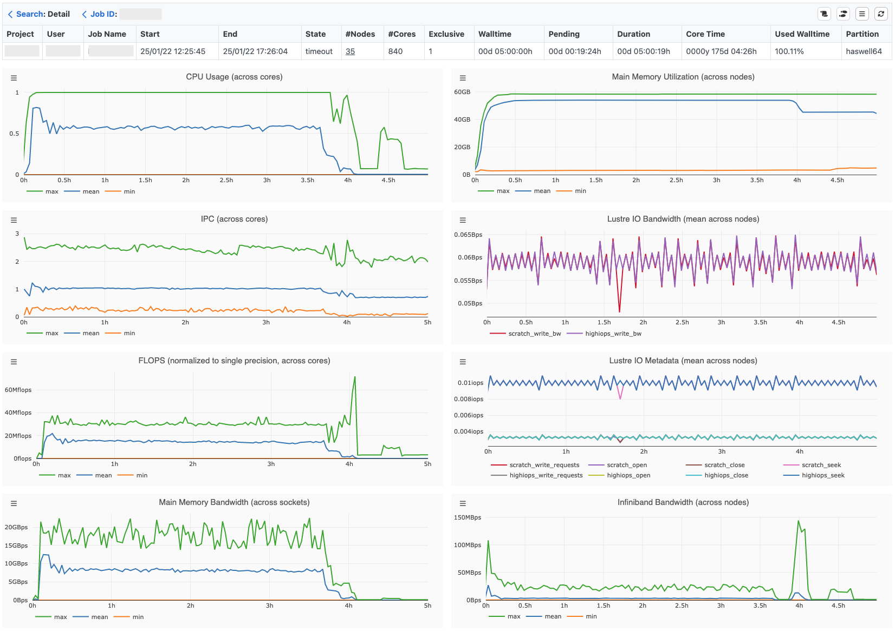
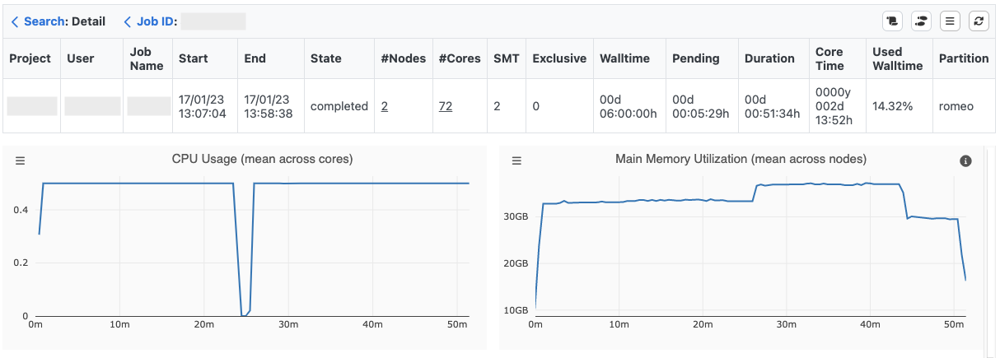
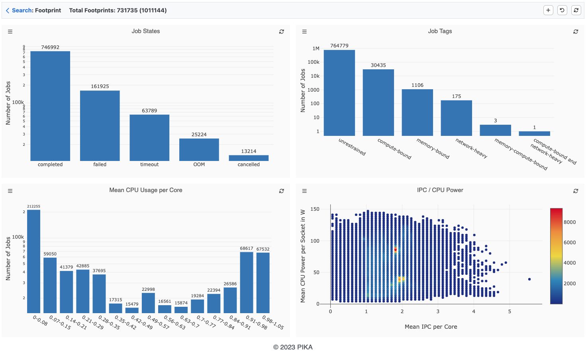
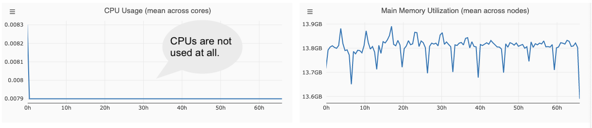
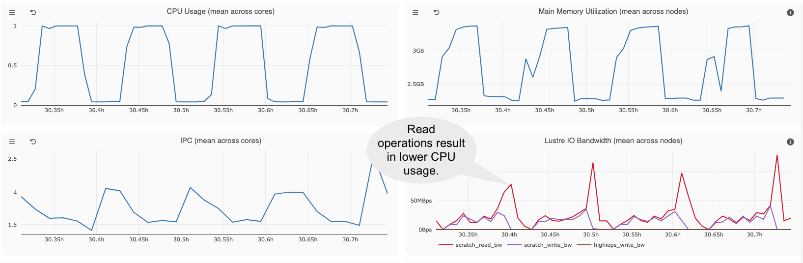
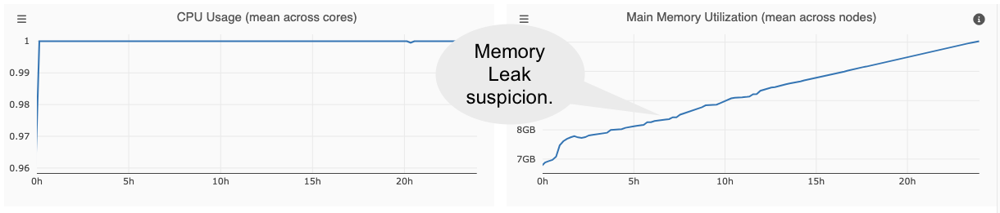

# Track Slurm Jobs with PIKA

PIKA is a hardware performance monitoring stack to identify inefficient HPC jobs. Users of ZIH
systems have the possibility to visualize and analyze the efficiency of their jobs via the
[PIKA web interface](https://selfservice.zih.tu-dresden.de/l/index.php/hpcportal/jobmonitoring/zih/jobs).

!!! hint

    To understand this guide, it is recommended that you open the
    [web interface](https://selfservice.zih.tu-dresden.de/l/index.php/hpcportal/jobmonitoring/zih/jobs)
    in a separate window. Furthermore, you should have submitted at least one real HPC job at ZIH
    systems.

## Overview

PIKA consists of several components and tools. It uses the collection daemon collectd, InfluxDB to
store time-series data and MariaDB to store job metadata. Furthermore, it provides a powerful
[web interface](https://selfservice.zih.tu-dresden.de/l/index.php/hpcportal/jobmonitoring/zih/jobs)
for the visualization and analysis of job performance data.

## Table View and Job Search

The analysis of HPC jobs in PIKA is designed as a top-down approach. Starting from the table view,
you can either analyze running or completed jobs. You can navigate from groups of jobs with the
same name to the metadata of an individual job and finally investigate the job’s runtime metrics in
a timeline view.

To find jobs with specific properties, you can sort the table by any column, e.g., by consumed CPU
hours to find jobs where an optimization has a large impact on the system utilization. Additionally,
there is a filter mask to find jobs that match several properties. When a job has been selected, the
timeline view opens.

## Timeline Visualization

PIKA provides timeline charts to visualize the resource utilization of a job over time. After a job
is completed, timeline charts can help you to identify periods of inefficient resource usage.
However, they are also suitable for the live assessment of performance during the job’s runtime. In
case of unexpected performance behavior, you can cancel the job, thus avoiding long execution with
subpar performance.

The following timeline visualization shows a job with 840 cores, spread over 35 (dual-socket
Haswell) nodes that have been allocated for exclusive use.


{: align="center"}

PIKA provides the following runtime metrics:

|Metric| Hardware Unit| Sampling Frequency|
|---|---|---:|
|CPU Usage|CPU core|30s|
|IPC (instructions per cycle)|CPU core|60s|
|FLOPS (normalized to single precision) |CPU core|60s|
|Main Memory Bandwidth|CPU socket|60s|
|CPU Power|CPU socket|60s|
|Main Memory Utilization|node|30s|
|I/O Bandwidth (local, Lustre) |node|30s|
|I/O Metadata (local, Lustre) |node|30s|
|GPU Usage|GPU device|30s|
|GPU Memory Utilization|GPU device|30s|
|GPU Power Consumption|GPU device|30s|
|GPU Temperature|GPU device|30s|

Each monitored metric is represented by a timeline, whereby metrics with the same unit and data
source are displayed in a common chart, e.g., different Lustre metadata operations. Each metric is
measured with a certain granularity concerning the hardware, e.g. per hardware thread, per CPU
socket or per node.
Most metrics are recorded every 30 seconds except IPC, FLOPS, Main Memory Bandwidth and Power
Consumption. The latter are determined every 60 seconds, as they are a combination of different
hardware counters, which leads to a higher measurement overhead. Depending on the architecture,
metrics such as normalized FLOPS (2 x double-precision + 1 x single-precision) can require
multiplexing, since single and double precision FLOPS cannot be measured simultaneously.
The sampling frequency cannot be changed by the user.

!!! hint

    Be aware that CPU socket or node metrics can share the resources of other jobs running on the
    same CPU socket or node. This can result e.g., in cache perturbation and thus a sub-optimal
    performance. To get valid performance data for those metrics, it is recommended to submit an
    exclusive job (`--exclusive`)!

If the current partition supports simultaneous multithreading (SMT) the maximum number of hardware
threads per physical core is displayed in the SMT column. The Slurm configuration on ZIH systems
disables SMT by default. Therefore, in the example below, only a maximum CPU usage of 0.5 can be
achieved, since PIKA combines two hardware threads per physical core. If you want to use SMT, you
must set the Slurm environment variable `SLURM_HINT=multithread`. In this case, `srun` distributes
the tasks to all available hardware threads, thus a CPU usage of 1 can be reached. However, the SMT
configuration only refers to the `srun` command. For single node jobs without `srun` command the
tasks are automatically distributed to all available hardware threads.


{: align="center"}

!!! note

    To reduce the amount of recorded data, PIKA summarizes per hardware thread metrics to the
    corresponding physical core. In terms of simultaneous multithreading (SMT), PIKA only provides
    performance data per physical core.

The following table explains different timeline visualization modes.
By default, each timeline shows the average value over all hardware units (HUs) per measured
interval.

|Visualization Mode| Description|
|---|---|
|Maximum |maximal value across all HUs per measured interval|
|Mean|mean value across all HUs per measured interval|
|Minimum |minimal value across all HUs per measured interval|
|Mean + Standard Deviation|mean value across all HUs including standard deviation per measured interval|
|Best|best average HU over time|
|Lowest|lowest average HU over time|

The visualization modes *Maximum*, *Mean*, and *Minimum* reveal the range in the utilization of
individual HUs per measured interval. A high deviation of the extrema from the mean value is a
reason for further investigation, since not all HUs are equally utilized.

To identify imbalances between HUs over time, the visualization modes *Best* and *Lowest* are a
first indicator how much the HUs differ in terms of resource usage. The timelines *Best* and
*Lowest* show the recorded performance data of the best/lowest average HU over time.

## Footprint Visualization

Complementary to the timeline visualization of one specific job, statistics on metadata and
footprints over multiple jobs or a group of jobs with the same name can be displayed with the
footprint view.  The performance footprint is a set of summarized run-time metrics that is generated
from the time series data for each job.  To limit the jobs displayed, a time period can be
specified.

To analyze the footprints of a larger number of jobs, a visualization with histograms and scatter
plots can be used. PIKA uses histograms to illustrate the number of jobs that fit into a category or
bin. For job states and job tags there is a fixed number of categories or values. For other
footprint metrics PIKA uses a binning with a user-configurable bin size, since the value range
usually contains an unlimited number of values.  A scatter plot enables the combined view of two
footprint metrics (except for job states and job tags), which is particularly useful for
investigating their correlation.


{: align="center"}

## Hints

If you wish to perform your own measurement of performance counters using performance tools other
than PIKA, it is recommended to disable PIKA monitoring. This can be done using the following Slurm
flags in the job script:

```Bash
#SBATCH --exclusive
#SBATCH --comment=no_monitoring
```

**Note:** Disabling PIKA monitoring is possible only for exclusive jobs!

## Known Issues

The PIKA metric FLOPS is not supported by the Intel Haswell CPU architecture.
However, PIKA provides this metric to show the computational intensity.
**Do not rely on FLOPS on Haswell!** We use the event `AVX_INSTS_CALC` which counts the `insertf128`
instruction.

## Case Studies

### Idle CPUs


{: align="center"}

### Blocking I/O Operations


{: align="center"}

### Memory Leaks


{: align="center"}
