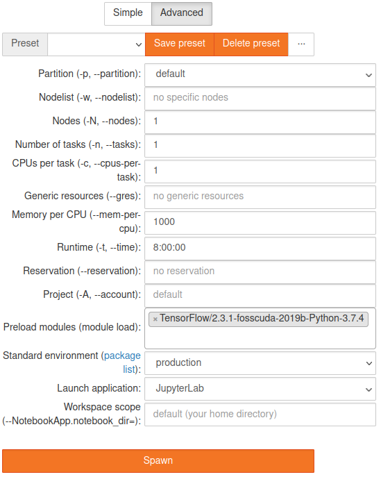

# Tensorflow

TensorFlow is a free end-to-end open-source software library for dataflow and differentiable programming across many tasks. It is a symbolic math library, used primarily for machine learning applications. It has a comprehensive, flexible ecosystem of tools, libraries and community resources.

On taurus, Tensorflow 2 is the default module version. Please check \<a href="SoftwareModulesList" target="\_blank">
the software modules list\</a> for information about available modules or use

    module spider TensorFlow

For compatibility hints between TF2 and TF1, see here.

We recommend using **Alpha** and/or **ML** partitions when working with machine learning workflows and the Tensorflow library. For more details see here. You can find detailed hardware specification here.

## Tensorflow Console

On the **ML** partition load the module environment:
    
    module load modenv/ml

On the **Alpha** partition load the module environment:
    
    module load modenv/scs5

This example shows how to install and start working with TensorFlow (with using modules system)

    srun -p ml --gres=gpu:1 -n 1 -c 7 --pty --mem-per-cpu=8000 bash   #Job submission in ml nodes with 1 gpu on 1 node with 8000 mb.
    module load modenv/ml                    #example output: The following have been reloaded with a version change:  1) modenv/scs5 => modenv/ml
    module load TensorFlow                   #load TensorFlow module. Example output: Module TensorFlow/1.10.0-PythonAnaconda-3.6 and 1 dependency loaded.

Now we check that we can access Tensorflow. One example is tensorflow-test:
    
    tauruslogin6 :~> srun -p ml --gres=gpu:1 -n 1 --pty --mem-per-cpu=10000 bash
    srun: job 4374195 queued and waiting for resources
    srun: job 4374195 has been allocated resources
    taurusml22 :~> module load TensorFlow/1.10.0-PythonAnaconda-3.6
    taurusml22 :~> tensorflow-test
    Basic test of tensorflow - A Hello World!!!...

As another example we use a python virtual environment and import Tensorflow.

    mkdir python-environments                #create folder 
    which python                #check which python are you using
    virtualenvv --system-site-packages python-environments/env   #create virtual environment "env" which inheriting with global site packages
    source python-environments/env/bin/activate                  #Activate virtual environment "env". Example output: (env) bash-4.2$
    python                                                       #start python
    import tensorflow as tf
    print(tf.VERSION)                                            #example output: 1.10.0

## Tensorflow in JupyterHub
In addition to using interactive and batch jobs, it is possible to work with Tensorflow using JupyterHub. The production and test environments of JupyterHub contain Python and R kernels, that both come with a Tensorflow support.

{: align="center"}

## Tensorflow in Containers
Another option to use Tensorflow are containers. In the HPC domain, the [Singularity](https://singularity.hpcng.org/) container system is a widely used tool. In the following example, we use the tesnroflow-test in a Singularity container:

    rotscher@tauruslogin6:~&gt; srun -p ml --gres=gpu:1 -n 1 -c 7 --pty --mem-per-cpu=8000 bash
    [rotscher@taurusml22 ~]$ singularity shell --nv /scratch/singularity/powerai-1.5.3-all-ubuntu16.04-py3.img
    Singularity powerai-1.5.3-all-ubuntu16.04-py3.img:~&gt; export PATH=/opt/anaconda3/bin:$PATH
    Singularity powerai-1.5.3-all-ubuntu16.04-py3.img:~&gt; . /opt/DL/tensorflow/bin/tensorflow-activate
    Singularity powerai-1.5.3-all-ubuntu16.04-py3.img:~&gt; tensorflow-test

## Tensorflow with Python or R
For further information on Tensorflow in combination with Python see [here](data_analytics_with_python.md), for R see [here](data_analytics_with_r.md).

## Compatibility TF2 and TF1
TensorFlow 2.0 includes many API changes, such as reordering arguments, renaming symbols, and changing default values for parameters. Thus in some cases, it makes code written for the TensorFlow 1 not compatible with TensorFlow 2. However, If you are using the high-level APIs (tf.keras) there may be little or no action you need to take to make your code fully [TensorFlow 2.0](https://www.tensorflow.org/guide/migrate) compatible. It is still possible to run 1.X code, unmodified (except for contrib), in TensorFlow 2.0:
    
    import tensorflow.compat.v1 as tf
    tf.disable_v2_behavior()                                  #instead of "import tensorflow as tf"

To make the transition to TF 2.0 as seamless as possible, the TensorFlow team has created the tf_upgrade_v2 utility to help transition legacy code to the new API.

## Additional libraires

The following NVIDIA libraries are available on all nodes:

|       |                                       |
|-------|---------------------------------------|
| NCCL  | /usr/local/cuda/targets/ppc64le-linux |
| cuDNN | /usr/local/cuda/targets/ppc64le-linux |

Note: For optimal NCCL performance it is recommended to set the
**NCCL_MIN_NRINGS** environment variable during execution. You can try
different values but 4 should be a pretty good starting point.

    export NCCL_MIN_NRINGS=4

