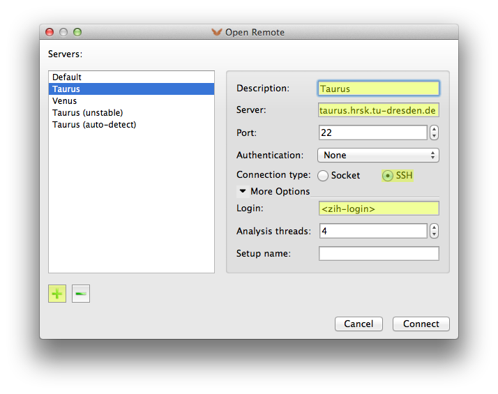
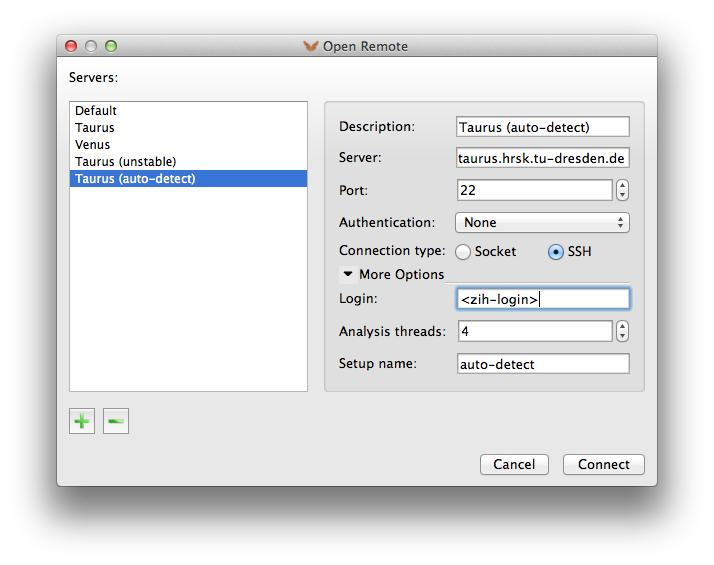
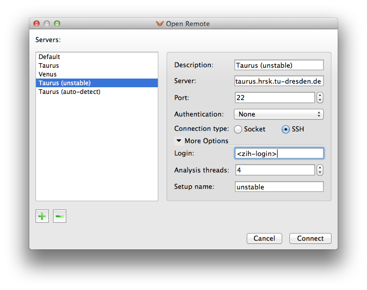

# Vampir

## Introduction

Vampir is a graphical analysis framework that provides a large set of different chart
representations of event based performance data generated through program instrumentation. These
graphical displays, including state diagrams, statistics, and timelines, can be used by developers
to obtain a better understanding of their parallel program inner working and to subsequently
optimize it. Vampir allows to focus on appropriate levels of detail, which allows the detection and
explanation of various performance bottlenecks such as load imbalances and communication
deficiencies. Follow this
[link](http://tu-dresden.de/die_tu_dresden/zentrale_einrichtungen/zih/forschung/projekte/vampir)
for further information.

[Score-P](scorep.md) is the primary code instrumentation and run-time measurement framework for
Vampir and supports various instrumentation methods, including instrumentation at source level and
at compile/link time. The tool supports trace files in Open Trace Format (OTF, OTF2) that is
developed by ZIH and its partners and is especially designed for massively parallel programs.


{: align="center"}

## Starting Vampir

Prior to using Vampir you need to set up the correct environment on one
the HPC systems with:

```Bash
module load Vampir
```

For members of TU Dresden the Vampir tool is also available as
[download](http://tu-dresden.de/die_tu_dresden/zentrale_einrichtungen/zih/forschung/projekte/vampir/vampir_download_tu)
for installation on your personal computer.

Make sure, that compressed display forwarding (e.g., `ssh -YC taurus.hrsk.tu-dresden.de`) is
enabled. Start the GUI by typing

```Bash
vampir
```

on your command line or by double-clicking the Vampir icon on your personal computer.

Please consult the
[Vampir user manual](http://tu-dresden.de/die_tu_dresden/zentrale_einrichtungen/zih/forschung/projekte/vampir/dateien/Vampir-User-Manual.pdf)
for a tutorial on using the tool.

## Using VampirServer

VampirServer provides additional scalable analysis capabilities to the Vampir GUI mentioned above.
To use VampirServer on the ZIH Systems proceed as follows: start the Vampir GUI as
described above and use the *Open Remote* dialog with the parameters indicated in the following
figure to start and connect a VampirServer already instance running on the HPC system. Make sure
to fill in your personal ZIH login name.


{: align="center"}

Click on the *Connect* button and wait until the connection is established. Enter your password when
requested. Depending on the available resources on the target system, this setup can take some time.
Please be patient and take a look at available resources beforehand.

## Advanced Usage

### Manual Server Startup

VampirServer is a parallel MPI program, which can also be started manually by typing:

```Bash
vampirserver start
```

Above automatically allocates its resources via the respective batch system. Use

```Bash
vampirserver start mpi
```

or

```Bash
vampirserver start srun
```

if you want to start vampirserver without batch allocation or inside an interactive allocation. The
latter is needed whenever you manually take care of the resource allocation by yourself.

After scheduling this job the server prints out the port number it is serving on, like `Listen port:
30088`.

Connecting to the most recently started server can be achieved by entering `auto-detect` as *Setup
name* in the *Open Remote* dialog of Vampir.


{: align="center"}

Please make sure you stop VampirServer after finishing your work with
the front-end or with

```Bash
vampirserver stop
```

Type

```Bash
vampirserver help 
```

for further information. The [user manual](http://tu-dresden.de/die_tu_dresden/zentrale_einrichtungen/zih/forschung/projekte/vampir/dateien/VampirServer-User-Manual.pdf)
of VampirServer can be found at `doc/vampirserver-manual.pdf` in the installation directory.
Type

```Bash
which vampirserver
```

to find the revision dependent *installation directory*.

### Port Forwarding

VampirServer listens to a given socket port. It is possible to forward
this port (SSH tunnel) to a remote machine. This procedure is not
recommended and not needed at ZIH. However, the following example shows
the tunneling to a VampirServer on a compute node.

Start VampirServer on the ZIH system and wait for its scheduling:

```Bash
vampirserver start
```

and wait for scheduling

```Bash
Launching VampirServer...
Submitting slurm 30 minutes job (this might take a while)...
salloc: Granted job allocation 2753510
VampirServer 8.1.0 (r8451)
Licensed to ZIH, TU Dresden
Running 4 analysis processes... (abort with vampirserver stop 594)
VampirServer  listens on: taurusi1253:30055
```

Open a second console on your local desktop and create an ssh tunnel to the compute node with:

```Bash
ssh -L 30000:taurusi1253:30055 taurus.hrsk.tu-dresden.de
```

Now, the port 30000 on your desktop is connected to the VampirServer port 30055 at the compute node
taurusi1253 of Taurus. Finally, start your local Vampir client and establish a remote connection to
`localhost`, port 30000 as described in the manual.

Remark: Please substitute the ports given in this example with appropriate numbers and available
ports.

### Nightly Builds (unstable)

Expert users who subscribed to the development program can test new, unstable tool features. The
corresponding Vampir and VampirServer software releases are provided as nightly builds. Unstable
versions of VampirServer are also installed on the HPC systems. The most recent version can be
launched/connected by entering `unstable` as *Setup name* in the *Open Remote* dialog of Vampir.


{: align="center"}
