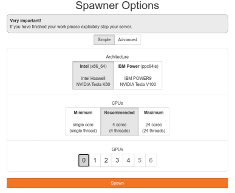
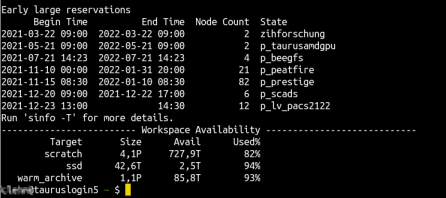

# Getting Started

This page is intended to provide the most important parts of starting to work on the ZIH High Performance Computing (HPC) system.
Especially to new users, this page is a map of the compendium as it provides an overview about the most relevant topics and it will direct to the corredponding detailed articles within the compendium. 

When you are new to HPC, start with the introductory article about HPC at [https://hpc-wiki.info/hpc/Getting_Started](https://hpc-wiki.info/hpc/Getting_Started).

## Before You Start

The ZIH HPC system is a linux system (same as most HPC systems), some basic linux knowledge is therefore needed at certain points. 
Users who are [new to linux can find here](https://hpc-wiki.info/hpc/Shell) a collection of the most important linux commands needed on the ZIH HPC system.

To work on the ZIH HPC system and to follow the instructions on this page as well as other Compendium pages, it is important to be familiar with the [basic terminology](https://hpc-wiki.info/hpc/HPC-Dictionary) such as 
[ssh](https://hpc-wiki.info/hpc/SSH), [cluster](https://hpc-wiki.info/hpc/HPC-Dictionary#Cluster), [login node](https://hpc-wiki.info/hpc/HPC-Dictionary#Login_Node), [compute node](https://hpc-wiki.info/hpc/HPC-Dictionary#Backend_Node), [local and shared file system](https://hpc-wiki.info/hpc/HPC-Dictionary#File_System), [command line (cli) or shell](https://hpc-wiki.info/hpc/Shell).

Throughout this example we use `marie@login` as an indication of working on the ZIH HPC command line and `marie@local` as working on your own local machine's command line. 

## Application for login and resources

To use the ZIH HPC system, an ZIH HPC login is needed, which is different from the ZIH login (which members of the TU Dresden have), but has the same credentials. 

To work on the ZIH HPC system, there are two possibilities: 

* create a [new project](https://doc.zih.tu-dresden.de/application/project_request_form/)
* join an existing project: e.g. new researchers in an existing project, students in projects for teaching purposes. The details will be provided to you by the project admin. 

The ZIH HPC system is structured by so-called HPC projects. 
An HPC project on the ZIH HPC system includes:

* project directory
* project group
* project members (at least admin and manager)
* resource quotas for compute time (CPU/GPU hours) and storage

One important aspect for HPC projects is a collaborative working style (research groups, student groups for teaching purposes). Thus, granting appropriate file permissions and creating a unified and consistent software environment for multiple users is essential.
This aspect is considered for all the following recommendations.

HPC projects can be broken down into two core parts:

1. [link] Data: input data, source code, scripts, ouptut data, calculation results, logfiles
2. [link] Software  


## Accessing the ZIH HPC system

!!! caution "Accessability of the ZIH HPC system"
	
	The ZIH HPC system can be accessed only within the data net of the TU Dresden.
	Access from outside is possible by establishing a VPN connection (find [VPN connection details for OpenVPN here](https://tu-dresden.de/zih/dienste/service-katalog/arbeitsumgebung/zugang_datennetz/vpn#section-4)).

There are different ways to access the ZIH HPC system. Depending on the user's needs and previous knowledge, these are the different possiblities: 

* JupyterHub: browser based approach, easiest way for beginners (more info [here](https://doc.zih.tu-dresden.de/access/jupyterhub/)) 
* ssh connection (command line/terminal/console): "classical" approach,  command line knowledge neccesary (more info [here](https://doc.zih.tu-dresden.de/access/ssh_login/))
* Desktop Visualisation, Graphical User Interfaces (GUIs) and similar: e.g. commercial software as Ansys, LS-DYNA.

	!!! hint "Desktop visiualisation for commercial software"
		
		In the following the desktop visualisation is not demonstrated. 		
		To find information about available commercial software on the ZIH system (e.g. Ansys, LS-DYNA, Abaqus) just use the search field in the [compendium](https://doc.zih.tu-dresden.de/).


### JupyterHub
Access JupyterHub here [https://taurus.hrsk.tu-dresden.de/jupyter](). 
Start by clicking on the `Start my server` button and you will see two Spawner Options, `Simple` and `Advanced`. 

The `Simple` view offers a limited selection of parameters to choose from. 
It is aimed towards simple projects and beginner users. 
For a simple start, choose according to the gray fields in the image, then click `Spawn`:


You will be working in your `/home/` directory as opposed to a specific workspace (see *Data: Management and Transfer* section below for more details). 
You will see:


After successful loading, you will see the possibility between opening a `Notebook`, `Console` or `Other`. 
See [here](../../access/jupyterhub/) for more information. 
 
!!! caution "Stopping session on JupyterHub"	

    Once you are done with your work on the ZIH HPC system, explicitely stop the session by logging out by clicking `File` -> `Log Out`.
    Alternatively, choose `File` -> `Hub control panel` -> `Stop server`.
 
More information on JupyterHub can be found [here](../../access/jupyterhub/).


### SSH Connection (Command Line)

The more "classical" way to work with HPC is based on the command line. 
Linux users simply need to open a terminal/shell and type
```console
marie@local$ ssh marie@taurus.hrsk.tu-dresden.de
```

After typing your password you end up with something like in the following image.



You have now accessed one of the login nodes. 
This is the starting point for many tasks as e.g. running programs or data management. 


!!! hint "Windows users"

	Windows users need an ssh-client as e.g. MobaXterm, see the instructions [here](../../access/ssh_login/#connecting-from-windows).

??? hint "Using ssh key pair"

	We suggest creating an ssh key pair by following the [instructions here](../../access/ssh_login/#before-your-first-connection).
	Using an ssh key pair is benefical for security reasons, although it is not necessary to work with the ZIH HPC system. 

## Data Management and Data Transfer

There are different areas for storing your data on the ZIH HPC system, called [Filesystems](https://doc.zih.tu-dresden.de/data_lifecycle/file_systems/). 
You will need to create a [workspace](https://doc.zih.tu-dresden.de/data_lifecycle/workspaces/) for your data (see example below) on one of these Filesystems. 

Every filesystem has its own properties (available space/capacity, storage time limit, permission rights). 
Therefore, choose the one that fits your project best. 
To start we recommend the filesystem **scratch**:

??? example "Creating a Workspace on Scratch Filesystem"
	The following command creates a workspace 

	* command: `ws_allocate` 
	* on the scratch filesystem: `-F scratch`
	* with the name: `test-workspace` 
	* a life time of `90` days
	* an email is sent to marie.testuser@tu-dresden.de 7 days before expiration: `-r 7 -m marie.testuser@tu-dresden.de`

	```console
	marie@login$ ws_allocate -F scratch -r 7 -m marie.testuser@tu-dresden.de test-workspace 90
	Info: creating workspace.
	/scratch/ws/marie-test-workspace
	remaining extensions  : 10
	remaining time in days: 90
	```
	You can refer to this workspace using the path `/scratch/ws/marie-test-workspace`.

Find more [information on workspaces in the compendium](https://doc.zih.tu-dresden.de/data_lifecycle/workspaces/).

!!! hint "Distinction: Transferring data from/to vs. within the ZIH system"
	Please note the different settings for transferring data, that might require different approaches:

	* transfer from or to the ZIH system
	* transfer within the ZIH system
		

Transferring data within the ZIH system depends on the data volume. 
We distinguish small data (up to 100 MB) and medium and large data volume (above 100 MB).

??? example "Copy file(s) within ZIH system (small data)"
	For transferring a small data volume (up to 100 MB) use the standard linux command `cp` on the commandline.
	
	* Copy the file `example1.R` **from your local machine to a workspace** on the ZIH system.
		```console
		marie@login$ cp /home/marie/example1.R /scratch/ws/marie-test-workspace
		```
	
	Find [here more examples for the cp command](http://bropages.org/cp).

??? example "Copy file(s) within ZIH system (large data)"
	For transferring a large data volume (more than 100 MB) use the datamover by applying e.g. `dtcp`, `dtmv` or `dtwget`.
	
	* Copy the directory `/warm_archive/ws/large-dataset` within the ZIH system.
		```console
		marie@login$ dtcp -r /warm_archive/ws/large-dataset /scratch/ws/marie-test-workspace/data
		```
	More [details on the datamover can be found here](../data_transfer/datamover.md).

Transferring data from/to the ZIH system.

??? example "Copy a file between local machine and ZIH HPC system (both directions)"
	For transferring all data volume use `scp` on the commandline.
	
	
	* Copy the file `example1.R` **from your local machine to a workspace** on the ZIH system.
		```console
		marie@local$ scp /home/marie/Documents/example1.R marie@taurusexport.hrsk.tu-dresden.de:/scratch/ws/0/your_workspace/
		Password:
		example1.R                                                     100%  312    32.2KB/s   00:00`` 
		```
		
		Note that the target path contains `taurusexport.hrsk.tu-dresden.de` which is one of the so called export nodes that allow for data transfer from/to outside the ZIH system.

	* Copy the file `results.csv` **from a workspace on the ZIH system to your local machine**.
		```console
		marie@local$ scp marie@taurusexport.hrsk.tu-dresden.de:/scratch/ws/0/marie-test-workspace/results.csv home/marie/Documents/
		```
	
	Find [here more examples for the scp command](http://bropages.org/scp).
##### Medium and high data volume (hundreds of megabytes up to gigabytes and beyond): using data mover `dtcp`, `dtls`, `dtmv`, `dtrm`, `dtrsync`, `dttar`, and `dtwget` (details [can be found here](../data_transfer/datamover.md))

2. More so for Linux-based systems, `sshfs` (a command-line tool for safely mounting a remote folder from a server to a local machine) can be used to mount user home, project home or workspaces within the local folder structure. 
Data can be transferred directly with drag and drop in your local file explorer. 
Moreover, this approach makes it possible to edit files with your common editors and tools on the local machine.


3. Windows users can apply the [step-by-step procedure as indicated here](../../data_transfer/export_nodes/#access-from-windows).


__* Example on how to move data within the ZIH HPC system *__
On the ZIH HPC command line, moving data from `/scratch/ws/0/your_workspace` to some other location (in this example we choose the `/projects` filesystem):

```console
marie@login$ dtcp -r /scratch/ws/0/your_workspace/ /projects/p_marie/.
```

-----

For more information on how to move files of different sizes from the local machine to the ZIH HPC system, within the ZIH HPC system, how to archive them, what to avoid and other information, see [here](https://hpc-wiki.zih.tu-dresden.de/data_transfer/datamover/). 

??? caution "Permission rights are crucial in a collaborative setting"

	By default workspaces are accessible only for the user who created the workspace.
	Files created by a user in the project directory have read-only access for other group members by default.
	Therefore, the correct file permissions must be configured (using `chmod` and `chgrp`) for all files in the project home and the workspaces that should be fully accessible (read, write, execute) to your collaborator group.
	A first overview on users and permissions in linux can be found [here](https://hpc-wiki.info/hpc/Introduction_to_Linux_in_HPC/Users_and_permissions).

!!! caution 

	If you are planning to move terabytes or even more from an outside machine into the ZIH system, please contact the ZIH HPC support in advance.


## Software Environment

The [software](../software/overview.md) on ZIH system is not installed system-wide, but is provided
within the so-called [modules](../software/modules.md). In order to use specific software you need
to "load" the respective module.

!!! note
    
    Different partitions might have available different versions of the same software. 

Use `module spider <software>` command to check all available versions of the software.

```console 
marie@login$ module spider Python 
--------------------------------------------------------------------------------------------------------------------------------
  Python:
--------------------------------------------------------------------------------------------------------------------------------
    Description:
      Python is a programming language that lets you work more quickly and integrate your systems more effectively.

     Versions:
        Python/2.7.14-foss-2018a
        Python/2.7.14-GCCcore-6.4.0-bare
        Python/2.7.14-gsolf-2018a
        [...]
        Python/3.8.2-GCCcore-9.3.0
        Python/3.8.2
        Python/3.8.6-GCCcore-10.2.0
        Python/3.8.6
        Python/3.9.5-bare
        Python/3.9.5
     Other possible modules matches:
        Biopython  Boost.Python  GitPython  IPython  PythonAnaconda  flatbuffers-python  netcdf4-python  protobuf-python  python

--------------------------------------------------------------------------------------------------------------------------------
  To find other possible module matches execute:

      $ module -r spider '.*Python.*'

--------------------------------------------------------------------------------------------------------------------------------
  For detailed information about a specific "Python" package (including how to load the modules) use the module's full name.
  Note that names that have a trailing (E) are extensions provided by other modules.
  For example:

     $ module spider Python/3.9.5
--------------------------------------------------------------------------------------------------------------------------------
```

Here we see the list of versions of Python that are available.
To get information on a specific module, use `module spider <software>/<version>` call.

```console  hl_lines="9 10 11"
marie@login$ module spider Python/3.9.5
--------------------------------------------------------------------------------------------------------------------------------
  Python: Python/3.9.5
--------------------------------------------------------------------------------------------------------------------------------
    Description:
      Python is a programming language that lets you work more quickly and integrate your systems more effectively.


    You will need to load all module(s) on any one of the lines below before the "Python/3.9.5" module is available to load.

      modenv/hiera  GCCcore/10.3.0

    This module provides the following extensions:

      alabaster/0.7.12 (E), appdirs/1.4.4 (E), asn1crypto/1.4.0 (E), atomicwrites/1.4.0 (E), attrs/21.2.0 (E), Babel/2.9.1 (E), bcrypt/3.2.0 (E), bitstring/3.1.7 (E), blist/1.3.6 (E), CacheControl/0.12.6 (E), cachy/0.3.0 (E), certifi/2020.12.5 (E), cffi/1.14.5 (E), chardet/4.0.0 (E), cleo/0.8.1 (E), click/7.1.2 (E), clikit/0.6.2 (E), colorama/
      [...]

    Help:
      Description
      ===========
      Python is a programming language that lets you work more quickly and integrate your systems
       more effectively.


      More information
      ================
       - Homepage: https://python.org/


      Included extensions
      ===================
      alabaster-0.7.12, appdirs-1.4.4, asn1crypto-1.4.0, atomicwrites-1.4.0,
      attrs-21.2.0, Babel-2.9.1, bcrypt-3.2.0, bitstring-3.1.7, blist-1.3.6,
      [...]
```

In some cases it is required to load additional modules before loading a desired software.
It is indicated with the highlighted lines in the example above.

```console 
marie@login$ module load modenv/hiera  GCCcore/10.3.0  # load prerequisites

The following have been reloaded with a version change:
  1) modenv/scs5 => modenv/hiera

Module GCCcore/10.3.0 loaded.

marie@login$ module load Python/3.9.5   # load desired version of software
Module Python/3.9.5 and 11 dependencies loaded.
```

For additional information refer to the detailed documentation on [modules](../software/modules.md)

!!! hint "Special hints on different software"
	
  	Special hints on different software can be found for [Python](../software/data_analytics_with_python.md),
    [R](../software/data_analytics_with_r.md), [Mathematica/MatLab](../software/mathematics.md), ...

!!! hint "Hint on Python packages"

  	The usage of virtual environments and, therefore, the usage of workspaces is recommended,
    especially for Python. Please check out the module system, even for specific Python packages,
    e.g. `tqdm`, `torchvision`, `tensorboard`, etc. to get a better idea of what is available 
    to you. The Python (and other) package ecosystem is very heterogeneous and dynamic, with,
    often, daily updates. The central update cycle for software on the ZIH HPC system occurs
    approximately every six months.

## Running a Job

Since all computational resources are shared with other users, in order to allocate them you need
to interact with the so-called scheduler or a batch system. On the ZIH system it is 
[Slurm](https://slurm.schedmd.com/quickstart.html).
It is possible to run a job [interactively](../jobs_and_resources/slurm.md#interactive-jobs)
(real time execution) or to submit a [batch job](../jobs_and_resources/slurm.md#batch-jobs) 
(scheduled execution). For beginners, we highly advise to run the job interactively.

To do so, use the `srun` command:

```bash
marie@login$ srun [options] <executable> [arguments]
```

Here, among the other options it is possible to define a partition you would like to work on
(`--partition`), the number of tasks (`--ntasks`), number of CPUs per task (`--cpus-per-task`),
the amount of time you would like to keep this interactive session open (`--time`), memory per 
CPU (`--mem-per-cpu`) and many others. See [Slurm documentation](../jobs_and_resources/slurm.md#interactive-jobs)
for more details. 

```console
marie@login$ srun --partition=haswell --ntasks=1 --cpus-per-task=4 --time=1:00:00 --mem-per-cpu=1700 --pty bash -l
```

The `srun` call will allocate 4 cores for an interactive job.
